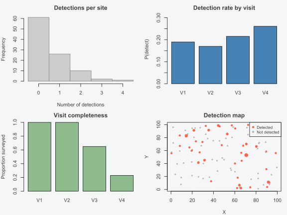
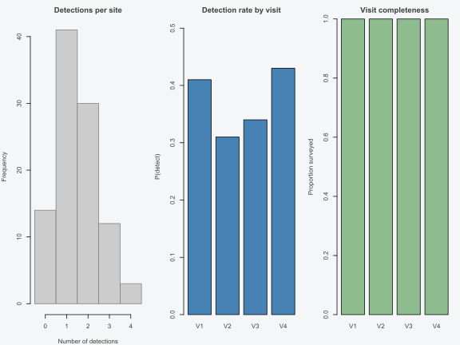

# Formatting Data for INLAocc

## Introduction

Occupancy models separate two processes that generate ecological survey
data: the true state of a site (occupied or not) and the observation
process (detected or not, given presence). This separation requires a
specific data layout. Detection histories — repeated visits to the same
sites — form the core input, and covariates must be cleanly partitioned
into those that affect occupancy (site-level) and those that affect
detection (visit-level).

INLAocc accepts two data formats. The first is a
**spOccupancy-compatible list** with named elements `y`, `occ.covs`,
`det.covs`, and optionally `coords`. If you already use spOccupancy,
your data works without modification. The second is a structured
**`occu_data` object** produced by the helper functions
[`occu_format()`](https://gillescolling.com/INLAocc/reference/occu_format.md)
and
[`occu_data()`](https://gillescolling.com/INLAocc/reference/occu_data.md),
which validate inputs and compute useful metadata (naive occupancy,
visit completeness, etc.).

This vignette covers building both formats from scratch, converting
long-format data frames into model-ready objects, handling multi-species
and multi-season layouts, and diagnosing common data mistakes before
they become cryptic model errors. For fitting models once the data is
ready, see
[`vignette("quickstart")`](https://gillescolling.com/INLAocc/articles/quickstart.md).

## The data structure

Consider a minimal survey of two sites, each visited up to four times:

    Site 1:  visit 1 = detected,      visit 2 = not detected,  visit 3 = detected,  visit 4 = NA (not surveyed)
    Site 2:  visit 1 = not detected,  visit 2 = not detected,  visit 3 = not detected, visit 4 = not detected

In matrix form, this becomes:

``` r

y <- matrix(c(1, 0, 1, NA,   # site 1
              0, 0, 0, 0),    # site 2
            nrow = 2, byrow = TRUE)
y
#>      [,1] [,2] [,3] [,4]
#> [1,]    1    0    1   NA
#> [2,]    0    0    0    0
```

Site 1 was detected at least once, so its naive occupancy status is 1.
Site 2 was never detected — but that does not mean the species is
absent. It could be present and undetected on all four visits.
Disentangling these two possibilities is exactly what the occupancy
model does, and it needs the full visit-level history (not just
presence/absence summaries) to do so.

The `NA` in site 1, visit 4 indicates that the visit was never
conducted. This is distinct from a 0, which means the visit happened but
the species was not detected. Getting this distinction right is one of
the most common data formatting tasks.

## Building data from scratch

### The detection matrix (y)

The detection matrix `y` has N rows (sites) and J columns (visits):

- **1** = species detected on that visit

- **0** = species not detected (visit was conducted)

- **NA** = visit was not conducted

``` r

set.seed(42)
N <- 100   # sites
J <- 4     # max visits per site

# Simulate: true occupancy ~ 0.6, detection ~ 0.4
z <- rbinom(N, 1, 0.6)                          # true state
y <- matrix(NA_integer_, N, J)
for (i in seq_len(N)) {
  n_visits <- sample(2:J, 1)                    # variable effort
  y[i, 1:n_visits] <- rbinom(n_visits, 1, 0.4 * z[i])
}
```

Key points:

- Rows always correspond to sites and columns to visits.

- Variable survey effort is encoded naturally: sites with fewer visits
  have trailing `NA` values.

- The matrix must contain only `0`, `1`, and `NA`. Non-integer values,
  counts greater than 1, or negative values will cause validation
  errors.

### Occupancy covariates (occ.covs)

Site-level covariates — variables that are constant across visits within
a site — go into `occ.covs`. These are the predictors for the occupancy
process (psi).

``` r

occ_covs <- data.frame(
  elevation = rnorm(N, mean = 500, sd = 200),
  forest    = runif(N, 0, 1),
  region    = sample(c("north", "south"), N, replace = TRUE)
)
```

Requirements:

- A `data.frame` with exactly N rows, one per site.

- Alternatively, a named list of vectors, each of length N.

- Column order must match the row order of `y`.

- Categorical variables should be factors or characters (the model
  formula handles coding).

### Detection covariates (det.covs)

Visit-level covariates — variables that can change between visits to the
same site — go into `det.covs`. These are the predictors for the
detection process (p).

`det.covs` is a **named list** where each element is either:

- An **N x J matrix** for covariates that vary by both site and visit
  (e.g., temperature at the time of survey, survey duration).
- A **vector of length N** for covariates that vary by site but are
  constant across visits (e.g., observer skill level). These are
  internally expanded to N x J matrices by
  [`occu_format()`](https://gillescolling.com/INLAocc/reference/occu_format.md).

``` r

det_covs <- list(
  date     = matrix(rnorm(N * J), N, J),          # varies by site and visit
  duration = matrix(runif(N * J, 1, 8), N, J),    # varies by site and visit
  observer = sample(1:3, N, replace = TRUE)        # constant across visits
)
```

Common detection covariates include survey date, survey duration or
effort, time of day, weather conditions, and observer identity.

### Coordinates (coords)

An N x 2 matrix of site coordinates, needed only for spatial models
(`occu(..., spatial = coords)`):

``` r

coords <- cbind(
  x = runif(N, 0, 100),
  y = runif(N, 0, 100)
)
```

Columns should be x/easting first, y/northing second. The coordinate
reference system does not matter for model fitting, but projected
coordinates (meters) give more interpretable spatial range estimates
than geographic coordinates (degrees).

### Putting it together

The raw spOccupancy-compatible list format:

``` r

data_list <- list(
  y        = y,
  occ.covs = occ_covs,
  det.covs = det_covs,
  coords   = coords
)
```

This can be passed directly to
[`occu()`](https://gillescolling.com/INLAocc/reference/occu.md):

``` r

library(INLAocc)
fit <- occu(~ elevation + forest, ~ date + duration, data = data_list, verbose = 0)
```

The list format is convenient if you are migrating from spOccupancy or
assembling data programmatically. For validation and exploratory
summaries, wrap it with
[`occu_format()`](https://gillescolling.com/INLAocc/reference/occu_format.md)
(next section).

## Using occu_format()

[`occu_format()`](https://gillescolling.com/INLAocc/reference/occu_format.md)
validates the raw components, checks dimension consistency, warns about
NAs, and returns a structured `occu_data` object with metadata:

``` r

library(INLAocc)

formatted <- occu_format(
  y        = y,
  occ.covs = occ_covs,
  det.covs = det_covs,
  coords   = coords
)
```

What it checks:

- `y` contains only 0, 1, and NA.

- `occ.covs` has exactly N rows.

- Every element of `det.covs` is either a length-N vector or an N x J
  matrix.

- `coords` has N rows and exactly 2 columns.

- Warns if any covariates contain NAs.

The returned `occu_data` object stores the validated data plus derived
quantities:

``` r

formatted
#> Occupancy data (occu_data)
#>   Sites:    100
#>   Visits:   4 (max)
#>   Detected: 39 / 100 (naive psi = 0.390)
#>   Naive p:  0.483
#>   Occ covs: elevation, forest, region
#>   Det covs: date, duration, observer
#>   Spatial:  coordinates provided
```

The [`summary()`](https://rdrr.io/r/base/summary.html) method provides
more detail:

``` r

summary(formatted)
#> Occupancy data summary
#>   Sites: 100 | Max visits: 4
#>   Observations: 288 | Missing: 112 (28.0%)
#>   Naive occupancy: 0.390 (39 / 100 sites)
#>   Naive detection: 0.483
#> 
#>   Detection frequency (detections per site):
#>  detections sites
#>           0    61
#>           1    26
#>           2    10
#>           3     2
#>           4     1
#> 
#>   Per-visit detection rate: V1=0.19  V2=0.17  V3=0.22  V4=0.26
#>   Coordinates: available
```

The [`plot()`](https://rdrr.io/r/graphics/plot.default.html) method
produces a diagnostic panel (detection frequency histogram, per-visit
detection rates, visit completeness, and a spatial detection map if
coordinates are available):

``` r

plot(formatted)
```



An `occu_data` object is also a valid list, so it works directly with
[`occu()`](https://gillescolling.com/INLAocc/reference/occu.md):

``` r

fit <- occu(~ elevation + forest, ~ date + duration, data = formatted, verbose = 0)
```

## Auto-detection with occu_data()

If your data starts as a long-format data frame (one row per
site-visit),
[`occu_data()`](https://gillescolling.com/INLAocc/reference/occu_data.md)
converts it to the structured format and automatically classifies
covariates as site-level (occupancy) or visit-level (detection):

``` r

long_df <- data.frame(
  site_id     = rep(1:100, each = 4),
  visit_num   = rep(1:4, times = 100),
  detected    = rbinom(400, 1, 0.4),
  elevation   = rep(rnorm(100), each = 4),   # constant within site
  forest      = rep(runif(100), each = 4),   # constant within site
  temperature = rnorm(400),                  # varies within site
  duration    = runif(400, 1, 8)             # varies within site
)

formatted <- occu_data(long_df,
                       y     = "detected",
                       site  = "site_id",
                       visit = "visit_num")
```

The auto-detection rule is simple: if a column’s values are constant
within every site, it is classified as a site-level occupancy covariate.
If it varies within at least one site, it is classified as a visit-level
detection covariate. You can override the auto-detection by specifying
the column names explicitly:

``` r

formatted <- occu_data(long_df,
                       y        = "detected",
                       site     = "site_id",
                       visit    = "visit_num",
                       occ.covs = c("elevation", "forest"),
                       det.covs = c("temperature", "duration"))
```

Coordinates can be extracted from columns in the same data frame:

``` r

long_df$lon <- rep(runif(100), each = 4)
long_df$lat <- rep(runif(100), each = 4)

formatted <- occu_data(long_df,
                       y      = "detected",
                       site   = "site_id",
                       visit  = "visit_num",
                       coords = c("lon", "lat"))
```

[`occu_data()`](https://gillescolling.com/INLAocc/reference/occu_data.md)
also supports NA imputation for site-level covariates that have missing
values after collapsing visit-rows (e.g., if all visit-rows for a site
have NA for a covariate). Set `impute = "mean"` or `impute = "median"`
to fill these gaps:

``` r

formatted <- occu_data(long_df,
                       y      = "detected",
                       site   = "site_id",
                       visit  = "visit_num",
                       impute = "mean")
```

## Multi-species data

Multi-species occupancy models require detection histories for multiple
species across the same set of sites. INLAocc supports two input
formats.

### From a 3D array

The spOccupancy convention is a 3D array with dimensions **species x
sites x visits**:

``` r

n_species <- 5
N <- 100
J <- 4

y_array <- array(
  rbinom(n_species * N * J, 1, 0.3),
  dim = c(n_species, N, J),
  dimnames = list(
    species = paste0("sp", 1:n_species),
    site    = NULL,
    visit   = NULL
  )
)

ms_data <- occu_format_ms(
  y_list   = y_array,
  occ.covs = data.frame(elevation = rnorm(N), forest = runif(N)),
  det.covs = list(date = matrix(rnorm(N * J), N, J))
)
```

[`occu_format_ms()`](https://gillescolling.com/INLAocc/reference/occu_format_ms.md)
slices the 3D array into per-species N x J matrices and validates each
one. Species names are taken from the first dimension’s dimnames; if
absent, they default to `sp1`, `sp2`, etc.

### From a list of matrices

Alternatively, pass a named list where each element is an N x J
detection matrix for one species:

``` r

y_list <- list(
  warbler = matrix(rbinom(N * J, 1, 0.5), N, J),
  thrush  = matrix(rbinom(N * J, 1, 0.3), N, J),
  vireo   = matrix(rbinom(N * J, 1, 0.2), N, J)
)

ms_data <- occu_format_ms(
  y_list   = y_list,
  occ.covs = data.frame(elevation = rnorm(N)),
  det.covs = list(date = matrix(rnorm(N * J), N, J))
)
```

All species must share the same sites and visit structure (same N and
J). Covariates are shared across species by default.

### Fitting multi-species models

``` r

fit_ms <- occu(~ elevation, ~ date, data = ms_data, multispecies = TRUE, verbose = 0)
```

## Multi-season (temporal) data

Multi-season occupancy models track changes in occupancy over time. The
detection matrix is a 3D array with dimensions **sites x seasons x
visits**:

``` r

N <- 50         # sites
n_seasons <- 5  # years
J <- 3          # visits per season

y_temporal <- array(
  rbinom(N * n_seasons * J, 1, 0.3),
  dim = c(N, n_seasons, J)
)
```

Covariates can be:

- **Static** (N-vector): constant across seasons (e.g., elevation).

- **Time-varying** (N x n_seasons matrix): changes between seasons
  (e.g., annual land-use change).

``` r

data_temporal <- list(
  y        = y_temporal,
  occ.covs = list(
    elevation = rnorm(N),                              # static
    land_use  = matrix(runif(N * n_seasons), N, n_seasons)  # time-varying
  ),
  det.covs = list(
    effort = array(runif(N * n_seasons * J, 1, 8),
                   dim = c(N, n_seasons, J))
  )
)

fit_temporal <- occu(~ elevation + land_use, ~ effort, data = data_temporal,
                     temporal = "ar1", verbose = 0)
```

The `temporal` argument controls the temporal correlation structure:
`"ar1"` for first-order autoregressive or `"iid"` for independent
seasons.

## Integrated (multi-source) data

Integrated occupancy models combine detection data from multiple survey
methods or data sources that share the same underlying occupancy state
but have different detection processes. The `y` component becomes a list
of detection matrices:

``` r

N_total <- 150   # total unique sites across all sources

# Source 1: point counts at 80 sites, 4 visits each
y_points <- matrix(rbinom(80 * 4, 1, 0.4), 80, 4)

# Source 2: acoustic monitors at 60 sites, 3 visits each
y_acoustic <- matrix(rbinom(60 * 3, 1, 0.6), 60, 3)

# 10 sites (71--80) are shared between sources
data_integrated <- list(
  y = list(
    points   = y_points,
    acoustic = y_acoustic
  ),
  occ.covs = data.frame(elevation = rnorm(N_total)),
  det.covs = list(
    list(effort = matrix(runif(80 * 4, 1, 8), 80, 4)),    # source 1
    list(noise  = matrix(rnorm(60 * 3), 60, 3))           # source 2
  ),
  sites = list(1:80, 71:130),     # which rows of occ.covs each source covers
  coords = cbind(x = runif(N_total), y = runif(N_total))
)

fit_integrated <- occu(~ elevation, ~ effort, data = data_integrated,
                       integrated = TRUE, verbose = 0)
```

Each data source can have a different number of sites and visits. The
`sites` element maps each source’s rows to the corresponding rows in
`occ.covs` and `coords`. Overlapping site indices indicate shared sites,
which strengthens inference on both occupancy and detection parameters.

## Using spOccupancy data directly

If you already have data formatted for spOccupancy, it works without any
modification:

``` r

# Existing spOccupancy workflow
library(spOccupancy)
data(hbef2015)
str(hbef2015)

# Pass directly to INLAocc
library(INLAocc)
fit <- occu(~ Elevation + Elevation2, ~ day + tod,
            data = hbef2015, multispecies = TRUE, verbose = 0)
```

The [`occu()`](https://gillescolling.com/INLAocc/reference/occu.md)
function detects the spOccupancy list structure and handles the
conversion internally. This means you can benchmark INLAocc against
spOccupancy using the exact same data objects.

## Common mistakes and fixes

| Mistake | Symptom | Fix |
|:---|:---|:---|
| Using 0 instead of NA for unvisited sites | Detection probability biased low | Use `NA` for visits that were not conducted |
| Same covariate in both `occ.covs` and `det.covs` | Identifiability issues, unstable estimates | Place in one process only, or transform differently for each |
| `det.covs` matrix with wrong dimensions | `"det.covs$X is M x K but expected N x J"` | Ensure exactly N rows and J columns |
| Coordinates in wrong column order | Spatial range estimate is wrong | Put x/easting in column 1, y/northing in column 2 |
| Character columns in `occ.covs` | Unexpected behavior or silent coercion | Use factors or numeric encoding |
| Unscaled continuous covariates | Slow convergence, poor EM mixing | Scale with [`scale()`](https://rdrr.io/r/base/scale.html) before formatting |
| Detection matrix has values \> 1 | `"y must contain only 0, 1, or NA"` | Convert counts to presence/absence: `y <- ifelse(y > 0, 1L, 0L)` |
| Long-format data with unequal visits | [`occu_data()`](https://gillescolling.com/INLAocc/reference/occu_data.md) produces NAs in unexpected places | This is correct — unequal effort is encoded as trailing NAs |

## Data exploration before modeling

Before fitting any model, inspect the data with
[`summary()`](https://rdrr.io/r/base/summary.html) and
[`plot()`](https://rdrr.io/r/graphics/plot.default.html):

``` r

summary(formatted)
#> Occupancy data summary
#>   Sites: 100 | Max visits: 4
#>   Observations: 400 | Missing: 0 (0.0%)
#>   Naive occupancy: 0.860 (86 / 100 sites)
#>   Naive detection: 0.433
#> 
#>   Detection frequency (detections per site):
#>  detections sites
#>           0    14
#>           1    41
#>           2    30
#>           3    12
#>           4     3
#> 
#>   Per-visit detection rate: V1=0.41  V2=0.31  V3=0.34  V4=0.43
```

``` r

plot(formatted)
```



What to look for:

- **Naive occupancy.** The fraction of sites with at least one detection
  is a lower bound on true occupancy. If naive occupancy is very low (\<
  0.05), you may not have enough data to estimate both occupancy and
  detection reliably. If it is very high (\> 0.95), the model may
  struggle to distinguish occupancy from detection.

- **Per-visit detection rates.** If detection rates decline sharply
  across visits (e.g., V1 = 0.50, V4 = 0.10), this may indicate a
  behavioral response to surveys or seasonal decline. Consider including
  visit number as a detection covariate.

- **Visit completeness.** If many sites have only one or two visits,
  detection probability is poorly estimated at those sites. The model
  will still run, but precision suffers. Sites with zero valid visits
  (all NAs) contribute nothing and can be dropped.

- **Covariate distributions.** Check for extreme outliers, heavy
  skewness, or near-constant columns. Standardizing continuous
  covariates with [`scale()`](https://rdrr.io/r/base/scale.html)
  improves numerical stability and makes coefficient magnitudes
  comparable.

- **Detection frequency distribution.** A large pile-up at zero
  detections is normal and expected (many sites are truly unoccupied).
  But if nearly all sites have zero or one detection, the model has
  limited information for estimating detection probability.

## Summary

| Format | Function | Input | When to use |
|:---|:---|:---|:---|
| Raw list | (manual) | `list(y, occ.covs, det.covs, coords)` | Already have matrices, want spOccupancy compatibility |
| Validated object | [`occu_format()`](https://gillescolling.com/INLAocc/reference/occu_format.md) | Separate y, occ.covs, det.covs, coords | Want validation, summaries, and plots |
| From long data | [`occu_data()`](https://gillescolling.com/INLAocc/reference/occu_data.md) | Long-format data.frame | Starting from a database export or tidy data |
| Multi-species | [`occu_format_ms()`](https://gillescolling.com/INLAocc/reference/occu_format_ms.md) | 3D array or list of matrices | Community occupancy models |

All four formats are accepted by
[`occu()`](https://gillescolling.com/INLAocc/reference/occu.md). Choose
whichever matches your data pipeline. When in doubt, start with
[`occu_data()`](https://gillescolling.com/INLAocc/reference/occu_data.md)
for long-format data or
[`occu_format()`](https://gillescolling.com/INLAocc/reference/occu_format.md)
for matrix data — both validate inputs and surface problems early.
