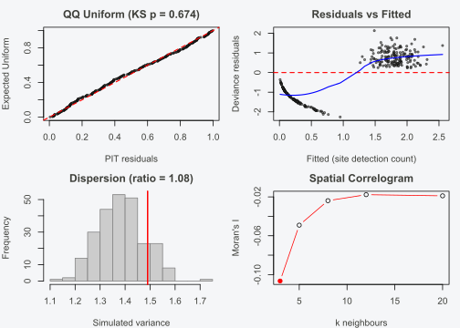
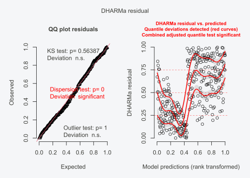
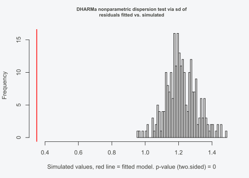
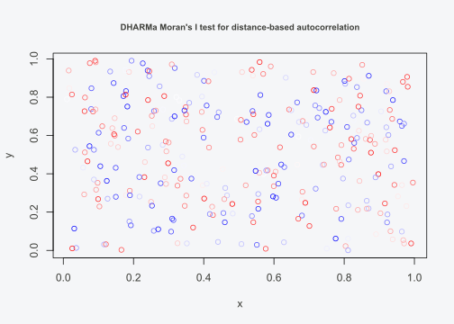

# Diagnostics & Model Selection

## Introduction

Occupancy models simultaneously estimate two processes: occupancy (is a
species present at a site?) and detection (given presence, is it
observed on a given visit?). This dual-process structure makes
diagnostics both essential and non-trivial. Misspecification in either
the occupancy or detection submodel can bias parameters in *both*
submodels, because the likelihood entangles the two. Traditional
residual plots — designed for models where the response is observed
directly — do not apply when the latent state (true presence) is never
seen.

INLAocc addresses this with simulation-based diagnostics. The idea is
simple: if the fitted model is correct, data simulated from it should
look like the observed data. Any systematic discrepancy points to a
specific kind of misspecification. This approach requires no
distributional assumptions beyond the model itself, and it works for any
occupancy model structure — single-season, multi-season, spatial, or
multi-species.

This vignette covers the full diagnostic and model selection toolkit:
the one-call diagnostic panel
([`checkModel()`](https://gillescolling.com/INLAocc/reference/checkModel.md)),
individual hypothesis tests for uniformity, dispersion, outliers, and
zero inflation, spatial and temporal autocorrelation diagnostics, DHARMa
integration, posterior predictive checks, model comparison via
information criteria and cross-validation, model averaging, and
identifiability checks. For model fitting basics, see
[`vignette("quickstart")`](https://gillescolling.com/INLAocc/articles/quickstart.md);
for spatial models specifically, see
[`vignette("spatial-models")`](https://gillescolling.com/INLAocc/articles/spatial-models.md).

## The simulation-based approach

All simulation-based diagnostics in INLAocc follow the same logic. Given
fitted parameters \\\hat{\boldsymbol{\theta}}\\:

1.  Simulate latent occupancy states \\z_i^{(r)} \sim
    \text{Bernoulli}(\hat{\psi}\_i)\\ for replicate \\r = 1, \ldots,
    R\\.
2.  Simulate detection histories \\y\_{ij}^{(r)} \sim
    \text{Bernoulli}(z_i^{(r)} \cdot \hat{p}\_{ij})\\.
3.  Compute a test statistic \\T(\mathbf{y}^{(r)})\\ on each simulated
    dataset.
4.  Compare the observed statistic \\T(\mathbf{y})\\ to the distribution
    \\\\T(\mathbf{y}^{(r)})\\\_{r=1}^R\\.

If \\T(\mathbf{y})\\ falls in the tails of the simulated distribution,
the model is misspecified in the direction that \\T\\ measures.
Different choices of \\T\\ target different aspects of model fit:
variance (dispersion), tail behaviour (outliers), the number of all-zero
sites (zero inflation), or the full distribution (PIT residuals).

This approach is well suited to occupancy models because the standard
diagnostic toolkit breaks down when the response is latent. In a
logistic regression, you observe 0s and 1s and can compute residuals
directly. In an occupancy model, you observe detection histories, not
occupancy states. A site with zero detections might be unoccupied or
might be occupied with low detection probability. There is no way to
compute a residual for occupancy without first deciding whether each
site is occupied, which is the quantity you are trying to estimate.
Simulation-based diagnostics avoid this circularity. They do not require
residuals from the occupancy process at all. Instead, they simulate the
full generative model: first draw occupancy states from the fitted
occupancy probabilities, then draw detection histories from those states
and the fitted detection probabilities. The simulated detection
histories are compared to the observed detection histories, and any
discrepancy is evaluated in terms of the detection data, which are
observed.

The second advantage is generality. The test statistic \\T\\ can be
anything: a variance ratio, a count of zeros, a spatial autocorrelation
coefficient, a quantile of the distribution. The reference distribution
for \\T\\ comes from the model’s own simulations, not from a theoretical
distribution that assumes a particular error structure. This means the
same diagnostic framework works for single-season models, multi-season
models, spatial models, and multi-species models without modification.
The only requirement is that the model can simulate from itself, which
any properly specified occupancy model can do.

## Setup: fit a model to work with

We simulate data with known parameters and fit a model that we will use
throughout the vignette:

``` r

library(INLAocc)

sim <- simulate_occu(N = 300, J = 4,
                     beta_occ = c(0.5, -0.8, 0.8),
                     beta_det = c(0, -0.5),
                     seed = 42)
fit <- occu(~ occ_x1 + occ_x2, ~ det_x1, data = sim$data, verbose = 0)
```

Because the data-generating model matches the fitted model, all
diagnostics should pass. When they do not, the sections below explain
what each failure means and how to fix it.

## One-call diagnostic panel

[`checkModel()`](https://gillescolling.com/INLAocc/reference/checkModel.md)
produces a four-panel diagnostic plot that gives a quick visual overview
of model adequacy:

``` r

checkModel(fit)
```


The four panels are:

1.  **QQ plot of PIT residuals.** Probability Integral Transform (PIT)
    residuals transform each observed value through the fitted CDF.
    Under the true model, these residuals follow a Uniform(0, 1)
    distribution, so the QQ plot should track the diagonal. An S-shaped
    curve indicates overdispersion (more variance than the model
    predicts). An inverted S indicates underdispersion. A systematic
    shift away from the diagonal suggests location bias — the model is
    consistently over- or under-predicting. Pay attention to where the
    deviations occur. Departures at the tails (the upper-right and
    lower-left corners of the QQ plot) indicate problems with extreme
    values: outlier sites that the model cannot explain, or heavy-tailed
    variation in the data. Departures in the middle of the plot point to
    problems with the mean structure: the model is getting the central
    tendency wrong, which usually means a missing covariate or a
    misspecified functional form.

2.  **Residuals vs fitted.** Deviance residuals plotted against fitted
    detection probabilities. This should be a formless cloud with no
    trends. A funnel shape (residuals spreading out as fitted values
    increase) indicates heteroscedasticity, meaning the variance of the
    detection process is not constant across sites. A curved trend
    suggests a missing covariate or a wrong functional form (e.g., a
    linear term where a quadratic is needed). A step pattern, where
    residuals jump at a particular fitted value, suggests a threshold
    effect in the data that the model’s smooth link function cannot
    capture.

3.  **Dispersion histogram.** The variance of site-level detection
    counts is computed for each simulated dataset, producing a reference
    distribution. The red vertical line marks the observed variance. A
    ratio greater than about 1.5 suggests overdispersion; below about
    0.7 suggests underdispersion. Overdispersion in occupancy models
    most often signals unmodelled heterogeneity: missing random effects,
    unaccounted spatial structure, or a covariate that groups sites into
    categories with different detection rates. Before adding complexity,
    check whether a single missing covariate explains the excess
    variance.

4.  **Correlogram.** If site coordinates are available, this panel shows
    Moran’s I at increasing numbers of neighbours. A flat line near zero
    means no residual spatial autocorrelation. Peaks at small neighbour
    counts suggest local spatial structure that the model is not
    capturing.

[`checkModel()`](https://gillescolling.com/INLAocc/reference/checkModel.md)
returns its results invisibly, so you can extract numerical summaries:

``` r

diag <- checkModel(fit)
```



``` r

diag$ks_p       # KS test p-value for PIT residuals
#> [1] 0.673618
diag$disp_ratio # observed / expected dispersion ratio
#> [1] 1.079455
```

## Individual diagnostic tests

Each test below returns an `htest` object with a `$p.value` that you can
use programmatically.

### Uniformity (PIT residuals)

``` r

testUniformity(fit)
#> 
#>  Asymptotic one-sample Kolmogorov-Smirnov test
#> 
#> data:  r
#> D = 0.04171, p-value = 0.6736
#> alternative hypothesis: two-sided
```

A high p-value means the observed data are consistent with the fitted
model across the entire distribution. This is the most general
diagnostic: it detects any systematic departure from the model, though
it has less power than targeted tests for specific problems.

### Dispersion

``` r

testDispersion(fit)
#> 
#>  Simulation-based dispersion test
#> 
#> data:  fit
#> dispersion ratio = 1.0795, p-value = 0.288
#> alternative hypothesis: two.sided
```

A dispersion ratio near 1 with a high p-value indicates correctly
specified variance. Overdispersion (ratio substantially above 1) in
occupancy models most often points to missing covariates, unmodelled
heterogeneity among sites, or residual spatial structure.

### Outliers

``` r

testOutliers(fit)
#> 
#>  Simulation outlier test (0/300 sites outside envelope)
#> 
#> data:  n_outliers and N
#> number of successes = 0, number of trials = 300, p-value = 1
#> alternative hypothesis: true probability of success is greater than 0.007968127
#> 95 percent confidence interval:
#>  0 1
#> sample estimates:
#> probability of success 
#>                      0
```

Sites are flagged as outliers if they fall outside the simulation
envelope. A similar number of outlier sites to the expected count is
unremarkable. A large excess of outliers points to heavy-tailed
variation that the model does not account for.

### Zero inflation

``` r

testZeroInflation(fit)
#> 
#>  Simulation-based zero-inflation test
#> 
#> data:  fit
#> zero-inflation ratio = 1.0353, observed zeros = 132.0, expected zeros =
#> 127.5, p-value = 0.584
#> alternative hypothesis: two.sided
```

“Zeros” here means sites where the species was never detected across all
visits. The test is one-sided: it asks whether there are *more* all-zero
sites than the model predicts. A significant result suggests either that
true occupancy is lower than estimated (the occupancy submodel is
misspecified) or that an additional zero-generating process is at work,
such as a habitat suitability threshold that makes some sites
structurally unsuitable.

In occupancy models, all-zero detection histories have two possible
causes: the site is truly unoccupied, or the species is present but was
never detected. The zero-inflation test evaluates whether the observed
number of all-zero sites exceeds what the model predicts after
accounting for both sources. A significant result means the model is
producing too few zeros in simulation, which typically indicates that
some sites are structurally unsuitable for the species. For example, a
forest bird survey that includes open grassland sites will show excess
zeros if the model lacks a forest cover covariate. The model assigns
moderate occupancy probability to grassland sites (because it has no
information to exclude them), but the species is never there. Adding a
habitat suitability covariate usually resolves the zero inflation.

## Spatial diagnostics

### Moran’s I

Residual spatial autocorrelation means the model is not capturing all
spatial structure in the data. To test for it, first simulate spatially
structured data and fit two models — one that ignores space, one that
accounts for it:

``` r

sim_sp <- simulate_occu(N = 300, J = 4, spatial_range = 0.3, seed = 123)

# Non-spatial fit (ignores spatial structure)
fit_nospatial <- occu(~ occ_x1, ~ det_x1, data = sim_sp$data, verbose = 0)
moranI(fit_nospatial)
#> 
#>  Moran's I (inverse-distance weights)
#> 
#> data:  fit_nospatial
#> Moran's I = -0.0037039, Expected I = -0.0033445, p-value = 0.9852
#> alternative hypothesis: two.sided
```

Significant Moran’s I confirms that the non-spatial model leaves spatial
structure in the residuals. Now fit a spatial model:

``` r

fit_sp <- occu(~ occ_x1, ~ det_x1, data = sim_sp$data,
               spatial = sim_sp$data$coords, verbose = 0)
moranI(fit_sp)
#> 
#>  Moran's I (inverse-distance weights)
#> 
#> data:  fit_sp
#> Moran's I = -0.03101, Expected I = -0.0033445, p-value = 0.1523
#> alternative hypothesis: two.sided
```

Non-significant Moran’s I confirms that the spatial random effect has
absorbed the spatial structure. Two weighting schemes are available:

- `weights = "inverse"` (default): inverse-distance weights across all
  pairs of sites. Sensitive to broad-scale spatial structure.
- `weights = "knn"` with `k = 10` (or another value): k nearest
  neighbours. Sensitive to local spatial structure.

``` r

moranI(fit_sp, weights = "knn", k = 10)
#> 
#>  Moran's I (k=10 nearest neighbours)
#> 
#> data:  fit_sp
#> Moran's I = 0.029893, Expected I = -0.0033445, p-value = 0.1728
#> alternative hypothesis: two.sided
```

### Semivariogram

``` r

variogram(fit_sp)
#>          dist     gamma n.pairs
#> 1  0.02256322 1.0756655     252
#> 2  0.06768966 1.0328384     746
#> 3  0.11281609 1.0495544    1179
#> 4  0.15794253 1.0652989    1613
#> 5  0.20306897 1.0875620    1840
#> 6  0.24819540 1.0275581    2048
#> 7  0.29332184 1.0209891    2283
#> 8  0.33844828 1.0459482    2397
#> 9  0.38357471 1.0335678    2571
#> 10 0.42870115 1.0197926    2555
#> 11 0.47382759 1.0177214    2669
#> 12 0.51895402 0.9935962    2619
#> 13 0.56408046 1.0081675    2618
#> 14 0.60920690 1.0556108    2621
#> 15 0.65433333 1.0751852    2486
```

The semivariogram plots semivariance against distance. A flat line at
the sill means no remaining spatial trend in the residuals. An
increasing curve that does not flatten suggests the SPDE mesh is too
coarse or the fitted range parameter is too short. See
[`vignette("spatial-models")`](https://gillescolling.com/INLAocc/articles/spatial-models.md)
for guidance on mesh construction and range priors.

## Temporal diagnostics

For multi-season models, the Durbin-Watson test checks for residual
lag-1 autocorrelation across seasons:

``` r

sim_t <- simTOcc(N = 100, J = 3, n_seasons = 5, seed = 300)
fit_t <- occu(~ 1, ~ 1, data = sim_t$data, temporal = "ar1", verbose = 0)

durbinWatson(fit_t)
#> 
#>  Durbin-Watson test for temporal autocorrelation
#> 
#> data:  fit_t
#> DW = 2.6209, lag-1 r = -0.31043, p-value = 0.4876
#> alternative hypothesis: two.sided
```

The DW statistic ranges from 0 to 4. A value near 2 indicates no
autocorrelation. Values near 0 suggest positive autocorrelation
(successive residuals are similar), and values near 4 suggest negative
autocorrelation (successive residuals alternate in sign). If the AR(1)
temporal structure is adequate, the DW statistic should be close to 2.

## DHARMa integration

If [DHARMa](https://CRAN.R-project.org/package=DHARMa) is installed,
[`dharma()`](https://gillescolling.com/INLAocc/reference/dharma.md)
converts INLAocc’s simulation-based residuals into a DHARMa residual
object. This gives access to DHARMa’s full suite of diagnostic tests and
plots:

``` r

res <- dharma(fit)
plot(res)
```



``` r


# Any DHARMa test works on the result
DHARMa::testDispersion(res)
```



    #> 
    #>  DHARMa nonparametric dispersion test via sd of residuals fitted vs.
    #>  simulated
    #> 
    #> data:  simulationOutput
    #> dispersion = 0.28806, p-value < 2.2e-16
    #> alternative hypothesis: two.sided
    DHARMa::testSpatialAutocorrelation(res, x = sim$data$coords[, 1],
                                            y = sim$data$coords[, 2])



    #> 
    #>  DHARMa Moran's I test for distance-based autocorrelation
    #> 
    #> data:  res
    #> observed = -0.0139308, expected = -0.0033445, sd = 0.0069655, p-value =
    #> 0.1286
    #> alternative hypothesis: Distance-based autocorrelation

The advantage of this integration is interoperability: if you already
use DHARMa for GLMs or GAMs, you can apply the same workflow to
occupancy models. INLAocc handles the occupancy-specific simulation
(accounting for the latent state) and DHARMa handles the visualization
and testing.

## Posterior predictive checks

[`ppcOccu()`](https://gillescolling.com/INLAocc/reference/ppcOccu.md)
implements Bayesian posterior predictive checks (Gelman et al. 2013). It
computes a fit statistic on both the observed data and on datasets
replicated from the posterior, then reports a Bayesian p-value:

``` r

ppc <- ppcOccu(fit, fit.stat = "freeman-tukey", group = 1)
ppc$bayesian.p
#> [1] 0
```

A Bayesian p-value near 0.5 indicates good fit — the model generates
data whose fit statistic distribution is centred on the observed value.
Values near 0 or 1 indicate systematic misfit. The `fit.stat` argument
accepts `"freeman-tukey"` or `"chi-squared"`. The `group` argument
controls aggregation: `group = 1` computes the statistic by site
(sensitive to site-level misfit), `group = 2` computes it by visit
(sensitive to visit-level misfit).

The choice of fit statistic affects what kinds of misfit you detect.
Freeman-Tukey is sensitive to both the location and spread of the
distribution, making it a good default for overall model assessment.
Chi-squared emphasizes individual observations that deviate strongly
from their expected values, so it is better at flagging specific problem
sites. For a well-specified model, both statistics give similar Bayesian
p-values. If Freeman-Tukey passes but chi-squared fails, look for a
small number of outlier sites rather than a systematic problem. Use
Freeman-Tukey as the default; switch to chi-squared when you suspect
that a few individual sites are driving the misfit.

## Model comparison

### Information criteria

Fit a set of candidate models and compare them:

``` r

m1 <- occu(~ 1, ~ 1, data = sim$data, verbose = 0)
m2 <- occu(~ occ_x1, ~ det_x1, data = sim$data, verbose = 0)
m3 <- occu(~ occ_x1 + occ_x2, ~ det_x1, data = sim$data, verbose = 0)

compare_models(null = m1, simple = m2, full = m3, criterion = "waic")
#>    model    loglik df      AIC      BIC     WAIC n_iter converged    delta
#> 1   full -612.1547  5 1234.309 1259.760 1316.039     22      TRUE  0.00000
#> 2 simple -610.9610  5 1231.922 1257.372 1333.216     19      TRUE 17.17696
#> 3   null -632.9911  4 1273.982 1294.342 1392.665     20      TRUE 76.62635
#>         weight
#> 1 9.998138e-01
#> 2 1.862042e-04
#> 3 2.294658e-17
```

The `delta` column gives the difference in WAIC from the best model.
`weight` gives the Akaike-style model weight, interpretable as the
probability that each model is the best approximating model given the
candidate set. WAIC (Widely Applicable Information Criterion) is
recommended for Bayesian models because it uses the full posterior
rather than a point estimate. AIC and BIC are also available via
`criterion = "aic"` and `criterion = "bic"`.

WAIC, AIC, and BIC answer related but distinct questions. WAIC uses the
full posterior predictive distribution to evaluate model fit, which
means it accounts for parameter uncertainty. AIC uses only the maximum
likelihood estimate (or in Bayesian contexts, the posterior mode) and
adds a penalty equal to the number of parameters. For models with simple
fixed-effect structures and flat priors, WAIC and AIC give nearly
identical rankings. The differences appear when the model includes
informative priors or complex random effects. In those cases, AIC
undercounts the effective complexity because it does not account for the
prior’s regularizing effect, while WAIC captures this through the
effective number of parameters \\p\_{\text{WAIC}}\\.

BIC penalizes complexity more heavily than AIC, with the penalty growing
as \\\log(N)\\ instead of a constant 2 per parameter. For large sample
sizes, BIC strongly favors simpler models. This is useful when parsimony
matters more than predictive accuracy, for instance when selecting a
minimal model for population monitoring where the same model will be
applied across many years and regions. In practice for occupancy models:
use WAIC as the default criterion, AIC as a cross-check (if they
disagree, investigate why), and BIC when you need the simplest
defensible model. When all three criteria select the same model, you can
be confident in the ranking.

### WAIC decomposition

[`waicOccu()`](https://gillescolling.com/INLAocc/reference/waicOccu.md)
decomposes WAIC into contributions from the occupancy and detection
submodels:

``` r

w <- waicOccu(m3)
w
#>   component      elpd       pD     WAIC
#> 1     total -655.6786 1.975463 1315.308
```

The `pD` column gives the effective number of parameters for each
component. If `pD` is much larger than the actual number of parameters,
the model may be overfitting — consider simplifying the covariate
structure or adding regularizing priors.

### K-fold cross-validation

For out-of-sample predictive assessment, pass `k.fold` during fitting:

``` r

fit_cv <- occu(~ occ_x1 + occ_x2, ~ det_x1, data = sim$data, k.fold = 5, verbose = 0)
fit_cv$k.fold
```

This holds out 1/k of sites at a time, refits on the remaining data, and
evaluates predictions on the held-out sites. K-fold cross-validation is
more reliable than information criteria for small datasets or models
with complex random effect structures, but it is k times slower because
the model must be refit for each fold.

## Model averaging

When no single model clearly dominates — for example, when the top two
models have similar WAIC weights — averaging predictions across models
avoids conditioning on a potentially wrong model:

``` r

avg <- modelAverage(null = m1, simple = m2, full = m3, criterion = "waic")

avg$weights       # model weights used for averaging
#>         null       simple         full 
#> 5.177299e-18 9.529655e-05 9.999047e-01
avg$psi_hat[1:5]  # model-averaged occupancy estimates (first 5 sites)
#>         1         2         3         4         5 
#> 0.3234743 0.8800860 0.6027889 0.6573729 0.5568812
avg$psi_se[1:5]   # unconditional standard errors (first 5 sites)
#>            1            2            3            4            5 
#> 0.0018765051 0.0006352244 0.0010434033 0.0013086561 0.0010751858
```

The unconditional standard errors follow Burnham & Anderson (2002, eq.
4.9). They account for both within-model uncertainty (how precisely each
model estimates occupancy) and between-model uncertainty (how much the
models disagree). This avoids the false precision that comes from
conditioning on a single selected model.

## Prior specification

INLAocc uses penalised complexity (PC) priors for random effects and
spatial components. The default settings work well for most
applications, but understanding how to adjust them is important when
defaults produce unexpected results.

### Fixed effects

The default prior on all fixed-effect coefficients is \\\mathcal{N}(0,
2.72)\\ (precision 0.367), following Gelman et al. (2008) for logistic
regression. On the logit scale, this gives a 95% prior interval of
approximately \\(-3.3, 3.3)\\, which corresponds to occupancy
probabilities from about 0.04 to 0.96. This is weakly informative — it
rules out extreme values but lets the data dominate.

To change fixed-effect priors:

``` r

prior <- occu_priors(
  beta.normal = list(mean = 0, var = 1),    # tighter on occupancy
  alpha.normal = list(mean = 0, var = 2.72)  # default on detection
)
fit_prior <- occu(~ occ_x1, ~ det_x1, data = sim$data, priors = prior)
#> Fitting single-species occupancy model (INLA)
#>   Sites: 300 | Max visits: 4 | Naive psi: 0.560 | Naive p: 0.512
#>   EM iter  1 | delta_psi = 0.861142 | delta_p = 0.405490 | damp = 0.30 | loglik = -1302.65
#>   EM iter  2 | delta_psi = 0.671423 | delta_p = 0.000000 | damp = 0.30 | loglik = -665.77
#>   EM iter  3 | delta_psi = 0.041597 | delta_p = 0.000000 | damp = 0.30 | loglik = -665.03 [det frozen]
#>   EM iter  4 | delta_psi = 0.024802 | delta_p = 0.000000 | damp = 0.30 | loglik = -664.75 [det frozen]
#>   EM iter  5 | delta_psi = 0.015029 | delta_p = 0.000000 | damp = 0.30 | loglik = -664.64 [det frozen]
#>   EM iter  6 | delta_psi = 0.009284 | delta_p = 0.000000 | damp = 0.30 | loglik = -664.59 [det frozen]
#>   EM iter  7 | delta_psi = 0.005710 | delta_p = 0.000000 | damp = 0.30 | loglik = -664.57 [det frozen]
#>   EM iter  8 | delta_psi = 0.003540 | delta_p = 0.000000 | damp = 0.30 | loglik = -664.56 [det frozen]
#>   EM iter  9 | delta_psi = 0.002309 | delta_p = 0.000000 | damp = 0.30 | loglik = -664.55 [det frozen]
#>   EM iter 10 | delta_psi = 0.001441 | delta_p = 0.000000 | damp = 0.30 | loglik = -664.55 [det frozen]
#>   EM iter 11 | delta_psi = 0.000983 | delta_p = 0.000000 | damp = 0.30 | loglik = -664.55 [det frozen]
#>   EM iter 12 | delta_psi = 0.000637 | delta_p = 0.000000 | damp = 0.30 | loglik = -664.55 [det frozen]
#>   EM iter 13 | delta_psi = 0.000466 | delta_p = 0.000000 | damp = 0.30 | loglik = -664.55 [det frozen]
#>   EM iter 14 | delta_psi = 0.000327 | delta_p = 0.000000 | damp = 0.30 | loglik = -664.55 [det frozen]
#>   EM iter 15 | delta_psi = 0.000252 | delta_p = 0.000000 | damp = 0.30 | loglik = -664.55 [det frozen]
#>   EM iter 16 | delta_psi = 0.000167 | delta_p = 0.000000 | damp = 0.30 | loglik = -664.55 [det frozen]
#>   EM iter 17 | delta_psi = 0.000124 | delta_p = 0.000000 | damp = 0.30 | loglik = -664.55 [det frozen]
#>   EM iter 18 | delta_psi = 0.000117 | delta_p = 0.000000 | damp = 0.30 | loglik = -664.55 [det frozen]
#>   EM iter 19 | delta_psi = 0.000078 | delta_p = 0.000000 | damp = 0.30 | loglik = -664.55 [det frozen]
#>   Converged.
#>   MI joint debiasing (3 rounds x 20 imputations)...
#>     Round 1/3 (K=5)
#>       Pooled: occ=[1.259, -1.234, 0.473] det=[-0.439, -0.413]
#>     Round 2/3 (K=5)
#>       Pooled: occ=[0.982, -1.287, 0.677] det=[-0.302, -0.455]
#>     Round 3/3 (K=20)
#>       MI  1: occ=[0.628, -0.993, 0.557] det=[-0.166, -0.476]
#>       MI  2: occ=[0.714, -1.052, 0.714] det=[-0.199, -0.47]
#>       MI  3: occ=[0.651, -0.975, 0.621] det=[-0.175, -0.489]
#>       MI  4: occ=[0.789, -1.158, 0.825] det=[-0.218, -0.459]
#>       MI  5: occ=[0.761, -1.151, 0.659] det=[-0.219, -0.461]
#>       MI  6: occ=[0.667, -1.028, 0.543] det=[-0.188, -0.48]
#>       MI  7: occ=[0.751, -1.138, 0.734] det=[-0.207, -0.466]
#>       MI  8: occ=[0.671, -1.007, 0.723] det=[-0.184, -0.428]
#>       MI  9: occ=[0.659, -0.983, 0.667] det=[-0.179, -0.452]
#>       MI 10: occ=[0.765, -1.302, 0.751] det=[-0.197, -0.477]
#>       MI 11: occ=[0.664, -1.007, 0.676] det=[-0.181, -0.466]
#>       MI 12: occ=[0.748, -1.197, 0.643] det=[-0.209, -0.449]
#>       MI 13: occ=[0.616, -1.135, 0.571] det=[-0.145, -0.483]
#>       MI 14: occ=[0.912, -1.326, 0.628] det=[-0.276, -0.448]
#>       MI 15: occ=[0.77, -1.183, 0.682] det=[-0.216, -0.479]
#>       MI 16: occ=[0.727, -1.033, 0.701] det=[-0.208, -0.465]
#>       MI 17: occ=[0.713, -0.994, 0.527] det=[-0.218, -0.463]
#>       MI 18: occ=[0.861, -1.216, 0.715] det=[-0.254, -0.471]
#>       MI 19: occ=[0.632, -1.04, 0.671] det=[-0.154, -0.496]
#>       MI 20: occ=[0.74, -1.148, 0.773] det=[-0.198, -0.47]
#>       Pooled: occ=[0.722, -1.103, 0.669] det=[-0.199, -0.467]
```

### Random effects

PC priors on random effect precision have two parameters: a scale \\u\\
and a tail probability \\\alpha\\, interpreted as \\P(\sigma \> u) =
\alpha\\. The default is \\P(\sigma \> 1) = 0.05\\, meaning there is a
5% prior probability that the random effect standard deviation exceeds 1
on the logit scale. This shrinks toward the base model (no random
effect) unless the data provide evidence otherwise.

When to adjust:

- **Few groups (\< 5)**: The variance estimate is poorly identified. A
  tighter prior (e.g., \\P(\sigma \> 0.5) = 0.01\\) prevents
  unreasonably large variance estimates.

- **Many groups (\> 50)**: The data strongly inform the variance. A
  looser prior (e.g., \\P(\sigma \> 2) = 0.1\\) avoids over-shrinkage.

- **Strong prior knowledge**: If previous studies show between-region SD
  of about 0.5 on the logit scale, set \\P(\sigma \> 0.5) = 0.5\\ to
  centre the prior there.

### Spatial components

The SPDE spatial field uses PC priors on the range and marginal standard
deviation, set via
[`occu_spatial()`](https://gillescolling.com/INLAocc/reference/occu_spatial.md)
or `spde.args`. The range prior \\P(\text{range} \< r_0) = p\\ controls
the minimum expected spatial correlation distance. The variance prior
\\P(\sigma \> s_0) = p\\ controls the maximum expected spatial
variation.

### Checking prior influence

If a posterior is nearly identical to its prior, the data are not
informing that parameter. Compare:

``` r

# Prior: N(0, 2.72) → SD = 1.65
# Posterior: summary(fit)$occ_fixed shows SD for each coefficient
# If posterior SD ≈ 1.65, the prior is dominating
```

Prior-posterior overlap is a useful diagnostic for individual
parameters. If the posterior distribution for a coefficient is nearly
identical to the prior, the data contain little information about that
parameter. A concrete way to check this: compare the posterior standard
deviation to the prior standard deviation. With the default
\\\mathcal{N}(0, 2.72)\\ prior, the prior SD is 1.65. If a coefficient’s
posterior SD is also around 1.65, the data have not narrowed the
estimate beyond what the prior already specified. The posterior mean may
differ from zero, but if the width has not changed, the estimate is
driven by the prior rather than by the data. This is not necessarily a
problem if the prior is well justified, but it means the data do not
support inference about that particular effect.

For random effects, the analogous check compares the posterior
distribution of the variance (or precision) to the PC prior. The PC
prior places most of its mass near zero variance, favoring the simpler
model without random effects. If the posterior for the random effect
variance sits right on top of the prior, the data cannot distinguish the
random effect from noise. This happens when the number of groups is
small (fewer than 5 or 6) or when the between-group variance is
genuinely small relative to within-group variance. In either case, the
random effect is not contributing to the model, and you should consider
dropping it.

## Choosing the number of latent factors

For multi-species models with latent factors, the number of factors
\\k\\ is a model selection choice. Too few factors underfit species
correlations; too many overfit to noise and slow computation.

A practical workflow:

``` r

# Fit a sequence of factor models
waic_by_k <- sapply(1:6, function(k) {
  fit_k <- occu(~ occ_x1, ~ det_x1, data = sim_ms$data,
                multispecies = TRUE, n.factors = k)
  waicOccu(fit_k)$waic
})
plot(1:6, waic_by_k, type = "b", xlab = "Number of factors", ylab = "WAIC")
```

Select the \\k\\ where WAIC stops improving. In most empirical datasets
with 10-30 species, 2-5 factors suffice. Beyond that, additional factors
capture noise rather than signal.

Starting point: \\k = \lfloor S / 2 \rfloor\\ where \\S\\ is the number
of species. Search downward from there.

## Identifiability

Before interpreting coefficients, verify that the model is identifiable:

``` r

checkIdentifiability(fit)
#> No identifiability issues detected.
```

This function flags three kinds of problems:

- **Flat posteriors**: a parameter whose posterior is essentially the
  same as its prior, meaning the data provide no information about it.
- **Extreme correlations**: pairs of parameters with posterior
  correlation above 0.95 in absolute value, indicating that the data
  cannot separate their effects.
- **Boundary estimates**: coefficients at or near the edge of the
  parameter space (e.g., detection probability near 0 or 1).

Identifiability problems are common in occupancy models when detection
probability is very low (few detections per site), when the same
covariate appears in both submodels, or when the number of visits per
site is small. Remedies include increasing survey effort, reducing model
complexity, using informative priors on detection parameters, or fixing
one submodel while varying the other.

## A diagnostic workflow

A practical checklist for diagnosing a fitted occupancy model:

1.  **`checkModel(fit)`** — visual overview of the four key diagnostics.

2.  **`testUniformity(fit)`** — overall calibration of the model.

3.  **`testDispersion(fit)`** — variance structure.

4.  **`testZeroInflation(fit)`** — excess all-zero detection histories.

5.  **`moranI(fit)`** — residual spatial autocorrelation (if site
    coordinates are available).

6.  **`durbinWatson(fit)`** — residual temporal autocorrelation (if
    multi-season model).

7.  **`compare_models(...)`** — select the best model from candidates.

8.  **`ppcOccu(fit)`** — Bayesian posterior predictive validation.

9.  **`checkIdentifiability(fit)`** — parameter identifiability.

Steps 1–4 diagnose the current model. Step 5–6 check for structure the
model may be missing. Steps 7–8 evaluate the model against alternatives
and against its own assumptions. Step 9 ensures the parameters you plan
to interpret are actually informed by the data.

## When diagnostics fail

Common diagnostic failures and their typical remedies:

- **Significant Moran’s I.** The model is not capturing spatial
  structure. Add a spatial random effect via the `spatial` argument to
  [`occu()`](https://gillescolling.com/INLAocc/reference/occu.md). See
  [`vignette("spatial-models")`](https://gillescolling.com/INLAocc/articles/spatial-models.md).

  For example, a model for a bird species that uses only climate
  covariates (temperature, precipitation) will show significant spatial
  autocorrelation if the species also depends on land cover and land
  cover is spatially clustered. The climate variables explain some of
  the spatial pattern, but the residual pattern in land cover leaks into
  the residuals. Adding a land cover covariate may resolve the
  autocorrelation without needing a spatial random effect. If it does
  not, the remaining spatial signal is from unmeasured processes, and a
  spatial term is needed.

- **Overdispersion (ratio \>\> 1).** More variance than the model
  predicts. Consider adding site-level random effects, additional
  covariates, or a spatial term. Overdispersion often signals missing
  heterogeneity rather than a wrong distribution.

  A common scenario: a detection model with a single observer-skill
  covariate, but the survey was conducted by three observers with very
  different skill levels. If the covariate only captures average
  experience (years of fieldwork) but not observer-specific quirks (one
  observer is unusually good at auditory detection, another is
  color-blind), the residual variation in detection rates across sites
  will exceed what the model predicts. Adding observer as a random
  effect, or including observer-specific covariates, will absorb this
  extra variation.

- **Excess zeros.** More all-zero sites than expected. This can indicate
  that the occupancy submodel needs additional covariates (some sites
  are truly unoccupied for reasons the model does not capture) or that a
  zero-inflated occupancy structure is needed.

  Consider a survey of a forest-dependent species where the sampling
  design includes sites at the edge of the species’ range with marginal
  habitat. The model, using elevation and canopy cover as covariates,
  assigns moderate occupancy probability to these marginal sites. But
  some of them are simply too small or too isolated to support a
  population, and no combination of the available covariates can
  separate them from the suitable sites. The result is an excess of
  all-zero detection histories. Adding a patch size or connectivity
  covariate, if available, can fix this. If no such covariate exists, a
  zero-inflated model structure explicitly accounts for the two sources
  of zeros.

- **Non-uniform PIT residuals.** The model is systematically
  mis-calibrated. Check the functional form of covariates — try adding
  polynomial or spline terms if a covariate’s effect may be nonlinear.
  Also check for missing covariates.

  A typical case is a unimodal relationship between occupancy and
  elevation: the species is most common at intermediate elevations and
  absent at both extremes. A linear elevation term forces a monotonic
  relationship, which under-predicts occupancy at intermediate sites and
  over-predicts at the extremes. The PIT residuals will show a
  systematic S-shape or reverse S-shape. Adding a quadratic term
  (elevation + elevation^2) usually resolves this.

- **Bayesian p-value near 0 or 1.** The model fundamentally cannot
  reproduce the observed data. This usually requires rethinking the
  model structure rather than tweaking covariates: consider whether the
  occupancy or detection process is specified correctly, whether there
  is unmodelled heterogeneity, or whether the link function is
  appropriate.

  This failure is qualitatively different from the others. A Bayesian
  p-value near zero means no set of parameter values under the current
  model structure can generate data that resemble the observed data.
  This happens, for instance, when detection probability varies strongly
  across visits (due to weather or season) but the model uses a constant
  detection intercept with no visit-level covariates. The model cannot
  produce the observed pattern of detections regardless of how it sets
  its parameters.

- **Identifiability warning.** The data do not support the current model
  complexity. Reduce the number of covariates, increase survey effort
  (more sites or more visits per site), use informative priors on
  detection parameters, or fix one submodel to a simpler form while
  varying the other. For multi-species models
  ([`vignette("multi-species")`](https://gillescolling.com/INLAocc/articles/multi-species.md)),
  shared detection parameters across species can improve
  identifiability.

  A frequent cause is including the same covariate in both the occupancy
  and detection submodels. For instance, if “distance to road” appears
  in both submodels, the model must decide whether sites far from roads
  have low occupancy or low detection (because they are harder to
  access). With limited data, both explanations fit equally well, and
  the posterior for that covariate in both submodels becomes wide and
  uninformative. The fix is to decide, based on ecological reasoning,
  which submodel the covariate belongs in, and remove it from the other.

## Convergence troubleshooting

When the EM algorithm does not converge within `max_iter` iterations,
the model reports `converged = FALSE`. Common causes and fixes:

- **Too many parameters for the data.** Simplify the model: fewer
  covariates, fewer random effects, no spatial term. Fit the simplest
  model first and add complexity incrementally.

- **Near-complete separation.** A covariate perfectly predicts occupancy
  or detection. Check `summary(fit)` for coefficients with very large
  absolute values (\> 5) and wide credible intervals. Remove or
  transform the problematic covariate.

- **Low detection.** When naive detection is below 0.10, the E-step
  weights for undetected sites are all near the prior, and the EM has
  little information to update. Increase survey effort, simplify the
  detection model, or use informative priors on detection.

- **Oscillation.** The EM alternates between two parameter values
  without settling. Increase the damping parameter via
  `control = list(damping = 0.5)` or higher. Damping slows convergence
  but prevents oscillation.

Use `verbose = 2` to monitor per-iteration convergence:

``` r

fit_debug <- occu(~ occ_x1, ~ det_x1, data = sim$data, verbose = 2)
#> Fitting single-species occupancy model (INLA)
#>   Sites: 300 | Max visits: 4 | Naive psi: 0.560 | Naive p: 0.512
#>   EM iter  1 | delta_psi = 0.861142 | delta_p = 0.405490 | damp = 0.30 | loglik = -1302.65
#>   EM iter  2 | delta_psi = 0.671423 | delta_p = 0.000000 | damp = 0.30 | loglik = -665.77
#>   EM iter  3 | delta_psi = 0.041597 | delta_p = 0.000000 | damp = 0.30 | loglik = -665.03 [det frozen]
#>   EM iter  4 | delta_psi = 0.024802 | delta_p = 0.000000 | damp = 0.30 | loglik = -664.75 [det frozen]
#>   EM iter  5 | delta_psi = 0.015029 | delta_p = 0.000000 | damp = 0.30 | loglik = -664.64 [det frozen]
#>   EM iter  6 | delta_psi = 0.009284 | delta_p = 0.000000 | damp = 0.30 | loglik = -664.59 [det frozen]
#>   EM iter  7 | delta_psi = 0.005710 | delta_p = 0.000000 | damp = 0.30 | loglik = -664.57 [det frozen]
#>   EM iter  8 | delta_psi = 0.003540 | delta_p = 0.000000 | damp = 0.30 | loglik = -664.56 [det frozen]
#>   EM iter  9 | delta_psi = 0.002309 | delta_p = 0.000000 | damp = 0.30 | loglik = -664.55 [det frozen]
#>   EM iter 10 | delta_psi = 0.001441 | delta_p = 0.000000 | damp = 0.30 | loglik = -664.55 [det frozen]
#>   EM iter 11 | delta_psi = 0.000983 | delta_p = 0.000000 | damp = 0.30 | loglik = -664.55 [det frozen]
#>   EM iter 12 | delta_psi = 0.000637 | delta_p = 0.000000 | damp = 0.30 | loglik = -664.55 [det frozen]
#>   EM iter 13 | delta_psi = 0.000466 | delta_p = 0.000000 | damp = 0.30 | loglik = -664.55 [det frozen]
#>   EM iter 14 | delta_psi = 0.000327 | delta_p = 0.000000 | damp = 0.30 | loglik = -664.55 [det frozen]
#>   EM iter 15 | delta_psi = 0.000252 | delta_p = 0.000000 | damp = 0.30 | loglik = -664.55 [det frozen]
#>   EM iter 16 | delta_psi = 0.000167 | delta_p = 0.000000 | damp = 0.30 | loglik = -664.55 [det frozen]
#>   EM iter 17 | delta_psi = 0.000124 | delta_p = 0.000000 | damp = 0.30 | loglik = -664.55 [det frozen]
#>   EM iter 18 | delta_psi = 0.000117 | delta_p = 0.000000 | damp = 0.30 | loglik = -664.55 [det frozen]
#>   EM iter 19 | delta_psi = 0.000078 | delta_p = 0.000000 | damp = 0.30 | loglik = -664.55 [det frozen]
#>   Converged.
#>   MI joint debiasing (3 rounds x 20 imputations)...
#>     Round 1/3 (K=5)
#>       Pooled: occ=[1.388, -1.333, 0.523] det=[-0.464, -0.421]
#>     Round 2/3 (K=5)
#>       Pooled: occ=[1.151, -1.248, 0.763] det=[-0.376, -0.402]
#>     Round 3/3 (K=20)
#>       MI  1: occ=[0.935, -1.031, 0.799] det=[-0.298, -0.453]
#>       MI  2: occ=[0.764, -1.073, 0.77] det=[-0.215, -0.471]
#>       MI  3: occ=[0.867, -1.186, 0.784] det=[-0.258, -0.433]
#>       MI  4: occ=[0.769, -1.024, 0.738] det=[-0.232, -0.442]
#>       MI  5: occ=[0.993, -1.095, 0.906] det=[-0.311, -0.444]
#>       MI  6: occ=[0.774, -1.109, 0.676] det=[-0.227, -0.456]
#>       MI  7: occ=[0.937, -1.31, 0.681] det=[-0.288, -0.428]
#>       MI  8: occ=[1.015, -1.205, 0.799] det=[-0.324, -0.412]
#>       MI  9: occ=[0.716, -1.035, 0.628] det=[-0.214, -0.425]
#>       MI 10: occ=[0.673, -1.078, 0.66] det=[-0.178, -0.472]
#>       MI 11: occ=[0.866, -1.211, 0.749] det=[-0.253, -0.461]
#>       MI 12: occ=[0.945, -1.202, 0.857] det=[-0.284, -0.461]
#>       MI 13: occ=[0.919, -1.385, 0.71] det=[-0.265, -0.447]
#>       MI 14: occ=[0.899, -1.214, 0.815] det=[-0.265, -0.458]
#>       MI 15: occ=[0.682, -1.007, 0.673] det=[-0.177, -0.514]
#>       MI 16: occ=[0.789, -1.271, 0.552] det=[-0.223, -0.501]
#>       MI 17: occ=[0.908, -1.107, 0.676] det=[-0.294, -0.453]
#>       MI 18: occ=[0.736, -1.092, 0.695] det=[-0.206, -0.472]
#>       MI converged at K=18 (rel_change=0.0450)
#>       Pooled: occ=[0.844, -1.146, 0.732] det=[-0.251, -0.456]
```

This prints the maximum change in \\\psi\\ and \\p\\ at each iteration,
the current damping value, and whether detection has been frozen. Look
for: (a) delta values that decrease monotonically (healthy convergence),
(b) delta values that oscillate (increase damping), or (c) delta values
that plateau above `tol` (simplify model).

For details on the EM algorithm and its tuning parameters, see
[`vignette("algorithm-details")`](https://gillescolling.com/INLAocc/articles/algorithm-details.md).
