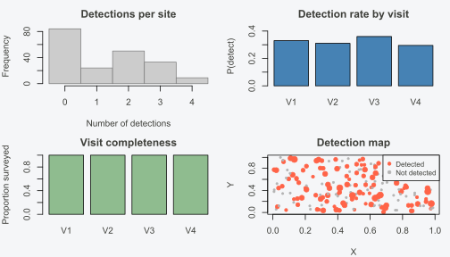
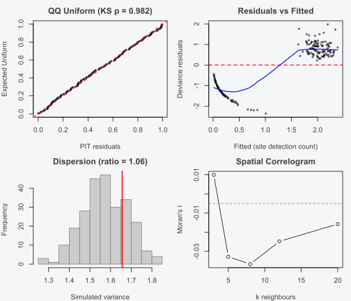
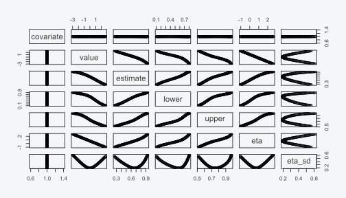

# Quick Start

## Introduction

INLAocc fits hierarchical occupancy models using Integrated Nested
Laplace Approximations (INLA) instead of Markov chain Monte Carlo
(MCMC). The package provides a single entry point —
[`occu()`](https://gillescolling.com/INLAocc/reference/occu.md) — that
handles single-species, multi-species, spatial, and temporal occupancy
models through a familiar formula interface.

Occupancy modeling addresses a fundamental problem in ecology: species
are present at some sites but may go undetected on any given survey
visit. Without accounting for this imperfect detection, naive estimates
of species occurrence are biased low. The occupancy model separates two
processes — the ecological state (is the species truly there?) and the
observation process (did we detect it?) — to produce unbiased estimates
of both occupancy and detection probability.

INLA replaces MCMC sampling with a deterministic approximation to the
posterior distribution. In practice, this means no burn-in period, no
thinning, no convergence diagnostics, and identical results every time
you run the model. For occupancy models of moderate complexity, this
translates to 5–20x speedups over equivalent MCMC implementations while
producing posterior summaries that are nearly indistinguishable from
long MCMC runs.

This vignette walks through the core workflow: simulating data with
known parameters, fitting a basic single-species model, checking the fit
with diagnostics, adding random effects, comparing competing models, and
making predictions. For spatial models with SPDE random fields, see
[`vignette("spatial-models")`](https://gillescolling.com/INLAocc/articles/spatial-models.md).
For multi-species community models, see
[`vignette("multi-species")`](https://gillescolling.com/INLAocc/articles/multi-species.md).
For a full treatment of the diagnostic toolkit, see
[`vignette("diagnostics")`](https://gillescolling.com/INLAocc/articles/diagnostics.md).

## The occupancy model

The standard single-species, single-season occupancy model has two
levels.

**Ecological process (true state).** Each site \\i = 1, \dots, N\\ has a
latent occupancy state \\z_i \in \\0, 1\\\\ drawn from a Bernoulli
distribution:

\\z_i \sim \text{Bernoulli}(\psi_i), \quad \text{logit}(\psi_i) =
\mathbf{x}\_i^\top \boldsymbol{\beta}\\

where \\\psi_i\\ is the occupancy probability at site \\i\\ and
\\\mathbf{x}\_i\\ is a vector of site-level covariates (e.g., elevation,
forest cover) with regression coefficients \\\boldsymbol{\beta}\\.

**Observation process (detection).** At each site \\i\\, we conduct
\\J\\ repeat visits. The observed detection/non-detection \\y\_{ij}\\ on
visit \\j\\ depends on both the true state and a detection probability
\\p\_{ij}\\:

\\y\_{ij} \mid z_i \sim \text{Bernoulli}(z_i \cdot p\_{ij}), \quad
\text{logit}(p\_{ij}) = \mathbf{w}\_{ij}^\top \boldsymbol{\alpha}\\

where \\\mathbf{w}\_{ij}\\ is a vector of visit-level covariates (e.g.,
survey effort, weather) with coefficients \\\boldsymbol{\alpha}\\.

The key constraint is that when \\z_i = 0\\ (species absent), detection
is impossible: \\y\_{ij} = 0\\ for all visits \\j\\, regardless of
\\p\_{ij}\\. When \\z_i = 1\\ (species present), each visit is an
independent Bernoulli trial with success probability \\p\_{ij}\\. A site
where the species was never detected across all visits could be either
truly unoccupied or occupied but missed every time — the model uses the
repeated visits to disentangle these two explanations.

The full likelihood marginalizes over the latent \\z_i\\, producing a
finite mixture that standard INLA cannot fit directly. INLAocc handles
this with an EM algorithm: the E-step computes the posterior probability
\\P(z_i = 1 \mid \mathbf{y}\_i)\\ for each site, and the M-step refits
the occupancy and detection sub-models via INLA using these posterior
weights. After convergence, a short Gibbs data augmentation phase
corrects for the coefficient attenuation inherent in the EM point-mass
approximation, yielding properly calibrated posterior summaries.

## Simulating data

We start by simulating occupancy data with known parameters so we can
verify that the model recovers them. The
[`simulate_occu()`](https://gillescolling.com/INLAocc/reference/simulate_occu.md)
function generates sites, visits, covariates, and detection histories
from the model described above.

``` r

library(INLAocc)

sim <- simulate_occu(
  N = 200, J = 4,
  beta_occ = c(0.5, -0.8, 0.8),
  beta_det = c(0, -0.5),
  seed = 42
)
```

This creates 200 sites with 4 visits each. The occupancy linear
predictor has an intercept of 0.5 and two covariate effects (\\-0.8\\
and \\0.8\\). The detection linear predictor has an intercept of 0
(corresponding to detection probability 0.5 on the logit scale) and one
covariate effect (\\-0.5\\). The function returns a list with the
formatted data (`sim$data`, an `occu_data` object) and the true
parameter values (`sim$truth`).

We can inspect the data with
[`summary()`](https://rdrr.io/r/base/summary.html):

``` r

summary(sim$data)
#> Occupancy data summary
#>   Sites: 200 | Max visits: 4
#>   Observations: 800 | Missing: 0 (0.0%)
#>   Naive occupancy: 0.580 (116 / 200 sites)
#>   Naive detection: 0.558
#> 
#>   Detection frequency (detections per site):
#>  detections sites
#>           0    84
#>           1    24
#>           2    50
#>           3    33
#>           4     9
#> 
#>   Per-visit detection rate: V1=0.33  V2=0.31  V3=0.36  V4=0.29
#>   Coordinates: available
```

The naive occupancy rate (proportion of sites where the species was
detected at least once) is a lower bound on the true occupancy rate —
some occupied sites had the species go undetected across all four
visits. A central goal of the model is to estimate how many of those
“all-zero” sites are actually occupied.

The [`plot()`](https://rdrr.io/r/graphics/plot.default.html) method for
`occu_data` objects produces a panel of histograms showing the
distribution of covariates and the per-site detection frequency:

``` r

plot(sim$data)
```



The detection frequency histogram (number of visits per site where the
species was detected) is the first thing to examine. A distribution
concentrated at zero means either the species is rare or detection
probability is low — the model will try to disentangle these, but
extremely sparse data (say, detections at fewer than 10% of sites) makes
parameter estimation unstable. At the other extreme, if the species is
detected on every visit at most sites, there is little information to
separate occupancy from detection, because the “all-zero” sites that
drive the occupancy estimate are rare.

Check the covariate histograms for extreme skew, outliers, or gaps.
Covariates that are strongly skewed or have a few extreme values can
dominate the linear predictor, pulling fitted probabilities toward 0 or
1 for those observations. Centering and scaling covariates before
fitting (which
[`simulate_occu()`](https://gillescolling.com/INLAocc/reference/simulate_occu.md)
does by default) mitigates this. Also check for missing visits — `NA`
entries in the detection matrix are handled by the likelihood, but sites
with only one valid visit out of four contribute less information about
detection probability, and many such sites can widen credible intervals.

## Fitting the basic model

The [`occu()`](https://gillescolling.com/INLAocc/reference/occu.md)
function takes two formulas: the first specifies occupancy covariates
(right-hand side only), and the second specifies detection covariates.
Intercepts are included automatically in both.

``` r

fit <- occu(~ occ_x1 + occ_x2, ~ det_x1, data = sim$data, verbose = 0)
```

The [`summary()`](https://rdrr.io/r/base/summary.html) method prints the
full posterior summary:

``` r

summary(fit)
#> === Occupancy Model (INLA-Laplace) ===
#> 
#> Sites: 200 | Max visits: 4
#> Naive occupancy: 0.580 | Naive detection: 0.558
#> EM iterations: 23 | Converged: TRUE
#> 
#> --- Occupancy (psi) ---
#>                mean     sd 0.025quant 0.5quant 0.975quant
#> (Intercept)  0.6939 0.1925     0.3167   0.6939     1.0711
#> occ_x1      -0.6416 0.1955    -1.0248  -0.6416    -0.2584
#> occ_x2       0.9066 0.2463     0.4239   0.9066     1.3894
#> 
#> --- Detection (p) ---
#>                mean     sd 0.025quant 0.5quant 0.975quant
#> (Intercept)  0.0113 0.1036    -0.1918   0.0113     0.2144
#> det_x1      -0.3339 0.0965    -0.5230  -0.3339    -0.1448
#> 
#> --- Model Fit ---
#> WAIC:  927.88
#> 
#> Estimated occupancy: 0.642 (0.174 - 0.930)
#> Estimated detection: 0.504 (0.371 - 0.656)
#> Estimated occupied sites: 124.7 / 200
```

**Interpreting the output.** The true occupancy coefficients were
\\\boldsymbol{\beta} = (0.5, -0.8, 0.8)\\ and the true detection
coefficients were \\\boldsymbol{\alpha} = (0, -0.5)\\. Compare the
posterior means to these true values — they should be close, and all 95%
credible intervals should contain the generating values.

The estimated mean occupancy probability is higher than the naive
detection rate, as expected. Accounting for imperfect detection reveals
sites that were occupied but the species went undetected across all four
visits.

The occupancy summary table reports posterior means, standard
deviations, and 95% credible intervals for each coefficient on the logit
scale. The intercept (\\\beta_0\\) sets the baseline occupancy
probability when all covariates are at zero: an intercept of 0.5
corresponds to \\\text{logit}^{-1}(0.5) \approx 0.62\\, meaning about
62% of sites are occupied at the covariate mean. Each slope coefficient
gives the change in log-odds per unit increase in the covariate. A
coefficient of \\-0.8\\ means a one-unit increase drops the log-odds of
occupancy by 0.8, which is a substantial effect — roughly halving the
odds.

The detection intercept has a parallel interpretation. An intercept of 0
translates to \\\text{logit}^{-1}(0) = 0.5\\, meaning a 50% chance of
detecting the species on any single visit when detection covariates are
at zero. This baseline matters for survey design: if per-visit detection
is 0.5 and you have 4 visits, the probability of detecting a present
species at least once is \\1 - (1 - 0.5)^4 = 0.94\\. Pushing detection
above 0.7 per visit (through better survey methods or more effort) would
raise this to 0.99. Conversely, if the detection intercept is strongly
negative (say \\-1.5\\, giving \\p \approx 0.18\\), four visits yield
only a 55% chance of detecting a present species — and the model must
attribute many all-zero sites to missed detections rather than true
absence, widening the occupancy credible intervals.

Because INLA is deterministic, re-running this code produces identical
results — there is no Monte Carlo variability to worry about.

## Checking the fit

Model checking is not optional. A model that converges is not
necessarily a model that fits the data well. INLAocc provides
simulation-based diagnostics through the
[`checkModel()`](https://gillescolling.com/INLAocc/reference/checkModel.md)
function and targeted hypothesis tests through
[`testUniformity()`](https://gillescolling.com/INLAocc/reference/testUniformity.md)
and
[`testDispersion()`](https://gillescolling.com/INLAocc/reference/testDispersion.md).

Occupancy models pose a specific diagnostic challenge. The response
variable is binary (detected or not), so standard residual plots that
assume continuous or count data are misleading. Worse, the ecological
state \\z_i\\ is latent — you never observe whether a site is truly
occupied, only whether the species was detected. This means you cannot
compute traditional residuals that compare observed vs. expected counts
at a site. Simulation-based diagnostics sidestep both problems: they
generate new datasets from the fitted model and compare properties of
the simulated data to the observed data, without requiring
distributional assumptions beyond the model itself.

### Full diagnostic panel

The
[`checkModel()`](https://gillescolling.com/INLAocc/reference/checkModel.md)
function generates posterior predictive simulations and produces a
four-panel diagnostic plot:

``` r

checkModel(fit)
```



The four panels are:

1.  **QQ plot of PIT residuals.** Probability integral transform (PIT)
    residuals should follow a uniform distribution if the model is
    correctly specified. On the QQ plot, this means the points should
    fall along the diagonal. Systematic departures indicate model
    misspecification — an S-shaped curve suggests overdispersion, while
    a step pattern suggests zero-inflation.

2.  **Residuals vs. fitted values.** The scaled residuals plotted
    against predicted detection rates should show no systematic trend. A
    funnel shape or curvature indicates that the variance structure or
    the functional form of the linear predictor is wrong.

3.  **Dispersion test.** The observed residual variance is compared
    against the distribution of variances from simulated data sets
    generated under the fitted model. The observed value (red line)
    should fall within the simulated distribution. A dispersion ratio
    near 1.0 is ideal.

4.  **Outlier test.** Extreme residuals are compared against their
    expected frequency under the model. An excess of outliers suggests
    that some sites behave very differently from the model’s
    predictions.

### Formal hypothesis tests

For a quantitative assessment, use the individual test functions:

``` r

testUniformity(fit)
#> 
#>  Asymptotic one-sample Kolmogorov-Smirnov test
#> 
#> data:  r
#> D = 0.032847, p-value = 0.9823
#> alternative hypothesis: two-sided
```

A non-significant p-value means we cannot reject the hypothesis that the
PIT residuals are uniformly distributed — no evidence of systematic
misspecification.

``` r

testDispersion(fit)
#> 
#>  Simulation-based dispersion test
#> 
#> data:  fit
#> dispersion ratio = 1.0557, p-value = 0.496
#> alternative hypothesis: two.sided
```

A dispersion ratio close to 1 confirms that the model’s assumed variance
matches the observed variance. Ratios substantially above 1 indicate
overdispersion; ratios below 1 indicate underdispersion.

### Posterior predictive check

For a Bayesian goodness-of-fit assessment,
[`ppcOccu()`](https://gillescolling.com/INLAocc/reference/ppcOccu.md)
compares a summary statistic computed on the observed data to the same
statistic computed on data simulated from the posterior:

``` r

ppc <- ppcOccu(fit, fit.stat = "freeman-tukey", group = 1)
ppc$bayesian.p
#> [1] 0
```

A Bayesian p-value near 0.5 means the model generates data whose summary
statistics are centred on the observed values. Values near 0 or 1 signal
systematic misfit. The `group = 1` argument aggregates by site;
`group = 2` aggregates by visit.

In practice, the diagnostic workflow proceeds in layers. Start with
[`checkModel()`](https://gillescolling.com/INLAocc/reference/checkModel.md)
for a visual overview — the four-panel plot catches most forms of
misspecification at a glance. If something looks off, run the targeted
tests
([`testUniformity()`](https://gillescolling.com/INLAocc/reference/testUniformity.md),
[`testDispersion()`](https://gillescolling.com/INLAocc/reference/testDispersion.md))
to quantify the concern. Finally, use
[`ppcOccu()`](https://gillescolling.com/INLAocc/reference/ppcOccu.md)
with different summary statistics (`"freeman-tukey"`, `"chi-square"`)
and grouping variables to probe specific hypotheses about where the
model fails.

## Comparing true vs. estimated parameters

When working with simulated data, the most direct validation is to
compare the estimated coefficients against the known truth. This
parameter recovery step builds confidence that the model and its fitting
algorithm are working correctly.

``` r

truth <- data.frame(
  parameter = c("beta_occ[1]", "beta_occ[2]", "beta_occ[3]",
                "beta_det[1]", "beta_det[2]"),
  true      = c(0.5, -0.8, 0.8, 0, -0.5),
  estimated = c(coef(fit, "occupancy"), coef(fit, "detection"))
)
truth
#>     parameter true   estimated
#> 1 beta_occ[1]  0.5  0.69389649
#> 2 beta_occ[2] -0.8 -0.64156979
#> 3 beta_occ[3]  0.8  0.90662708
#> 4 beta_det[1]  0.0  0.01125177
#> 5 beta_det[2] -0.5 -0.33391604
```

The Gibbs data augmentation correction that runs after the EM algorithm
is responsible for this close recovery — without it, the EM
approximation alone would attenuate the coefficients toward zero.

## Random effects

When data are grouped — sites nested within regions, surveys conducted
by different observers, or species within communities — random effects
capture the between-group variation that fixed effects cannot. In
occupancy models, random effects are common on both the occupancy and
detection sides.

The mathematical extension adds a group-level random intercept to the
linear predictor:

\\\text{logit}(\psi_i) = \mathbf{x}\_i^\top \boldsymbol{\beta} +
u\_{g\[i\]}, \quad u_g \sim \mathcal{N}(0, \sigma^2_u)\\

where \\g\[i\]\\ maps site \\i\\ to its group and \\\sigma^2_u\\
controls how much groups differ after accounting for the fixed-effect
covariates.

INLAocc uses standard mixed-model formula syntax. To add a random
intercept for region:

``` r

# Add a grouping variable to the data
sim$data$occ.covs$region <- sample(1:5, 200, replace = TRUE)

fit_re <- occu(~ occ_x1 + occ_x2 + (1 | region), ~ det_x1,
               data = sim$data, verbose = 0)
summary(fit_re)
#> === Occupancy Model (INLA-Laplace) ===
#> 
#> Sites: 200 | Max visits: 4
#> Naive occupancy: 0.580 | Naive detection: 0.558
#> EM iterations: 39 | Converged: TRUE
#> 
#> --- Occupancy (psi) ---
#>                mean     sd 0.025quant 0.5quant 0.975quant
#> (Intercept)  0.2219 0.3756    -0.5142   0.2219     0.9580
#> occ_x1      -0.6360 0.1808    -0.9904  -0.6360    -0.2816
#> occ_x2       0.7395 0.1989     0.3496   0.7395     1.1295
#> region       0.0988 0.1215    -0.1393   0.0988     0.3368
#> 
#> --- Detection (p) ---
#>                mean     sd 0.025quant 0.5quant 0.975quant
#> (Intercept)  0.1302 0.0974    -0.0607   0.1302     0.3211
#> det_x1      -0.3464 0.0959    -0.5343  -0.3464    -0.1585
#> 
#> --- Hyperparameters (Occupancy) ---
#>                               mean     sd 0.025quant 0.5quant 0.975quant
#> Precision for occ_re_region 0.8281 0.4066     0.2582   0.7546      1.819
#> 
#> --- Model Fit ---
#> WAIC:  918.29
#> 
#> Estimated occupancy: 0.607 (0.195 - 0.895)
#> Estimated detection: 0.533 (0.397 - 0.686)
#> Estimated occupied sites: 121.7 / 200
```

INLA parameterizes random effects in terms of precision (the inverse of
variance). High precision means low between-group variation — the groups
do not differ substantially after accounting for the covariates. This is
expected here, since we simulated the data without any grouping
structure.

To convert precision to a standard deviation, take \\\sigma = 1 /
\sqrt{\tau}\\. A precision of 4 corresponds to \\\sigma = 0.5\\, meaning
groups differ by about 1 unit on the logit scale (\\\pm 2\sigma\\). What
does that look like in practice? If the mean occupancy is 0.5 (logit =
0), a group-level SD of 0.5 shifts the logit to roughly \\-1\\ and
\\+1\\ at the extremes, giving occupancy probabilities between about
0.27 and 0.73 — meaningful ecological variation. A SD of 0.1, by
contrast, keeps all groups between 0.48 and 0.52, which is negligible.
When reporting results, always convert precision to SD for
interpretability. Precision values are useful for INLA’s internal
parameterization but carry no ecological intuition.

The supported random effect syntaxes are:

- `(1 | group)` — random intercept per level of `group`

- `(x | group)` — correlated random intercept and slope for covariate
  `x`

- `(x || group)` — uncorrelated random intercept and slope

- `(1 | a/b)` — nested random effects (random intercept for `b` within
  `a`)

Random effects work on both the occupancy and detection sides of the
model. For example,
`occu(~ elev + (1 | region), ~ (1 | observer), data = dat)` includes a
random intercept for region in occupancy and a random intercept for
observer in detection.

## Model comparison

Selecting among competing model structures is a standard step in any
analysis. INLAocc supports comparison via WAIC (Watanabe-Akaike
Information Criterion), AIC, and BIC. WAIC is the natural choice for
Bayesian models fitted with INLA, as it uses the full posterior
predictive distribution rather than a point estimate.

``` r

m1 <- occu(~ 1, ~ 1, data = sim$data, verbose = 0)
m2 <- occu(~ occ_x1, ~ det_x1, data = sim$data, verbose = 0)
m3 <- occu(~ occ_x1 + occ_x2, ~ det_x1, data = sim$data, verbose = 0)

compare_models(null = m1, simple = m2, full = m3, criterion = "waic")
#>    model    loglik df      AIC      BIC     WAIC n_iter converged    delta
#> 1   full -427.5827  6 867.1654 895.2731 929.2385     21      TRUE  0.00000
#> 2 simple -427.7029  6 867.4059 895.5136 943.5824     19      TRUE 14.34386
#> 3   null -434.7033  5 879.4065 902.8296 963.2039     18      TRUE 33.96540
#>         weight
#> 1 9.992327e-01
#> 2 7.672507e-04
#> 3 4.208944e-08
```

The table ranks models by WAIC (lower is better). The `delta` column
gives the WAIC difference from the best model, and `weight` gives the
Akaike-style model weight. The full model carrying both covariates
should be strongly preferred, confirming that both `occ_x1` and `occ_x2`
contribute meaningful information about occupancy.

For situations where no single model is clearly dominant,
[`modelAverage()`](https://gillescolling.com/INLAocc/reference/modelAverage.md)
computes WAIC-weighted averages of predictions across models:

``` r

avg <- modelAverage(null = m1, simple = m2, full = m3, criterion = "waic")
head(avg$psi_hat)  # weighted-average occupancy probabilities
#>         1         2         3         4         5         6 
#> 0.1150252 0.8185780 0.7824055 0.9032967 0.3536848 0.3914757
```

Model averaging is particularly useful when several models have similar
WAIC values and you want predictions that account for model uncertainty
rather than conditioning on a single “best” structure.

When interpreting the `delta` column (WAIC difference from the best
model), standard rules of thumb from Burnham and Anderson (2002) apply:
a delta below 2 means the models are essentially indistinguishable given
the data, and model averaging is appropriate. A delta between 2 and 7
indicates moderate support for the better model, though the weaker model
may still contribute usefully in an averaging framework. A delta above
10 is strong evidence that the better model fits the data substantially
more accurately, and the weaker model can be dropped from consideration.
These thresholds are guidelines, not bright lines — context and sample
size matter.

### K-fold cross-validation

For out-of-sample validation, pass `k.fold` during fitting:

``` r

fit_cv <- occu(~ occ_x1 + occ_x2, ~ det_x1, data = sim$data,
               k.fold = 5, verbose = 0)
fit_cv$k.fold
```

This holds out 1/5 of sites at a time, refits on the rest, and evaluates
predictions on the held-out sites. K-fold is slower than WAIC (the model
is refit \\k\\ times) but gives a direct estimate of out-of-sample
predictive performance.

## Prediction

### Marginal effects

To understand how a single covariate influences occupancy (or detection)
while holding other covariates at their means, use
[`marginal_effect()`](https://gillescolling.com/INLAocc/reference/marginal_effect.md):

``` r

me <- marginal_effect(fit, "occ_x1")
plot(me)
```



This varies `occ_x1` across its observed range, fixes all other
covariates at their sample means, and computes predicted occupancy
probabilities with 95% credible intervals. The
[`plot()`](https://rdrr.io/r/graphics/plot.default.html) method produces
a ribbon plot with the posterior mean and credible band. Because
`occ_x1` has a negative coefficient, the plot shows occupancy declining
from left to right.

Marginal effects differ from raw coefficient interpretation in an
important way. The coefficients are on the logit scale, where a one-unit
change always corresponds to the same change in log-odds. But on the
probability scale, the effect is nonlinear. A unit increase in a
covariate has the largest impact on probability when the baseline is
near 0.5 (the steepest part of the logistic curve) and a diminishing
impact as the baseline approaches 0 or 1. A coefficient of \\-0.8\\
drops occupancy from 0.62 to 0.43 when the baseline logit is 0.5, but
only from 0.12 to 0.07 when the baseline logit is \\-2\\. Marginal
effect plots capture this nonlinearity directly, showing the actual
probability change across the covariate range rather than a constant
slope.

### Prediction at new covariate values

For predictions at specific covariate combinations, use
[`predict()`](https://rdrr.io/r/stats/predict.html) with a data frame of
new values:

``` r

new_sites <- data.frame(occ_x1 = c(-1, 0, 1), occ_x2 = c(0, 0, 0))
predict(fit, X.0 = new_sites, type = "occupancy")
#> $psi.0
#> $psi.0$mean
#> [1] 0.7917434 0.6668332 0.5130787
#> 
#> $psi.0$sd
#> [1] 0 0 0
#> 
#> $psi.0$quantiles
#>      2.5% 50% 97.5%
#> [1,]  0.5 0.5   0.5
#> [2,]  0.5 0.5   0.5
#> [3,]  0.5 0.5   0.5
#> 
#> $psi.0$samples
#>      [,1] [,2] [,3] [,4] [,5] [,6] [,7] [,8] [,9] [,10] [,11] [,12] [,13] [,14]
#> [1,]  0.5  0.5  0.5  0.5  0.5  0.5  0.5  0.5  0.5   0.5   0.5   0.5   0.5   0.5
#> [2,]  0.5  0.5  0.5  0.5  0.5  0.5  0.5  0.5  0.5   0.5   0.5   0.5   0.5   0.5
#> [3,]  0.5  0.5  0.5  0.5  0.5  0.5  0.5  0.5  0.5   0.5   0.5   0.5   0.5   0.5
#>      [,15] [,16] [,17] [,18] [,19] [,20] [,21] [,22] [,23] [,24] [,25] [,26]
#> [1,]   0.5   0.5   0.5   0.5   0.5   0.5   0.5   0.5   0.5   0.5   0.5   0.5
#> [2,]   0.5   0.5   0.5   0.5   0.5   0.5   0.5   0.5   0.5   0.5   0.5   0.5
#> [3,]   0.5   0.5   0.5   0.5   0.5   0.5   0.5   0.5   0.5   0.5   0.5   0.5
#>      [,27] [,28] [,29] [,30] [,31] [,32] [,33] [,34] [,35] [,36] [,37] [,38]
#> [1,]   0.5   0.5   0.5   0.5   0.5   0.5   0.5   0.5   0.5   0.5   0.5   0.5
#> [2,]   0.5   0.5   0.5   0.5   0.5   0.5   0.5   0.5   0.5   0.5   0.5   0.5
#> [3,]   0.5   0.5   0.5   0.5   0.5   0.5   0.5   0.5   0.5   0.5   0.5   0.5
#>      [,39] [,40] [,41] [,42] [,43] [,44] [,45] [,46] [,47] [,48] [,49] [,50]
#> [1,]   0.5   0.5   0.5   0.5   0.5   0.5   0.5   0.5   0.5   0.5   0.5   0.5
#> [2,]   0.5   0.5   0.5   0.5   0.5   0.5   0.5   0.5   0.5   0.5   0.5   0.5
#> [3,]   0.5   0.5   0.5   0.5   0.5   0.5   0.5   0.5   0.5   0.5   0.5   0.5
#>      [,51] [,52] [,53] [,54] [,55] [,56] [,57] [,58] [,59] [,60] [,61] [,62]
#> [1,]   0.5   0.5   0.5   0.5   0.5   0.5   0.5   0.5   0.5   0.5   0.5   0.5
#> [2,]   0.5   0.5   0.5   0.5   0.5   0.5   0.5   0.5   0.5   0.5   0.5   0.5
#> [3,]   0.5   0.5   0.5   0.5   0.5   0.5   0.5   0.5   0.5   0.5   0.5   0.5
#>      [,63] [,64] [,65] [,66] [,67] [,68] [,69] [,70] [,71] [,72] [,73] [,74]
#> [1,]   0.5   0.5   0.5   0.5   0.5   0.5   0.5   0.5   0.5   0.5   0.5   0.5
#> [2,]   0.5   0.5   0.5   0.5   0.5   0.5   0.5   0.5   0.5   0.5   0.5   0.5
#> [3,]   0.5   0.5   0.5   0.5   0.5   0.5   0.5   0.5   0.5   0.5   0.5   0.5
#>      [,75] [,76] [,77] [,78] [,79] [,80] [,81] [,82] [,83] [,84] [,85] [,86]
#> [1,]   0.5   0.5   0.5   0.5   0.5   0.5   0.5   0.5   0.5   0.5   0.5   0.5
#> [2,]   0.5   0.5   0.5   0.5   0.5   0.5   0.5   0.5   0.5   0.5   0.5   0.5
#> [3,]   0.5   0.5   0.5   0.5   0.5   0.5   0.5   0.5   0.5   0.5   0.5   0.5
#>      [,87] [,88] [,89] [,90] [,91] [,92] [,93] [,94] [,95] [,96] [,97] [,98]
#> [1,]   0.5   0.5   0.5   0.5   0.5   0.5   0.5   0.5   0.5   0.5   0.5   0.5
#> [2,]   0.5   0.5   0.5   0.5   0.5   0.5   0.5   0.5   0.5   0.5   0.5   0.5
#> [3,]   0.5   0.5   0.5   0.5   0.5   0.5   0.5   0.5   0.5   0.5   0.5   0.5
#>      [,99] [,100] [,101] [,102] [,103] [,104] [,105] [,106] [,107] [,108]
#> [1,]   0.5    0.5    0.5    0.5    0.5    0.5    0.5    0.5    0.5    0.5
#> [2,]   0.5    0.5    0.5    0.5    0.5    0.5    0.5    0.5    0.5    0.5
#> [3,]   0.5    0.5    0.5    0.5    0.5    0.5    0.5    0.5    0.5    0.5
#>      [,109] [,110] [,111] [,112] [,113] [,114] [,115] [,116] [,117] [,118]
#> [1,]    0.5    0.5    0.5    0.5    0.5    0.5    0.5    0.5    0.5    0.5
#> [2,]    0.5    0.5    0.5    0.5    0.5    0.5    0.5    0.5    0.5    0.5
#> [3,]    0.5    0.5    0.5    0.5    0.5    0.5    0.5    0.5    0.5    0.5
#>      [,119] [,120] [,121] [,122] [,123] [,124] [,125] [,126] [,127] [,128]
#> [1,]    0.5    0.5    0.5    0.5    0.5    0.5    0.5    0.5    0.5    0.5
#> [2,]    0.5    0.5    0.5    0.5    0.5    0.5    0.5    0.5    0.5    0.5
#> [3,]    0.5    0.5    0.5    0.5    0.5    0.5    0.5    0.5    0.5    0.5
#>      [,129] [,130] [,131] [,132] [,133] [,134] [,135] [,136] [,137] [,138]
#> [1,]    0.5    0.5    0.5    0.5    0.5    0.5    0.5    0.5    0.5    0.5
#> [2,]    0.5    0.5    0.5    0.5    0.5    0.5    0.5    0.5    0.5    0.5
#> [3,]    0.5    0.5    0.5    0.5    0.5    0.5    0.5    0.5    0.5    0.5
#>      [,139] [,140] [,141] [,142] [,143] [,144] [,145] [,146] [,147] [,148]
#> [1,]    0.5    0.5    0.5    0.5    0.5    0.5    0.5    0.5    0.5    0.5
#> [2,]    0.5    0.5    0.5    0.5    0.5    0.5    0.5    0.5    0.5    0.5
#> [3,]    0.5    0.5    0.5    0.5    0.5    0.5    0.5    0.5    0.5    0.5
#>      [,149] [,150] [,151] [,152] [,153] [,154] [,155] [,156] [,157] [,158]
#> [1,]    0.5    0.5    0.5    0.5    0.5    0.5    0.5    0.5    0.5    0.5
#> [2,]    0.5    0.5    0.5    0.5    0.5    0.5    0.5    0.5    0.5    0.5
#> [3,]    0.5    0.5    0.5    0.5    0.5    0.5    0.5    0.5    0.5    0.5
#>      [,159] [,160] [,161] [,162] [,163] [,164] [,165] [,166] [,167] [,168]
#> [1,]    0.5    0.5    0.5    0.5    0.5    0.5    0.5    0.5    0.5    0.5
#> [2,]    0.5    0.5    0.5    0.5    0.5    0.5    0.5    0.5    0.5    0.5
#> [3,]    0.5    0.5    0.5    0.5    0.5    0.5    0.5    0.5    0.5    0.5
#>      [,169] [,170] [,171] [,172] [,173] [,174] [,175] [,176] [,177] [,178]
#> [1,]    0.5    0.5    0.5    0.5    0.5    0.5    0.5    0.5    0.5    0.5
#> [2,]    0.5    0.5    0.5    0.5    0.5    0.5    0.5    0.5    0.5    0.5
#> [3,]    0.5    0.5    0.5    0.5    0.5    0.5    0.5    0.5    0.5    0.5
#>      [,179] [,180] [,181] [,182] [,183] [,184] [,185] [,186] [,187] [,188]
#> [1,]    0.5    0.5    0.5    0.5    0.5    0.5    0.5    0.5    0.5    0.5
#> [2,]    0.5    0.5    0.5    0.5    0.5    0.5    0.5    0.5    0.5    0.5
#> [3,]    0.5    0.5    0.5    0.5    0.5    0.5    0.5    0.5    0.5    0.5
#>      [,189] [,190] [,191] [,192] [,193] [,194] [,195] [,196] [,197] [,198]
#> [1,]    0.5    0.5    0.5    0.5    0.5    0.5    0.5    0.5    0.5    0.5
#> [2,]    0.5    0.5    0.5    0.5    0.5    0.5    0.5    0.5    0.5    0.5
#> [3,]    0.5    0.5    0.5    0.5    0.5    0.5    0.5    0.5    0.5    0.5
#>      [,199] [,200] [,201] [,202] [,203] [,204] [,205] [,206] [,207] [,208]
#> [1,]    0.5    0.5    0.5    0.5    0.5    0.5    0.5    0.5    0.5    0.5
#> [2,]    0.5    0.5    0.5    0.5    0.5    0.5    0.5    0.5    0.5    0.5
#> [3,]    0.5    0.5    0.5    0.5    0.5    0.5    0.5    0.5    0.5    0.5
#>      [,209] [,210] [,211] [,212] [,213] [,214] [,215] [,216] [,217] [,218]
#> [1,]    0.5    0.5    0.5    0.5    0.5    0.5    0.5    0.5    0.5    0.5
#> [2,]    0.5    0.5    0.5    0.5    0.5    0.5    0.5    0.5    0.5    0.5
#> [3,]    0.5    0.5    0.5    0.5    0.5    0.5    0.5    0.5    0.5    0.5
#>      [,219] [,220] [,221] [,222] [,223] [,224] [,225] [,226] [,227] [,228]
#> [1,]    0.5    0.5    0.5    0.5    0.5    0.5    0.5    0.5    0.5    0.5
#> [2,]    0.5    0.5    0.5    0.5    0.5    0.5    0.5    0.5    0.5    0.5
#> [3,]    0.5    0.5    0.5    0.5    0.5    0.5    0.5    0.5    0.5    0.5
#>      [,229] [,230] [,231] [,232] [,233] [,234] [,235] [,236] [,237] [,238]
#> [1,]    0.5    0.5    0.5    0.5    0.5    0.5    0.5    0.5    0.5    0.5
#> [2,]    0.5    0.5    0.5    0.5    0.5    0.5    0.5    0.5    0.5    0.5
#> [3,]    0.5    0.5    0.5    0.5    0.5    0.5    0.5    0.5    0.5    0.5
#>      [,239] [,240] [,241] [,242] [,243] [,244] [,245] [,246] [,247] [,248]
#> [1,]    0.5    0.5    0.5    0.5    0.5    0.5    0.5    0.5    0.5    0.5
#> [2,]    0.5    0.5    0.5    0.5    0.5    0.5    0.5    0.5    0.5    0.5
#> [3,]    0.5    0.5    0.5    0.5    0.5    0.5    0.5    0.5    0.5    0.5
#>      [,249] [,250] [,251] [,252] [,253] [,254] [,255] [,256] [,257] [,258]
#> [1,]    0.5    0.5    0.5    0.5    0.5    0.5    0.5    0.5    0.5    0.5
#> [2,]    0.5    0.5    0.5    0.5    0.5    0.5    0.5    0.5    0.5    0.5
#> [3,]    0.5    0.5    0.5    0.5    0.5    0.5    0.5    0.5    0.5    0.5
#>      [,259] [,260] [,261] [,262] [,263] [,264] [,265] [,266] [,267] [,268]
#> [1,]    0.5    0.5    0.5    0.5    0.5    0.5    0.5    0.5    0.5    0.5
#> [2,]    0.5    0.5    0.5    0.5    0.5    0.5    0.5    0.5    0.5    0.5
#> [3,]    0.5    0.5    0.5    0.5    0.5    0.5    0.5    0.5    0.5    0.5
#>      [,269] [,270] [,271] [,272] [,273] [,274] [,275] [,276] [,277] [,278]
#> [1,]    0.5    0.5    0.5    0.5    0.5    0.5    0.5    0.5    0.5    0.5
#> [2,]    0.5    0.5    0.5    0.5    0.5    0.5    0.5    0.5    0.5    0.5
#> [3,]    0.5    0.5    0.5    0.5    0.5    0.5    0.5    0.5    0.5    0.5
#>      [,279] [,280] [,281] [,282] [,283] [,284] [,285] [,286] [,287] [,288]
#> [1,]    0.5    0.5    0.5    0.5    0.5    0.5    0.5    0.5    0.5    0.5
#> [2,]    0.5    0.5    0.5    0.5    0.5    0.5    0.5    0.5    0.5    0.5
#> [3,]    0.5    0.5    0.5    0.5    0.5    0.5    0.5    0.5    0.5    0.5
#>      [,289] [,290] [,291] [,292] [,293] [,294] [,295] [,296] [,297] [,298]
#> [1,]    0.5    0.5    0.5    0.5    0.5    0.5    0.5    0.5    0.5    0.5
#> [2,]    0.5    0.5    0.5    0.5    0.5    0.5    0.5    0.5    0.5    0.5
#> [3,]    0.5    0.5    0.5    0.5    0.5    0.5    0.5    0.5    0.5    0.5
#>      [,299] [,300] [,301] [,302] [,303] [,304] [,305] [,306] [,307] [,308]
#> [1,]    0.5    0.5    0.5    0.5    0.5    0.5    0.5    0.5    0.5    0.5
#> [2,]    0.5    0.5    0.5    0.5    0.5    0.5    0.5    0.5    0.5    0.5
#> [3,]    0.5    0.5    0.5    0.5    0.5    0.5    0.5    0.5    0.5    0.5
#>      [,309] [,310] [,311] [,312] [,313] [,314] [,315] [,316] [,317] [,318]
#> [1,]    0.5    0.5    0.5    0.5    0.5    0.5    0.5    0.5    0.5    0.5
#> [2,]    0.5    0.5    0.5    0.5    0.5    0.5    0.5    0.5    0.5    0.5
#> [3,]    0.5    0.5    0.5    0.5    0.5    0.5    0.5    0.5    0.5    0.5
#>      [,319] [,320] [,321] [,322] [,323] [,324] [,325] [,326] [,327] [,328]
#> [1,]    0.5    0.5    0.5    0.5    0.5    0.5    0.5    0.5    0.5    0.5
#> [2,]    0.5    0.5    0.5    0.5    0.5    0.5    0.5    0.5    0.5    0.5
#> [3,]    0.5    0.5    0.5    0.5    0.5    0.5    0.5    0.5    0.5    0.5
#>      [,329] [,330] [,331] [,332] [,333] [,334] [,335] [,336] [,337] [,338]
#> [1,]    0.5    0.5    0.5    0.5    0.5    0.5    0.5    0.5    0.5    0.5
#> [2,]    0.5    0.5    0.5    0.5    0.5    0.5    0.5    0.5    0.5    0.5
#> [3,]    0.5    0.5    0.5    0.5    0.5    0.5    0.5    0.5    0.5    0.5
#>      [,339] [,340] [,341] [,342] [,343] [,344] [,345] [,346] [,347] [,348]
#> [1,]    0.5    0.5    0.5    0.5    0.5    0.5    0.5    0.5    0.5    0.5
#> [2,]    0.5    0.5    0.5    0.5    0.5    0.5    0.5    0.5    0.5    0.5
#> [3,]    0.5    0.5    0.5    0.5    0.5    0.5    0.5    0.5    0.5    0.5
#>      [,349] [,350] [,351] [,352] [,353] [,354] [,355] [,356] [,357] [,358]
#> [1,]    0.5    0.5    0.5    0.5    0.5    0.5    0.5    0.5    0.5    0.5
#> [2,]    0.5    0.5    0.5    0.5    0.5    0.5    0.5    0.5    0.5    0.5
#> [3,]    0.5    0.5    0.5    0.5    0.5    0.5    0.5    0.5    0.5    0.5
#>      [,359] [,360] [,361] [,362] [,363] [,364] [,365] [,366] [,367] [,368]
#> [1,]    0.5    0.5    0.5    0.5    0.5    0.5    0.5    0.5    0.5    0.5
#> [2,]    0.5    0.5    0.5    0.5    0.5    0.5    0.5    0.5    0.5    0.5
#> [3,]    0.5    0.5    0.5    0.5    0.5    0.5    0.5    0.5    0.5    0.5
#>      [,369] [,370] [,371] [,372] [,373] [,374] [,375] [,376] [,377] [,378]
#> [1,]    0.5    0.5    0.5    0.5    0.5    0.5    0.5    0.5    0.5    0.5
#> [2,]    0.5    0.5    0.5    0.5    0.5    0.5    0.5    0.5    0.5    0.5
#> [3,]    0.5    0.5    0.5    0.5    0.5    0.5    0.5    0.5    0.5    0.5
#>      [,379] [,380] [,381] [,382] [,383] [,384] [,385] [,386] [,387] [,388]
#> [1,]    0.5    0.5    0.5    0.5    0.5    0.5    0.5    0.5    0.5    0.5
#> [2,]    0.5    0.5    0.5    0.5    0.5    0.5    0.5    0.5    0.5    0.5
#> [3,]    0.5    0.5    0.5    0.5    0.5    0.5    0.5    0.5    0.5    0.5
#>      [,389] [,390] [,391] [,392] [,393] [,394] [,395] [,396] [,397] [,398]
#> [1,]    0.5    0.5    0.5    0.5    0.5    0.5    0.5    0.5    0.5    0.5
#> [2,]    0.5    0.5    0.5    0.5    0.5    0.5    0.5    0.5    0.5    0.5
#> [3,]    0.5    0.5    0.5    0.5    0.5    0.5    0.5    0.5    0.5    0.5
#>      [,399] [,400] [,401] [,402] [,403] [,404] [,405] [,406] [,407] [,408]
#> [1,]    0.5    0.5    0.5    0.5    0.5    0.5    0.5    0.5    0.5    0.5
#> [2,]    0.5    0.5    0.5    0.5    0.5    0.5    0.5    0.5    0.5    0.5
#> [3,]    0.5    0.5    0.5    0.5    0.5    0.5    0.5    0.5    0.5    0.5
#>      [,409] [,410] [,411] [,412] [,413] [,414] [,415] [,416] [,417] [,418]
#> [1,]    0.5    0.5    0.5    0.5    0.5    0.5    0.5    0.5    0.5    0.5
#> [2,]    0.5    0.5    0.5    0.5    0.5    0.5    0.5    0.5    0.5    0.5
#> [3,]    0.5    0.5    0.5    0.5    0.5    0.5    0.5    0.5    0.5    0.5
#>      [,419] [,420] [,421] [,422] [,423] [,424] [,425] [,426] [,427] [,428]
#> [1,]    0.5    0.5    0.5    0.5    0.5    0.5    0.5    0.5    0.5    0.5
#> [2,]    0.5    0.5    0.5    0.5    0.5    0.5    0.5    0.5    0.5    0.5
#> [3,]    0.5    0.5    0.5    0.5    0.5    0.5    0.5    0.5    0.5    0.5
#>      [,429] [,430] [,431] [,432] [,433] [,434] [,435] [,436] [,437] [,438]
#> [1,]    0.5    0.5    0.5    0.5    0.5    0.5    0.5    0.5    0.5    0.5
#> [2,]    0.5    0.5    0.5    0.5    0.5    0.5    0.5    0.5    0.5    0.5
#> [3,]    0.5    0.5    0.5    0.5    0.5    0.5    0.5    0.5    0.5    0.5
#>      [,439] [,440] [,441] [,442] [,443] [,444] [,445] [,446] [,447] [,448]
#> [1,]    0.5    0.5    0.5    0.5    0.5    0.5    0.5    0.5    0.5    0.5
#> [2,]    0.5    0.5    0.5    0.5    0.5    0.5    0.5    0.5    0.5    0.5
#> [3,]    0.5    0.5    0.5    0.5    0.5    0.5    0.5    0.5    0.5    0.5
#>      [,449] [,450] [,451] [,452] [,453] [,454] [,455] [,456] [,457] [,458]
#> [1,]    0.5    0.5    0.5    0.5    0.5    0.5    0.5    0.5    0.5    0.5
#> [2,]    0.5    0.5    0.5    0.5    0.5    0.5    0.5    0.5    0.5    0.5
#> [3,]    0.5    0.5    0.5    0.5    0.5    0.5    0.5    0.5    0.5    0.5
#>      [,459] [,460] [,461] [,462] [,463] [,464] [,465] [,466] [,467] [,468]
#> [1,]    0.5    0.5    0.5    0.5    0.5    0.5    0.5    0.5    0.5    0.5
#> [2,]    0.5    0.5    0.5    0.5    0.5    0.5    0.5    0.5    0.5    0.5
#> [3,]    0.5    0.5    0.5    0.5    0.5    0.5    0.5    0.5    0.5    0.5
#>      [,469] [,470] [,471] [,472] [,473] [,474] [,475] [,476] [,477] [,478]
#> [1,]    0.5    0.5    0.5    0.5    0.5    0.5    0.5    0.5    0.5    0.5
#> [2,]    0.5    0.5    0.5    0.5    0.5    0.5    0.5    0.5    0.5    0.5
#> [3,]    0.5    0.5    0.5    0.5    0.5    0.5    0.5    0.5    0.5    0.5
#>      [,479] [,480] [,481] [,482] [,483] [,484] [,485] [,486] [,487] [,488]
#> [1,]    0.5    0.5    0.5    0.5    0.5    0.5    0.5    0.5    0.5    0.5
#> [2,]    0.5    0.5    0.5    0.5    0.5    0.5    0.5    0.5    0.5    0.5
#> [3,]    0.5    0.5    0.5    0.5    0.5    0.5    0.5    0.5    0.5    0.5
#>      [,489] [,490] [,491] [,492] [,493] [,494] [,495] [,496] [,497] [,498]
#> [1,]    0.5    0.5    0.5    0.5    0.5    0.5    0.5    0.5    0.5    0.5
#> [2,]    0.5    0.5    0.5    0.5    0.5    0.5    0.5    0.5    0.5    0.5
#> [3,]    0.5    0.5    0.5    0.5    0.5    0.5    0.5    0.5    0.5    0.5
#>      [,499] [,500]
#> [1,]    0.5    0.5
#> [2,]    0.5    0.5
#> [3,]    0.5    0.5
#> 
#> 
#> $z.0
#> $z.0$mean
#> [1] 1 1 1
```

The predicted occupancy decreases as `occ_x1` increases, reflecting the
negative effect of this covariate. All predictions are on the
probability scale (inverse-logit of the linear predictor), with
quantile-based credible intervals.

The `terms` argument offers a more concise syntax for marginal
prediction grids, similar to `ggeffects::ggpredict()`:

``` r

predict(fit, terms = "occ_x1 [-2:2 by=0.5]")
#>      x  estimate     lower     upper
#> 1 -2.0 0.8794537 0.7564020 0.9448766
#> 2 -1.5 0.8411062 0.7268976 0.9132536
#> 3 -1.0 0.7934252 0.6916729 0.8680059
#> 4 -0.5 0.7359283 0.6460631 0.8096974
#> 5  0.0 0.6691021 0.5809945 0.7467582
#> 6  0.5 0.5946789 0.4900535 0.6913579
#> 7  1.0 0.5156342 0.3833892 0.6457254
#> 8  1.5 0.4357994 0.2797362 0.6057102
#> 9  2.0 0.3591598 0.1925966 0.5683692
```

## S3 methods

Fitted `occu_inla` objects support the standard R model interface,
making them interoperable with tools you already know:

| Method | Description |
|:---|:---|
| `summary(fit)` | Full posterior summary with model fit statistics |
| `coef(fit)` | Posterior means of fixed effects |
| `confint(fit)` | Credible intervals for fixed effects |
| `fitted(fit)` | Fitted occupancy and detection probabilities |
| `residuals(fit)` | Residuals (Pearson or PIT) |
| `predict(fit, X.0 = ...)` | Prediction at new covariate values |
| `plot(fit)` | Four-panel diagnostic plot (EM trace, psi, p, z vs. naive) |
| `logLik(fit)` | Marginal log-likelihood |
| `nobs(fit)` | Number of sites |
| `vcov(fit)` | Posterior variance-covariance matrix |
| `simulate(fit)` | Simulate new detection histories from the fitted model |
| `update(fit, ~ . - occ_x2)` | Refit with a modified formula |
| `tidy(fit)` / `glance(fit)` | Tidy summaries (broom-compatible) |
| `ranef(fit)` | Extract random effect posteriors |

## What’s next

This vignette covered the core single-species workflow. A recommended
analysis sequence: start with the intercept-only model to establish
baseline occupancy and detection rates, then add covariates guided by
ecological hypotheses. Check diagnostics at each step — a model that
fits well without covariates but fails after adding them suggests a
misspecified functional form (e.g., a quadratic effect forced through a
linear term). Add random effects only when the study design includes
genuine grouping structure, not as a generic variance sponge. Compare
models with WAIC, and report marginal effects rather than raw
coefficients for biological interpretation.

INLAocc supports substantially more complex models through the same
[`occu()`](https://gillescolling.com/INLAocc/reference/occu.md)
interface:

- **Spatial models.** When sites are spatially correlated, add an SPDE
  random field by passing coordinates to the `spatial` argument. See
  [`vignette("spatial-models")`](https://gillescolling.com/INLAocc/articles/spatial-models.md)
  for the full treatment, including mesh construction, spatially varying
  coefficients, and spatial prediction maps.

- **Multi-species models.** Community occupancy models that share
  information across species, with optional latent factor structure. See
  [`vignette("multi-species")`](https://gillescolling.com/INLAocc/articles/multi-species.md).

- **Diagnostics deep dive.** The full suite of simulation-based
  diagnostics, including spatial residual analysis, temporal
  autocorrelation tests, and posterior predictive checks. See
  [`vignette("diagnostics")`](https://gillescolling.com/INLAocc/articles/diagnostics.md).

- **Migrating from spOccupancy.** If you are switching from an
  MCMC-based workflow,
  [`vignette("spoccupancy-migration")`](https://gillescolling.com/INLAocc/articles/spoccupancy-migration.md)
  maps spOccupancy’s function names, data formats, and output structures
  to their INLAocc equivalents.
