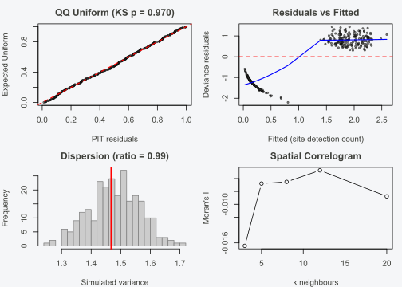

# Spatial Occupancy Models

## Introduction

Species detection/non-detection data are collected at sites distributed
across a landscape, and nearby sites tend to share unmeasured
environmental conditions. When this spatial dependence is ignored,
occupancy models treat sites as independent replicates — an assumption
that is almost always wrong. The consequences are real: residual spatial
autocorrelation inflates effective sample size, producing confidence
intervals that are too narrow and fixed-effect estimates that may be
biased. If a covariate of interest is itself spatially structured, the
bias can be substantial.

INLAocc handles spatial structure through the SPDE (Stochastic Partial
Differential Equations) approximation to a continuous Gaussian random
field. Rather than working with a dense \\N \times N\\ covariance matrix
(which becomes intractable for large \\N\\), the SPDE approach
represents the spatial field as a piecewise linear function over a
triangulation mesh. This yields a sparse precision matrix that INLA can
exploit for fast, exact inference. The mesh is built automatically from
site coordinates, or you can construct it manually for full control.

This vignette covers the full spatial modelling workflow: fitting SPDE
models, tuning the mesh and PC priors, mapping occupancy, predicting at
new locations, checking spatial residuals, areal (CAR/BYM2) models for
regional data, spatially varying coefficients, and space-time
extensions. For general model diagnostics beyond the spatial context,
see
[`vignette("diagnostics")`](https://gillescolling.com/INLAocc/articles/diagnostics.md).

## The spatial occupancy model

The standard single-season occupancy model with a spatial random effect
is:

\\z_i \sim \text{Bernoulli}(\psi_i), \quad \text{logit}(\psi_i) =
\mathbf{x}\_i^\top \boldsymbol{\beta} + w(\mathbf{s}\_i)\\

\\y\_{ij} \mid z_i \sim \text{Bernoulli}(z_i \cdot p\_{ij}), \quad
\text{logit}(p\_{ij}) = \mathbf{w}\_{ij}^\top \boldsymbol{\alpha}\\

where \\z_i\\ is the true (latent) occupancy state at site \\i\\,
\\\psi_i\\ is the occupancy probability, \\y\_{ij}\\ is the observed
detection/non-detection at site \\i\\ during visit \\j\\, and
\\p\_{ij}\\ is the detection probability.

The spatial component \\w(\mathbf{s})\\ is a Gaussian random field (GRF)
with zero mean and Matern covariance function:

\\\text{Cov}(w(\mathbf{s}\_1), w(\mathbf{s}\_2)) = \sigma^2
\frac{2^{1-\nu}}{\Gamma(\nu)} \left(\kappa \\\mathbf{s}\_1 -
\mathbf{s}\_2\\\right)^\nu K\_\nu\left(\kappa \\\mathbf{s}\_1 -
\mathbf{s}\_2\\\right)\\

The three parameters have intuitive interpretations:

- \\\sigma^2\\ is the **marginal variance** of the spatial field — how
  much spatial variation there is on the logit-occupancy scale.
- \\\kappa\\ is a **scale parameter** that relates to the practical
  correlation range via \\\rho = \sqrt{8\nu}/\kappa\\. The practical
  range \\\rho\\ is the distance at which the Matern correlation drops
  to approximately 0.1.
- \\\nu\\ controls **smoothness**. For the 2D SPDE approximation,
  \\\nu\\ is fixed at 1 (corresponding to \\\alpha = 2\\), giving a
  once-differentiable field.

**The SPDE trick.** Rather than evaluating the dense covariance matrix,
the SPDE approach solves a stochastic PDE whose stationary solution has
the Matern covariance. The solution is approximated as a piecewise
linear function over a triangulation mesh, yielding a sparse precision
matrix \\\mathbf{Q}\\ with \\O(n)\\ non-zero entries (where \\n\\ is the
number of mesh nodes). This sparsity is what makes INLA fast: the
Cholesky factorisation of \\\mathbf{Q}\\ scales as \\O(n^{3/2})\\ in 2D,
compared to \\O(N^3)\\ for the dense approach.

## Why spatial matters — a motivating example

To see what goes wrong when spatial structure is ignored, we simulate
data with a known spatial field, then fit a model without the spatial
term.

``` r

library(INLAocc)

sim <- simulate_occu(N = 300, J = 4,
                     n_occ_covs = 1, n_det_covs = 1,
                     beta_occ = c(0.5, -0.8),
                     beta_det = c(0, -0.5),
                     spatial_range = 0.3, seed = 42)
```

The simulated data has 300 sites with 4 visits each. The true occupancy
intercept is 0.5, the effect of `occ_x1` is -0.8, and there is spatial
autocorrelation with a practical range of 0.3 (in coordinate units).

### Fitting without the spatial effect

``` r

fit_nospatial <- occu(~ occ_x1, ~ det_x1, data = sim$data, verbose = 0)
moranI(fit_nospatial)
#> 
#>  Moran's I (inverse-distance weights)
#> 
#> data:  fit_nospatial
#> Moran's I = 0.018479, Expected I = -0.0033445, p-value = 0.008853
#> alternative hypothesis: two.sided
```

If Moran’s I is significantly positive with a p-value near zero, the
residuals are spatially autocorrelated. The non-spatial model has left
systematic spatial structure on the table. This does not just violate an
assumption — it means the reported standard errors are too small and the
95% credible intervals are too narrow to be trusted.

## Fitting the SPDE model

Adding the spatial effect is a single argument:

``` r

fit <- occu(~ occ_x1, ~ det_x1, data = sim$data,
            spatial = sim$data$coords, verbose = 0)
summary(fit)
#> === Occupancy Model (INLA-Laplace) ===
#> 
#> Sites: 300 | Max visits: 4
#> Naive occupancy: 0.610 | Naive detection: 0.514
#> EM iterations: 2 | Converged: TRUE
#> 
#> --- Occupancy (psi) ---
#>                mean     sd 0.025quant 0.5quant 0.975quant
#> (Intercept)  0.3176 0.1922    -0.0592   0.3176     0.6944
#> occ_x1      -0.7750 0.1819    -1.1315  -0.7750    -0.4185
#> 
#> --- Detection (p) ---
#>                mean     sd 0.025quant 0.5quant 0.975quant
#> (Intercept) -0.1011 0.0821    -0.2620  -0.1011     0.0597
#> det_x1      -0.4931 0.0790    -0.6479  -0.4931    -0.3384
#> 
#> --- Hyperparameters (Occupancy) ---
#>                     mean     sd 0.025quant 0.5quant 0.975quant
#> Range for spatial 0.9341 2.2519     0.0419   0.3743     5.4003
#> Stdev for spatial 0.1697 0.1478     0.0235   0.1279     0.5616
#> 
#> --- Model Fit ---
#> WAIC:  1402.57
#> 
#> Estimated occupancy: 0.649 (0.329 - 0.911)
#> Estimated detection: 0.479 (0.286 - 0.693)
#> Estimated occupied sites: 195.3 / 300
#> 
#> --- Spatial Component (SPDE) ---
#> Mesh nodes: 740
#>                     mean     sd 0.025quant 0.975quant
#> Range for spatial 0.9341 2.2519     0.0419     5.4003
#> Stdev for spatial 0.1697 0.1478     0.0235     0.5616
```

Several things to note:

- **Fixed effects should be recovered well.** The true occupancy
  intercept is 0.5 and the true `occ_x1` effect is -0.8. Both credible
  intervals should contain the true values.
- **The spatial range should be recovered.** The true range was 0.3; the
  posterior should be close to this value. The model correctly
  identifies the scale of spatial correlation.
- **Intervals are wider than the non-spatial model.** This is correct
  behaviour: accounting for spatial dependence reduces the effective
  sample size, producing more honest uncertainty.
- **A substantial spatial SD** confirms that the spatial field explains
  meaningful variation in occupancy.

You can extract the spatial range and standard deviation directly:

``` r

spatialRange(fit)
#>            mean       sd       q025      q975
#> range 0.9340845 2.251909 0.04194751 5.4003295
#> stdev 0.1697476 0.147844 0.02346154 0.5616363
```

### Verifying the spatial residuals

``` r

moranI(fit)
#> 
#>  Moran's I (inverse-distance weights)
#> 
#> data:  fit
#> Moran's I = -0.00439, Expected I = -0.0033445, p-value = 0.9002
#> alternative hypothesis: two.sided
```

Moran’s I should have dropped substantially and should no longer be
significant. The spatial model has absorbed the autocorrelation.

The empirical semivariogram tells the same story:

``` r

variogram(fit)
#>          dist    gamma n.pairs
#> 1  0.02261495 1.211126     283
#> 2  0.06784484 1.155622     784
#> 3  0.11307473 1.165627    1189
#> 4  0.15830462 1.123434    1612
#> 5  0.20353451 1.122068    1828
#> 6  0.24876440 1.114394    2049
#> 7  0.29399429 1.110758    2224
#> 8  0.33922418 1.105457    2381
#> 9  0.38445407 1.105001    2556
#> 10 0.42968396 1.095276    2647
#> 11 0.47491385 1.117407    2657
#> 12 0.52014374 1.114540    2660
#> 13 0.56537363 1.149280    2681
#> 14 0.61060352 1.147667    2527
#> 15 0.65583341 1.112152    2527
```

A flat line at the sill confirms that no residual spatial trend remains.
If the variogram still shows an increasing trend at short distances, the
mesh may be too coarse or the range prior too restrictive — see the next
section.

For the full diagnostic panel (residuals, Moran’s I, Q-Q plot, DHARMa):

``` r

checkModel(fit)
```



## Controlling the mesh

The automatic mesh works well for most datasets. INLAocc scales
`max.edge` to roughly 1/20th (inner) and 1/5th (outer) of the coordinate
extent, with a cutoff of `max.edge[1] / 5`. This is adequate when sites
are reasonably spread across the study area.

You may need manual control when:

- **Sites are clustered** (e.g., along roads or rivers) — the auto-mesh
  may waste nodes in empty regions.

- **The study extent is very large** — a coarser mesh saves computation.

- **You have strong prior knowledge** about the spatial range — tighter
  PC priors can stabilise estimation.

Use
[`occu_spatial()`](https://gillescolling.com/INLAocc/reference/occu_spatial.md)
to pre-build the mesh:

``` r

sp <- occu_spatial(sim$data$coords,
                   max.edge = c(0.05, 0.2),
                   cutoff = 0.01,
                   prior.range = c(0.2, 0.5),
                   prior.sigma = c(1, 0.05))
sp
#> SPDE spatial component (occu_spatial)
#>   Sites:      300
#>   Mesh nodes: 2388
#>   Max edge:   [0.050, 0.200]
#>   PC prior range: P(range < 0.20) = 0.50
#>   PC prior sigma: P(sigma > 1.00) = 0.05
```

Then pass the pre-built object to
[`occu()`](https://gillescolling.com/INLAocc/reference/occu.md):

``` r

fit <- occu(~ occ_x1, ~ det_x1, data = sim$data, spatial = sp, verbose = 0)
```

### PC priors for the spatial field

The PC (penalizing complexity) priors deserve explanation because they
directly influence how much spatial structure the model captures.

**`prior.range = c(r0, p)`** encodes \\P(\rho \< r_0) = p\\, where
\\\rho\\ is the practical correlation range. This sets a lower bound on
the spatial scale: if you believe the range is unlikely to be shorter
than 0.2 (in your coordinate units), set `prior.range = c(0.2, 0.5)`. A
tighter prior (e.g., `c(0.2, 0.01)`) strongly penalises very short-range
fluctuations.

**`prior.sigma = c(s0, p)`** encodes \\P(\sigma \> s_0) = p\\, where
\\\sigma\\ is the marginal standard deviation of the spatial field. This
sets an upper bound on the spatial variance: `prior.sigma = c(1, 0.05)`
means you believe the spatial SD is unlikely to exceed 1 on the logit
scale.

The logic behind PC priors is shrinkage toward the **base model** — in
this case, no spatial effect at all (\\\sigma = 0\\). This prevents the
spatial field from soaking up variation that properly belongs to
fixed-effect covariates. When in doubt, use weakly informative priors
(the defaults) and let the data speak.

**Units matter.** If your coordinates are in UTM metres, the range prior
should be in metres. If they are in decimal degrees, the prior is in
degrees. Rescaling coordinates to a \[0, 1\] box can simplify prior
elicitation.

### Quick mesh tweaks via `spde.args`

For minor adjustments without building a full
[`occu_spatial()`](https://gillescolling.com/INLAocc/reference/occu_spatial.md)
object, pass mesh arguments directly:

``` r

fit <- occu(~ occ_x1, ~ det_x1, data = sim$data,
            spatial = sim$data$coords,
            spde.args = list(max.edge = c(0.05, 0.2)),
            verbose = 0)
```

## Occupancy maps

After fitting a spatial model,
[`occuMap()`](https://gillescolling.com/INLAocc/reference/occuMap.md)
produces publication-quality maps by projecting the spatial field and
fixed effects onto a regular grid:

``` r

occuMap(fit)                          # occupancy probability
```


``` r

occuMap(fit, type = "sd")             # posterior uncertainty
```


``` r

occuMap(fit, type = "spatial")        # spatial random effect only
```


``` r

occuMap(fit, type = "all")            # 2-panel: psi + sd
```


Each map type serves a different purpose:

- **`"psi"`** (default): the predicted occupancy probability
  \\\hat{\psi}\\ at each grid cell, combining fixed effects and the
  spatial field. This is the primary output for conservation or
  management applications.
- **`"sd"`**: the posterior standard deviation of \\\psi\\.
  High-uncertainty regions are candidates for additional survey effort.
- **`"spatial"`**: the spatial random effect \\w(\mathbf{s})\\ alone,
  centred at zero. This reveals spatial patterns not explained by the
  covariates — essentially, where occupancy is higher or lower than the
  covariates predict. Symmetric colour scale (blue-white-red) with zero
  as white.
- **`"all"`**: a side-by-side panel of `"psi"` and `"sd"`.

All maps overlay observed sites, coloured by whether the species was
detected (filled circles) or not (open circles). The returned object
(invisible) contains the gridded values for custom plotting.

## Spatial prediction at new locations

To predict occupancy at unsampled locations — for instance, a regular
grid covering the study area — use
[`predict_spatial()`](https://gillescolling.com/INLAocc/reference/predict_spatial.md):

``` r

new_coords <- expand.grid(
  x = seq(0, 1, by = 0.02),
  y = seq(0, 1, by = 0.02)
)
new_covs <- data.frame(occ_x1 = 0)  # hold covariate at its mean

preds <- predict_spatial(fit, newcoords = new_coords, newocc.covs = new_covs)
head(preds)
#> $psi.0
#> $psi.0$mean
#>    [1] 0.5757784 0.5752092 0.5746641 0.5744713 0.5745993 0.5745707 0.5749833
#>    [8] 0.5756953 0.5756423 0.5754109 0.5750172 0.5747879 0.5748914 0.5751940
#>   [15] 0.5753115 0.5752336 0.5749397 0.5747644 0.5745048 0.5741548 0.5737343
#>   [22] 0.5733809 0.5729706 0.5726854 0.5725147 0.5726507 0.5727987 0.5730731
#>   [29] 0.5731785 0.5732961 0.5731625 0.5728649 0.5725234 0.5722511 0.5719762
#>   [36] 0.5718654 0.5721591 0.5729265 0.5742924 0.5760336 0.5779636 0.5797231
#>   [43] 0.5813757 0.5831370 0.5846335 0.5862937 0.5876689 0.5889773 0.5898819
#>   [50] 0.5902754 0.5903100 0.5760573 0.5756984 0.5749970 0.5750210 0.5752953
#>   [57] 0.5756045 0.5760588 0.5765553 0.5761351 0.5759122 0.5754535 0.5748692
#>   [64] 0.5752238 0.5755517 0.5757507 0.5754839 0.5751618 0.5750530 0.5745720
#>   [71] 0.5741033 0.5736041 0.5729732 0.5724510 0.5720959 0.5719495 0.5721498
#>   [78] 0.5723512 0.5728616 0.5731248 0.5732034 0.5730533 0.5726147 0.5720474
#>   [85] 0.5715602 0.5710745 0.5709036 0.5708709 0.5717399 0.5735726 0.5755218
#>   [92] 0.5776131 0.5796042 0.5815402 0.5833121 0.5851621 0.5868830 0.5885724
#>   [99] 0.5900334 0.5909805 0.5912245 0.5913551 0.5765330 0.5761793 0.5759750
#>  [106] 0.5762612 0.5767080 0.5771456 0.5775848 0.5777676 0.5774067 0.5768293
#>  [113] 0.5761105 0.5757900 0.5759852 0.5762758 0.5762355 0.5759691 0.5757068
#>  [120] 0.5752267 0.5747568 0.5741014 0.5734137 0.5727090 0.5720759 0.5716867
#>  [127] 0.5715335 0.5716178 0.5725943 0.5730471 0.5732656 0.5733236 0.5731601
#>  [134] 0.5726444 0.5717736 0.5709267 0.5703939 0.5699349 0.5701531 0.5710693
#>  [141] 0.5729351 0.5752443 0.5773592 0.5794753 0.5814842 0.5833495 0.5855220
#>  [148] 0.5874050 0.5892994 0.5906220 0.5916001 0.5918343 0.5917407 0.5770860
#>  [155] 0.5771668 0.5771095 0.5775964 0.5781918 0.5787345 0.5789777 0.5789108
#>  [162] 0.5784653 0.5777799 0.5768574 0.5767492 0.5768001 0.5769132 0.5767392
#>  [169] 0.5764539 0.5760185 0.5755202 0.5749257 0.5742386 0.5734502 0.5726419
#>  [176] 0.5718309 0.5714270 0.5714228 0.5721113 0.5728499 0.5735560 0.5739869
#>  [183] 0.5738126 0.5736120 0.5728582 0.5720248 0.5705946 0.5697890 0.5694891
#>  [190] 0.5698208 0.5706562 0.5726802 0.5749425 0.5772853 0.5794224 0.5813971
#>  [197] 0.5837398 0.5859604 0.5880563 0.5900214 0.5911536 0.5920607 0.5921425
#>  [204] 0.5920792 0.5776916 0.5779079 0.5782675 0.5788945 0.5796025 0.5802063
#>  [211] 0.5800563 0.5800026 0.5794762 0.5789385 0.5782415 0.5779862 0.5778364
#>  [218] 0.5776939 0.5773366 0.5769548 0.5764417 0.5758476 0.5751538 0.5744551
#>  [225] 0.5737177 0.5730755 0.5724545 0.5720703 0.5723586 0.5730646 0.5738125
#>  [232] 0.5743852 0.5747764 0.5747161 0.5745855 0.5736264 0.5724580 0.5711215
#>  [239] 0.5698577 0.5695078 0.5700514 0.5707995 0.5730538 0.5753793 0.5776626
#>  [246] 0.5796436 0.5814473 0.5838503 0.5865284 0.5886788 0.5905917 0.5916861
#>  [253] 0.5924361 0.5924117 0.5923554 0.5783820 0.5788270 0.5794127 0.5800578
#>  [260] 0.5807459 0.5812748 0.5812639 0.5810902 0.5807365 0.5802279 0.5797856
#>  [267] 0.5793591 0.5790881 0.5787650 0.5781797 0.5776818 0.5771260 0.5763343
#>  [274] 0.5755508 0.5748121 0.5741277 0.5735919 0.5730688 0.5731025 0.5733793
#>  [281] 0.5741156 0.5748725 0.5754520 0.5758982 0.5758788 0.5758912 0.5747856
#>  [288] 0.5735663 0.5722403 0.5708300 0.5702033 0.5708786 0.5720454 0.5738073
#>  [295] 0.5761097 0.5783041 0.5803663 0.5824797 0.5848571 0.5874061 0.5892922
#>  [302] 0.5908595 0.5920565 0.5929174 0.5928289 0.5925029 0.5792622 0.5796977
#>  [309] 0.5804488 0.5810669 0.5816469 0.5821032 0.5824617 0.5822586 0.5819784
#>  [316] 0.5814828 0.5810536 0.5806842 0.5804209 0.5800192 0.5794665 0.5788618
#>  [323] 0.5778549 0.5768402 0.5759856 0.5752718 0.5746542 0.5742269 0.5738261
#>  [330] 0.5739014 0.5743632 0.5751989 0.5760725 0.5767680 0.5771252 0.5772369
#>  [337] 0.5772362 0.5763017 0.5751293 0.5741047 0.5727139 0.5722815 0.5730725
#>  [344] 0.5739504 0.5755504 0.5773493 0.5794324 0.5815496 0.5836291 0.5858238
#>  [351] 0.5879764 0.5896301 0.5909081 0.5917135 0.5925884 0.5928347 0.5925407
#>  [358] 0.5799917 0.5805106 0.5812153 0.5818556 0.5825949 0.5830996 0.5834833
#>  [365] 0.5835643 0.5831666 0.5826695 0.5822478 0.5818923 0.5818144 0.5814851
#>  [372] 0.5809866 0.5800103 0.5789123 0.5776978 0.5763902 0.5758174 0.5755490
#>  [379] 0.5751254 0.5747071 0.5748947 0.5753245 0.5762214 0.5771549 0.5780186
#>  [386] 0.5783931 0.5786169 0.5786429 0.5780997 0.5771667 0.5762392 0.5752337
#>  [393] 0.5748944 0.5755911 0.5763803 0.5774108 0.5789215 0.5808047 0.5829663
#>  [400] 0.5850733 0.5867064 0.5885248 0.5897358 0.5907098 0.5914434 0.5920214
#>  [407] 0.5924793 0.5925636 0.5804884 0.5811044 0.5819501 0.5827657 0.5834923
#>  [414] 0.5841120 0.5844774 0.5846050 0.5841432 0.5835292 0.5832534 0.5830348
#>  [421] 0.5828403 0.5823597 0.5817705 0.5808916 0.5797982 0.5786315 0.5774225
#>  [428] 0.5769007 0.5766361 0.5761691 0.5756229 0.5757245 0.5761770 0.5770592
#>  [435] 0.5781433 0.5790339 0.5796387 0.5800854 0.5801714 0.5798189 0.5791524
#>  [442] 0.5783245 0.5777130 0.5774753 0.5780385 0.5787765 0.5796864 0.5804176
#>  [449] 0.5824740 0.5846396 0.5863818 0.5878786 0.5889869 0.5901652 0.5908072
#>  [456] 0.5914165 0.5916906 0.5919640 0.5922730 0.5816083 0.5821682 0.5829114
#>  [463] 0.5837547 0.5845600 0.5851386 0.5854311 0.5853686 0.5849780 0.5843243
#>  [470] 0.5841129 0.5838809 0.5835806 0.5830253 0.5822639 0.5814882 0.5807803
#>  [477] 0.5798294 0.5789892 0.5781944 0.5777502 0.5770347 0.5763319 0.5762506
#>  [484] 0.5768503 0.5778802 0.5790253 0.5800076 0.5808000 0.5813426 0.5817002
#>  [491] 0.5815911 0.5811161 0.5805177 0.5799361 0.5795505 0.5802678 0.5813470
#>  [498] 0.5820562 0.5830770 0.5845398 0.5859590 0.5874628 0.5886843 0.5895918
#>  [505] 0.5903968 0.5910666 0.5915078 0.5918186 0.5919825 0.5922035 0.5829776
#>  [512] 0.5834527 0.5840667 0.5849218 0.5858422 0.5863125 0.5865115 0.5863749
#>  [519] 0.5859798 0.5852170 0.5847216 0.5847378 0.5842750 0.5836288 0.5827802
#>  [526] 0.5821980 0.5819059 0.5810714 0.5802407 0.5793483 0.5784491 0.5775054
#>  [533] 0.5767585 0.5767711 0.5771539 0.5785912 0.5798421 0.5809733 0.5817449
#>  [540] 0.5824568 0.5829283 0.5834127 0.5829648 0.5827762 0.5823762 0.5820704
#>  [547] 0.5829795 0.5840742 0.5849138 0.5858455 0.5868895 0.5877999 0.5888810
#>  [554] 0.5896853 0.5904146 0.5910764 0.5916329 0.5920737 0.5923876 0.5925614
#>  [561] 0.5923899 0.5843010 0.5848793 0.5856082 0.5864543 0.5873402 0.5877024
#>  [568] 0.5879182 0.5876793 0.5871975 0.5865818 0.5860657 0.5856874 0.5851811
#>  [575] 0.5845549 0.5838292 0.5833090 0.5829246 0.5822888 0.5813925 0.5803890
#>  [582] 0.5794665 0.5785588 0.5778548 0.5777713 0.5781833 0.5791951 0.5803612
#>  [589] 0.5814552 0.5823547 0.5834083 0.5842404 0.5847239 0.5851315 0.5850911
#>  [596] 0.5849529 0.5849990 0.5855952 0.5864932 0.5873437 0.5882093 0.5888372
#>  [603] 0.5897403 0.5903356 0.5908858 0.5912373 0.5917390 0.5923324 0.5927099
#>  [610] 0.5928597 0.5929554 0.5925997 0.5856260 0.5862587 0.5870968 0.5879337
#>  [617] 0.5887695 0.5890696 0.5892904 0.5890509 0.5886874 0.5880241 0.5873461
#>  [624] 0.5868481 0.5862086 0.5855546 0.5850185 0.5844935 0.5840454 0.5836155
#>  [631] 0.5826788 0.5816194 0.5806596 0.5798717 0.5793099 0.5790107 0.5792719
#>  [638] 0.5799705 0.5808788 0.5819486 0.5830749 0.5842158 0.5853901 0.5864288
#>  [645] 0.5870658 0.5871192 0.5872548 0.5876283 0.5880099 0.5888580 0.5897570
#>  [652] 0.5904276 0.5909015 0.5913260 0.5916512 0.5917621 0.5919806 0.5922425
#>  [659] 0.5927547 0.5930541 0.5931949 0.5931874 0.5928170 0.5868099 0.5876718
#>  [666] 0.5885398 0.5893611 0.5901295 0.5905339 0.5908836 0.5908352 0.5902625
#>  [673] 0.5894745 0.5887977 0.5878930 0.5872632 0.5866250 0.5860486 0.5855579
#>  [680] 0.5851340 0.5845778 0.5837591 0.5828112 0.5818846 0.5810997 0.5804770
#>  [687] 0.5802306 0.5801575 0.5806921 0.5815816 0.5825707 0.5837203 0.5851462
#>  [694] 0.5867630 0.5881133 0.5887587 0.5890027 0.5892977 0.5896543 0.5900586
#>  [701] 0.5907590 0.5916284 0.5922625 0.5927120 0.5928286 0.5929750 0.5927441
#>  [708] 0.5926928 0.5926312 0.5929087 0.5932303 0.5935087 0.5934230 0.5930377
#>  [715] 0.5880637 0.5889603 0.5899447 0.5909236 0.5917012 0.5921121 0.5924590
#>  [722] 0.5924310 0.5920918 0.5912183 0.5899101 0.5889017 0.5882181 0.5876303
#>  [729] 0.5870578 0.5865165 0.5860152 0.5854075 0.5847192 0.5839274 0.5830956
#>  [736] 0.5822503 0.5815861 0.5813332 0.5811502 0.5814032 0.5822790 0.5833005
#>  [743] 0.5845629 0.5861770 0.5879886 0.5896087 0.5903096 0.5905633 0.5906864
#>  [750] 0.5913776 0.5920413 0.5925281 0.5932205 0.5938844 0.5944037 0.5943284
#>  [757] 0.5941234 0.5936973 0.5931819 0.5927194 0.5931191 0.5934959 0.5937350
#>  [764] 0.5936583 0.5932530 0.5891345 0.5901070 0.5912022 0.5922990 0.5932801
#>  [771] 0.5936143 0.5938597 0.5940138 0.5937031 0.5922389 0.5909061 0.5899094
#>  [778] 0.5891441 0.5885478 0.5879437 0.5874092 0.5869063 0.5862290 0.5855300
#>  [785] 0.5847967 0.5839722 0.5833206 0.5826365 0.5823593 0.5821600 0.5822821
#>  [792] 0.5829378 0.5841168 0.5854775 0.5871759 0.5888524 0.5904812 0.5913774
#>  [799] 0.5916459 0.5918909 0.5924803 0.5931277 0.5937245 0.5943527 0.5949912
#>  [806] 0.5955363 0.5955136 0.5951441 0.5945926 0.5940248 0.5934592 0.5935002
#>  [813] 0.5937894 0.5939777 0.5937981 0.5933856 0.5900651 0.5911563 0.5922877
#>  [820] 0.5932373 0.5942027 0.5946877 0.5948011 0.5950184 0.5943850 0.5928661
#>  [827] 0.5915221 0.5903849 0.5898597 0.5892660 0.5886841 0.5883051 0.5878137
#>  [834] 0.5870983 0.5863096 0.5855428 0.5847221 0.5841524 0.5837027 0.5834121
#>  [841] 0.5832490 0.5832778 0.5837366 0.5845416 0.5861930 0.5878854 0.5895189
#>  [848] 0.5907437 0.5916402 0.5922428 0.5926646 0.5932534 0.5938657 0.5945285
#>  [855] 0.5951829 0.5957866 0.5965278 0.5965738 0.5962336 0.5956714 0.5950429
#>  [862] 0.5944936 0.5942230 0.5941246 0.5941073 0.5938824 0.5934607 0.5908909
#>  [869] 0.5920370 0.5931092 0.5940090 0.5948418 0.5951817 0.5951327 0.5948618
#>  [876] 0.5942394 0.5933704 0.5920626 0.5909010 0.5904531 0.5897606 0.5891820
#>  [883] 0.5888267 0.5884398 0.5877972 0.5870448 0.5863398 0.5857143 0.5851462
#>  [890] 0.5847337 0.5844466 0.5843672 0.5844270 0.5846751 0.5854084 0.5871460
#>  [897] 0.5886225 0.5900576 0.5910203 0.5918111 0.5924885 0.5931535 0.5938071
#>  [904] 0.5943762 0.5951170 0.5958222 0.5965768 0.5973624 0.5973649 0.5971479
#>  [911] 0.5966065 0.5960102 0.5954542 0.5948744 0.5946193 0.5944712 0.5941360
#>  [918] 0.5935835 0.5915753 0.5927782 0.5937656 0.5947047 0.5955923 0.5954774
#>  [925] 0.5953342 0.5947958 0.5940572 0.5932758 0.5923063 0.5912345 0.5907096
#>  [932] 0.5901558 0.5895367 0.5891953 0.5888465 0.5882671 0.5877216 0.5871301
#>  [939] 0.5865776 0.5860791 0.5857248 0.5854719 0.5855368 0.5856215 0.5861131
#>  [946] 0.5867984 0.5882758 0.5896659 0.5905238 0.5913541 0.5920511 0.5927262
#>  [953] 0.5934370 0.5941504 0.5948491 0.5955281 0.5957177 0.5964495 0.5973390
#>  [960] 0.5977839 0.5976809 0.5974100 0.5968651 0.5963774 0.5958504 0.5953999
#>  [967] 0.5950956 0.5943387 0.5937736 0.5920518 0.5933354 0.5943015 0.5952150
#>  [974] 0.5959190 0.5957163 0.5955307 0.5949514 0.5938090 0.5930508 0.5925252
#>  [981] 0.5916222 0.5909080 0.5902929 0.5897076 0.5892697 0.5889530 0.5887641
#>  [988] 0.5883435 0.5878174 0.5873501 0.5868991 0.5866849 0.5865028 0.5864874
#>  [995] 0.5867246 0.5872531 0.5880196 0.5892179 0.5903026 0.5909741 0.5916845
#> [1002] 0.5923279 0.5929840 0.5937229 0.5944459 0.5949488 0.5954119 0.5957215
#> [1009] 0.5963971 0.5972557 0.5978864 0.5984622 0.5981359 0.5976446 0.5971208
#> [1016] 0.5968446 0.5961889 0.5953621 0.5945397 0.5937989 0.5923091 0.5935475
#> [1023] 0.5945789 0.5955902 0.5962473 0.5960754 0.5958702 0.5954465 0.5943954
#> [1030] 0.5934335 0.5927500 0.5918454 0.5909134 0.5902849 0.5897726 0.5893763
#> [1037] 0.5892989 0.5891901 0.5889392 0.5884955 0.5880388 0.5875950 0.5874165
#> [1044] 0.5873754 0.5874214 0.5878463 0.5882724 0.5890784 0.5899286 0.5908713
#> [1051] 0.5915532 0.5921331 0.5926871 0.5931086 0.5939247 0.5947159 0.5952030
#> [1058] 0.5957005 0.5961060 0.5965879 0.5974918 0.5983002 0.5988885 0.5986562
#> [1065] 0.5982404 0.5976877 0.5971548 0.5963672 0.5955169 0.5946692 0.5938730
#> [1072] 0.5924934 0.5937581 0.5949374 0.5959404 0.5966444 0.5964866 0.5963240
#> [1079] 0.5959064 0.5952672 0.5943031 0.5930782 0.5920478 0.5910756 0.5902208
#> [1086] 0.5896068 0.5893263 0.5893441 0.5894666 0.5895581 0.5889953 0.5885733
#> [1093] 0.5881718 0.5880786 0.5881622 0.5882383 0.5886549 0.5892186 0.5899374
#> [1100] 0.5906732 0.5914431 0.5920865 0.5926935 0.5931817 0.5936061 0.5943031
#> [1107] 0.5951741 0.5958422 0.5962152 0.5963673 0.5969007 0.5978131 0.5986220
#> [1114] 0.5991835 0.5990053 0.5984533 0.5978781 0.5972648 0.5964521 0.5955816
#> [1121] 0.5947008 0.5938670 0.5926278 0.5939077 0.5951901 0.5961333 0.5967734
#> [1128] 0.5968320 0.5966455 0.5963095 0.5957904 0.5947173 0.5935190 0.5922141
#> [1135] 0.5909987 0.5901787 0.5893755 0.5892515 0.5892644 0.5893451 0.5893991
#> [1142] 0.5891047 0.5887960 0.5885994 0.5885482 0.5887505 0.5890396 0.5892729
#> [1149] 0.5899986 0.5908044 0.5914957 0.5920592 0.5927067 0.5933243 0.5937717
#> [1156] 0.5941397 0.5947852 0.5955790 0.5964797 0.5969221 0.5971319 0.5975266
#> [1163] 0.5983041 0.5990122 0.5993286 0.5991787 0.5985436 0.5979300 0.5972781
#> [1170] 0.5964340 0.5955809 0.5946795 0.5938022 0.5926052 0.5939619 0.5953243
#> [1177] 0.5962046 0.5966856 0.5968911 0.5967865 0.5965565 0.5957750 0.5947109
#> [1184] 0.5935530 0.5924384 0.5911745 0.5900364 0.5892373 0.5891532 0.5891785
#> [1191] 0.5892882 0.5893331 0.5891228 0.5889801 0.5889089 0.5888181 0.5893640
#> [1198] 0.5896332 0.5902102 0.5911205 0.5917510 0.5922973 0.5927644 0.5932259
#> [1205] 0.5936431 0.5941102 0.5946073 0.5952962 0.5963908 0.5972240 0.5980238
#> [1212] 0.5984524 0.5988623 0.5991901 0.5993385 0.5993943 0.5992313 0.5986232
#> [1219] 0.5980230 0.5972510 0.5964207 0.5954762 0.5945385 0.5936792 0.5924329
#> [1226] 0.5938118 0.5950459 0.5956192 0.5961225 0.5963729 0.5962419 0.5959165
#> [1233] 0.5953012 0.5944882 0.5937298 0.5926097 0.5914460 0.5903822 0.5897608
#> [1240] 0.5891961 0.5892296 0.5893264 0.5892975 0.5892380 0.5891841 0.5891238
#> [1247] 0.5892801 0.5898574 0.5906897 0.5914059 0.5920622 0.5925437 0.5930456
#> [1254] 0.5934924 0.5937168 0.5940244 0.5943927 0.5949974 0.5959061 0.5969286
#> [1261] 0.5982377 0.5991959 0.5996362 0.5995332 0.5995312 0.5997188 0.5997696
#> [1268] 0.5994245 0.5988130 0.5980191 0.5972515 0.5962962 0.5953342 0.5943597
#> [1275] 0.5936030 0.5919246 0.5931595 0.5943632 0.5949626 0.5952874 0.5954624
#> [1282] 0.5954184 0.5950777 0.5946838 0.5942008 0.5936232 0.5927949 0.5918486
#> [1289] 0.5908398 0.5899063 0.5895903 0.5893095 0.5893717 0.5893363 0.5893161
#> [1296] 0.5893490 0.5895766 0.5899272 0.5904968 0.5913451 0.5921522 0.5928539
#> [1303] 0.5932482 0.5936446 0.5940743 0.5942686 0.5939479 0.5943867 0.5954494
#> [1310] 0.5963423 0.5972873 0.5983861 0.5993736 0.5998759 0.5999767 0.5998720
#> [1317] 0.5999578 0.5997071 0.5992585 0.5987230 0.5979460 0.5971015 0.5960815
#> [1324] 0.5950643 0.5941140 0.5932853 0.5912480 0.5924501 0.5934496 0.5940178
#> [1331] 0.5942824 0.5943701 0.5944287 0.5942528 0.5939918 0.5936227 0.5931246
#> [1338] 0.5925226 0.5917644 0.5915260 0.5906644 0.5899354 0.5896103 0.5894571
#> [1345] 0.5893705 0.5894227 0.5895447 0.5898408 0.5903920 0.5910981 0.5917997
#> [1352] 0.5925265 0.5932479 0.5937043 0.5941246 0.5945194 0.5944505 0.5941186
#> [1359] 0.5944608 0.5955266 0.5965280 0.5973602 0.5982413 0.5991228 0.5992260
#> [1366] 0.5991093 0.5989570 0.5990165 0.5988731 0.5987010 0.5980749 0.5973742
#> [1373] 0.5966223 0.5956027 0.5946901 0.5937562 0.5928751 0.5903822 0.5913906
#> [1380] 0.5923147 0.5926874 0.5929872 0.5931746 0.5933508 0.5931965 0.5930009
#> [1387] 0.5927577 0.5925268 0.5921223 0.5920102 0.5918981 0.5911041 0.5902886
#> [1394] 0.5897221 0.5893839 0.5892105 0.5893944 0.5896638 0.5902117 0.5907234
#> [1401] 0.5914398 0.5922111 0.5929603 0.5936017 0.5941258 0.5945201 0.5948595
#> [1408] 0.5948739 0.5949660 0.5950875 0.5958341 0.5962196 0.5967815 0.5975093
#> [1415] 0.5976741 0.5977644 0.5976393 0.5973616 0.5971578 0.5972382 0.5971370
#> [1422] 0.5967578 0.5961954 0.5954868 0.5946460 0.5939730 0.5932733 0.5924440
#> [1429] 0.5895413 0.5904038 0.5906572 0.5910577 0.5916994 0.5920347 0.5921915
#> [1436] 0.5920894 0.5919802 0.5918117 0.5916456 0.5916274 0.5915771 0.5911420
#> [1443] 0.5907016 0.5899237 0.5894017 0.5892018 0.5890377 0.5892883 0.5897000
#> [1450] 0.5901961 0.5909240 0.5916711 0.5925194 0.5932565 0.5939266 0.5944686
#> [1457] 0.5949084 0.5951727 0.5953782 0.5954904 0.5955415 0.5957690 0.5960855
#> [1464] 0.5961617 0.5960343 0.5961837 0.5961151 0.5957225 0.5953428 0.5951783
#> [1471] 0.5951320 0.5950679 0.5950069 0.5945730 0.5940238 0.5937182 0.5932534
#> [1478] 0.5926332 0.5919800 0.5885883 0.5894587 0.5897307 0.5900909 0.5906456
#> [1485] 0.5909843 0.5912097 0.5911998 0.5911134 0.5909595 0.5908864 0.5908514
#> [1492] 0.5907157 0.5903584 0.5899061 0.5893766 0.5888100 0.5885209 0.5885105
#> [1499] 0.5888627 0.5893031 0.5898946 0.5909630 0.5918246 0.5927520 0.5935221
#> [1506] 0.5942039 0.5947539 0.5952110 0.5956153 0.5958405 0.5959528 0.5958849
#> [1513] 0.5958665 0.5956354 0.5951516 0.5948836 0.5945516 0.5940738 0.5935888
#> [1520] 0.5930098 0.5927030 0.5928108 0.5929582 0.5929973 0.5929842 0.5928399
#> [1527] 0.5926526 0.5926068 0.5919756 0.5913382 0.5875412 0.5883592 0.5889235
#> [1534] 0.5892816 0.5897881 0.5902082 0.5903982 0.5903786 0.5902971 0.5901669
#> [1541] 0.5900240 0.5899086 0.5897842 0.5894503 0.5890353 0.5884932 0.5879015
#> [1548] 0.5876822 0.5876908 0.5881856 0.5888032 0.5895176 0.5908169 0.5917623
#> [1555] 0.5928086 0.5936038 0.5943657 0.5949712 0.5953592 0.5958471 0.5962906
#> [1562] 0.5964994 0.5961401 0.5958390 0.5951932 0.5945309 0.5937976 0.5930329
#> [1569] 0.5920571 0.5914758 0.5908446 0.5906948 0.5909695 0.5911745 0.5912705
#> [1576] 0.5912821 0.5912488 0.5915075 0.5915260 0.5912780 0.5906370 0.5865060
#> [1583] 0.5872232 0.5878369 0.5885000 0.5891048 0.5895043 0.5896627 0.5895085
#> [1590] 0.5893708 0.5891452 0.5889219 0.5888001 0.5887631 0.5885571 0.5880994
#> [1597] 0.5872429 0.5865924 0.5864978 0.5865847 0.5871656 0.5878515 0.5886946
#> [1604] 0.5901453 0.5915428 0.5924034 0.5935761 0.5943553 0.5947970 0.5952813
#> [1611] 0.5958563 0.5963472 0.5966665 0.5963940 0.5956055 0.5947929 0.5938948
#> [1618] 0.5929050 0.5915865 0.5901206 0.5896360 0.5891734 0.5889507 0.5892124
#> [1625] 0.5895350 0.5896057 0.5896100 0.5898571 0.5902079 0.5903979 0.5905137
#> [1632] 0.5899241 0.5852843 0.5859915 0.5868668 0.5876297 0.5884988 0.5888311
#> [1639] 0.5889005 0.5887001 0.5884131 0.5880264 0.5877659 0.5874894 0.5873204
#> [1646] 0.5873670 0.5868930 0.5859465 0.5851770 0.5846768 0.5852748 0.5858726
#> [1653] 0.5866029 0.5873573 0.5888123 0.5901956 0.5916839 0.5927508 0.5938054
#> [1660] 0.5944654 0.5949005 0.5954559 0.5959283 0.5962051 0.5960266 0.5953145
#> [1667] 0.5943901 0.5934016 0.5922513 0.5909671 0.5897123 0.5885948 0.5877480
#> [1674] 0.5876899 0.5878996 0.5881121 0.5882230 0.5884416 0.5886931 0.5889704
#> [1681] 0.5891443 0.5889257 0.5883591 0.5839481 0.5847673 0.5856432 0.5866502
#> [1688] 0.5874924 0.5880642 0.5881459 0.5877672 0.5873674 0.5868262 0.5863798
#> [1695] 0.5859685 0.5855672 0.5852755 0.5847925 0.5840462 0.5835848 0.5832088
#> [1702] 0.5835556 0.5840709 0.5848189 0.5856131 0.5869396 0.5883392 0.5895879
#> [1709] 0.5909785 0.5922665 0.5936644 0.5942043 0.5948380 0.5953886 0.5955238
#> [1716] 0.5954154 0.5948333 0.5939825 0.5930524 0.5919422 0.5906845 0.5894193
#> [1723] 0.5881347 0.5868819 0.5868776 0.5869330 0.5870029 0.5872225 0.5874210
#> [1730] 0.5876466 0.5878071 0.5877136 0.5874230 0.5871986 0.5826988 0.5833240
#> [1737] 0.5843899 0.5854604 0.5864425 0.5871675 0.5873788 0.5867761 0.5862994
#> [1744] 0.5854957 0.5847101 0.5841923 0.5837366 0.5831690 0.5825660 0.5820204
#> [1751] 0.5817669 0.5816477 0.5818624 0.5822547 0.5826923 0.5837267 0.5850086
#> [1758] 0.5863219 0.5873866 0.5887316 0.5906361 0.5922369 0.5931542 0.5940553
#> [1765] 0.5947018 0.5948888 0.5948397 0.5942100 0.5935725 0.5926707 0.5916741
#> [1772] 0.5906354 0.5895966 0.5883591 0.5872462 0.5867634 0.5861952 0.5861692
#> [1779] 0.5862776 0.5864881 0.5867155 0.5868107 0.5867518 0.5866120 0.5864550
#> [1786] 0.5819729 0.5824593 0.5832627 0.5842933 0.5852988 0.5861321 0.5865172
#> [1793] 0.5857715 0.5849301 0.5840835 0.5832592 0.5824637 0.5818441 0.5811725
#> [1800] 0.5804763 0.5801728 0.5800398 0.5800387 0.5802300 0.5805100 0.5810019
#> [1807] 0.5819622 0.5831935 0.5845112 0.5857994 0.5871833 0.5889568 0.5907439
#> [1814] 0.5920261 0.5930230 0.5938450 0.5943815 0.5943596 0.5938844 0.5931967
#> [1821] 0.5922928 0.5913883 0.5905024 0.5896358 0.5886334 0.5874512 0.5862726
#> [1828] 0.5853899 0.5853488 0.5854292 0.5856450 0.5858640 0.5860698 0.5859689
#> [1835] 0.5858075 0.5856605 0.5812025 0.5815911 0.5822594 0.5830013 0.5838880
#> [1842] 0.5846739 0.5848223 0.5841644 0.5834221 0.5824880 0.5816308 0.5808570
#> [1849] 0.5801971 0.5795305 0.5788925 0.5785188 0.5782999 0.5783709 0.5785925
#> [1856] 0.5789422 0.5795290 0.5803367 0.5815945 0.5829649 0.5844240 0.5860175
#> [1863] 0.5876636 0.5893745 0.5908628 0.5919991 0.5929445 0.5937848 0.5936282
#> [1870] 0.5933920 0.5926056 0.5919193 0.5909394 0.5903094 0.5897964 0.5888076
#> [1877] 0.5874372 0.5860824 0.5851498 0.5849087 0.5848768 0.5849349 0.5849947
#> [1884] 0.5850298 0.5850727 0.5850088 0.5850009 0.5802639 0.5805972 0.5810698
#> [1891] 0.5816298 0.5820326 0.5826371 0.5826535 0.5823463 0.5814716 0.5806595
#> [1898] 0.5799239 0.5791727 0.5785416 0.5778556 0.5772783 0.5768555 0.5764895
#> [1905] 0.5766569 0.5768758 0.5773178 0.5779125 0.5787690 0.5801818 0.5816364
#> [1912] 0.5831422 0.5847046 0.5863584 0.5880935 0.5895861 0.5907247 0.5916691
#> [1919] 0.5924516 0.5927928 0.5926052 0.5918534 0.5911262 0.5904076 0.5897196
#> [1926] 0.5890090 0.5880612 0.5869043 0.5857215 0.5850274 0.5844767 0.5842707
#> [1933] 0.5841443 0.5841893 0.5842679 0.5843330 0.5843849 0.5843724 0.5791528
#> [1940] 0.5794459 0.5795315 0.5799052 0.5801515 0.5798649 0.5799629 0.5796055
#> [1947] 0.5790697 0.5786278 0.5779799 0.5774477 0.5767592 0.5761383 0.5755856
#> [1954] 0.5750769 0.5746309 0.5748287 0.5752345 0.5757016 0.5763771 0.5773939
#> [1961] 0.5788071 0.5803374 0.5818550 0.5833033 0.5849221 0.5864267 0.5878418
#> [1968] 0.5889308 0.5900911 0.5908728 0.5910104 0.5909556 0.5903839 0.5899121
#> [1975] 0.5892742 0.5887069 0.5879854 0.5871412 0.5860783 0.5850911 0.5844299
#> [1982] 0.5838939 0.5835030 0.5833846 0.5834574 0.5836429 0.5837172 0.5837746
#> [1989] 0.5837975 0.5780016 0.5778474 0.5779442 0.5777774 0.5772905 0.5768319
#> [1996] 0.5768995 0.5766982 0.5763220 0.5760931 0.5759269 0.5754185 0.5748111
#> [2003] 0.5742978 0.5738189 0.5733504 0.5731501 0.5732109 0.5736265 0.5741391
#> [2010] 0.5748710 0.5758969 0.5775407 0.5790759 0.5805943 0.5820177 0.5834398
#> [2017] 0.5846937 0.5859362 0.5870496 0.5880908 0.5888226 0.5890607 0.5890346
#> [2024] 0.5888054 0.5884611 0.5880958 0.5875795 0.5867941 0.5858589 0.5849504
#> [2031] 0.5841886 0.5837401 0.5831635 0.5826417 0.5825845 0.5828138 0.5830945
#> [2038] 0.5831439 0.5831910 0.5832218 0.5767641 0.5764609 0.5757258 0.5752727
#> [2045] 0.5746681 0.5739973 0.5736245 0.5734974 0.5733664 0.5735090 0.5733629
#> [2052] 0.5731539 0.5726937 0.5722427 0.5718680 0.5716298 0.5716432 0.5716811
#> [2059] 0.5721353 0.5725866 0.5733708 0.5742168 0.5761368 0.5777449 0.5792789
#> [2066] 0.5807488 0.5818375 0.5827837 0.5839685 0.5849580 0.5859400 0.5865142
#> [2073] 0.5869091 0.5870122 0.5869630 0.5868104 0.5865956 0.5861825 0.5854978
#> [2080] 0.5845108 0.5836169 0.5828741 0.5825258 0.5820860 0.5818275 0.5818312
#> [2087] 0.5821540 0.5824261 0.5825534 0.5826301 0.5826803 0.5753977 0.5748165
#> [2094] 0.5739673 0.5730295 0.5719692 0.5710979 0.5704077 0.5705681 0.5705073
#> [2101] 0.5706135 0.5708514 0.5707311 0.5705170 0.5701564 0.5699380 0.5698594
#> [2108] 0.5697596 0.5697247 0.5703898 0.5710444 0.5719844 0.5731850 0.5747362
#> [2115] 0.5763642 0.5778183 0.5791996 0.5802622 0.5812477 0.5821022 0.5831254
#> [2122] 0.5839388 0.5843766 0.5847461 0.5848803 0.5849117 0.5850553 0.5848192
#> [2129] 0.5845069 0.5837044 0.5828144 0.5820273 0.5814048 0.5812586 0.5812248
#> [2136] 0.5812706 0.5812472 0.5815494 0.5817782 0.5820119 0.5820718 0.5821271
#> [2143] 0.5741989 0.5733713 0.5720735 0.5709827 0.5696627 0.5685388 0.5681998
#> [2150] 0.5682194 0.5680848 0.5682605 0.5685284 0.5685758 0.5683738 0.5680537
#> [2157] 0.5676414 0.5674490 0.5676140 0.5677620 0.5684826 0.5696047 0.5706648
#> [2164] 0.5719762 0.5733607 0.5748483 0.5761701 0.5775254 0.5787078 0.5797747
#> [2171] 0.5806412 0.5814968 0.5820169 0.5823474 0.5825689 0.5827272 0.5827388
#> [2178] 0.5828465 0.5826509 0.5822848 0.5815207 0.5808918 0.5802718 0.5800101
#> [2185] 0.5800659 0.5803664 0.5804418 0.5807427 0.5811101 0.5813194 0.5814259
#> [2192] 0.5814936 0.5815791 0.5729293 0.5719839 0.5707059 0.5692167 0.5677913
#> [2199] 0.5664855 0.5664803 0.5665180 0.5665579 0.5667326 0.5670346 0.5668133
#> [2206] 0.5665081 0.5658597 0.5652803 0.5651378 0.5651175 0.5656997 0.5666378
#> [2213] 0.5680034 0.5694183 0.5707502 0.5719619 0.5731778 0.5743569 0.5758338
#> [2220] 0.5769478 0.5778455 0.5787850 0.5797176 0.5801411 0.5805315 0.5807108
#> [2227] 0.5808149 0.5808506 0.5810054 0.5806007 0.5798244 0.5790450 0.5790156
#> [2234] 0.5787966 0.5788445 0.5789946 0.5793589 0.5798408 0.5802000 0.5806483
#> [2241] 0.5807640 0.5808274 0.5808986 0.5809864 0.5718723 0.5708110 0.5693551
#> [2248] 0.5678105 0.5663131 0.5657134 0.5653815 0.5654130 0.5654413 0.5656445
#> [2255] 0.5658667 0.5658658 0.5655610 0.5646637 0.5638318 0.5630508 0.5626553
#> [2262] 0.5634168 0.5648767 0.5665654 0.5682300 0.5696814 0.5705997 0.5719877
#> [2269] 0.5731706 0.5745230 0.5754069 0.5762409 0.5770426 0.5778591 0.5782872
#> [2276] 0.5786833 0.5787790 0.5788830 0.5788548 0.5787184 0.5781846 0.5774509
#> [2283] 0.5769467 0.5772543 0.5774866 0.5775717 0.5777981 0.5784579 0.5790331
#> [2290] 0.5795404 0.5798020 0.5800160 0.5800854 0.5802395 0.5804078 0.5708935
#> [2297] 0.5696715 0.5683183 0.5668487 0.5657464 0.5651888 0.5645844 0.5644069
#> [2304] 0.5643531 0.5646539 0.5648880 0.5651281 0.5652333 0.5641338 0.5632231
#> [2311] 0.5619337 0.5610772 0.5618116 0.5635520 0.5655693 0.5673299 0.5688898
#> [2318] 0.5701452 0.5712788 0.5723139 0.5732150 0.5741352 0.5747900 0.5755517
#> [2325] 0.5762080 0.5765321 0.5767840 0.5768500 0.5767914 0.5766013 0.5761476
#> [2332] 0.5756148 0.5750608 0.5749245 0.5752202 0.5757811 0.5760439 0.5764724
#> [2339] 0.5772856 0.5784118 0.5787345 0.5788767 0.5790722 0.5792856 0.5795172
#> [2346] 0.5797887 0.5700186 0.5688089 0.5677479 0.5664767 0.5657308 0.5650640
#> [2353] 0.5642450 0.5634971 0.5632077 0.5637374 0.5647062 0.5650693 0.5651530
#> [2360] 0.5646511 0.5634034 0.5617188 0.5609086 0.5614650 0.5631816 0.5650759
#> [2367] 0.5670529 0.5684686 0.5696596 0.5706398 0.5715541 0.5722510 0.5729444
#> [2374] 0.5735403 0.5740944 0.5746324 0.5749594 0.5751209 0.5750741 0.5747859
#> [2381] 0.5742468 0.5736853 0.5731193 0.5728011 0.5730176 0.5735205 0.5740487
#> [2388] 0.5745931 0.5751081 0.5763067 0.5774083 0.5777457 0.5775778 0.5778761
#> [2395] 0.5782185 0.5787540 0.5791577 0.5694525 0.5681293 0.5670913 0.5666330
#> [2402] 0.5660020 0.5653659 0.5646271 0.5638709 0.5638654 0.5640460 0.5648293
#> [2409] 0.5651923 0.5655087 0.5651647 0.5637525 0.5621699 0.5616557 0.5623202
#> [2416] 0.5637432 0.5652496 0.5669010 0.5682401 0.5692926 0.5701579 0.5709640
#> [2423] 0.5716476 0.5719225 0.5722890 0.5727996 0.5733461 0.5736772 0.5735444
#> [2430] 0.5733626 0.5727220 0.5719430 0.5712347 0.5708199 0.5708146 0.5710892
#> [2437] 0.5719523 0.5727582 0.5731149 0.5736114 0.5750342 0.5760295 0.5763762
#> [2444] 0.5762377 0.5764499 0.5773012 0.5779699 0.5785627 0.5691965 0.5677030
#> [2451] 0.5668960 0.5665898 0.5664609 0.5660776 0.5657202 0.5653260 0.5651374
#> [2458] 0.5650117 0.5651067 0.5653803 0.5657496 0.5654503 0.5643429 0.5635961
#> [2465] 0.5630885 0.5637090 0.5647897 0.5659072 0.5672844 0.5682445 0.5692415
#> [2472] 0.5699032 0.5705150 0.5708365 0.5710286 0.5711983 0.5715888 0.5722965
#> [2479] 0.5725744 0.5723477 0.5719221 0.5711345 0.5700874 0.5693539 0.5689466
#> [2486] 0.5693222 0.5700494 0.5708428 0.5714898 0.5719027 0.5723823 0.5736011
#> [2493] 0.5745201 0.5751465 0.5754463 0.5759748 0.5766834 0.5774610 0.5781170
#> [2500] 0.5692468 0.5681191 0.5672535 0.5669176 0.5671510 0.5670976 0.5668140
#> [2507] 0.5667625 0.5665964 0.5662060 0.5657664 0.5656967 0.5660994 0.5658013
#> [2514] 0.5654471 0.5649208 0.5649317 0.5651229 0.5657723 0.5666177 0.5675962
#> [2521] 0.5684280 0.5692331 0.5697731 0.5703530 0.5705244 0.5705914 0.5704962
#> [2528] 0.5709316 0.5718628 0.5720896 0.5716371 0.5711189 0.5702659 0.5689827
#> [2535] 0.5678274 0.5685125 0.5690995 0.5696685 0.5703834 0.5710457 0.5715663
#> [2542] 0.5722276 0.5731928 0.5736938 0.5743670 0.5749322 0.5756483 0.5763708
#> [2549] 0.5771240 0.5777295 0.5696580 0.5687318 0.5680058 0.5678384 0.5681655
#> [2556] 0.5682562 0.5679928 0.5678663 0.5676847 0.5672615 0.5668465 0.5666188
#> [2563] 0.5667480 0.5665929 0.5664465 0.5661725 0.5661397 0.5663607 0.5667753
#> [2570] 0.5674744 0.5678804 0.5685810 0.5694020 0.5697852 0.5701383 0.5704070
#> [2577] 0.5705347 0.5706692 0.5710126 0.5716152 0.5717313 0.5713237 0.5706846
#> [2584] 0.5697047 0.5690486 0.5683471 0.5684327 0.5691166 0.5698271 0.5704727
#> [2591] 0.5710502 0.5715948 0.5722059 0.5727713 0.5732428 0.5738105 0.5746698
#> [2598] 0.5754158 0.5761556 0.5768160 0.5774110
#> 
#> $psi.0$sd
#> [1] 0
#> 
#> $psi.0$quantiles
#>      2.5% 50% 97.5%
#> [1,]  0.5 0.5   0.5
#> 
#> $psi.0$samples
#>      [,1] [,2] [,3] [,4] [,5] [,6] [,7] [,8] [,9] [,10] [,11] [,12] [,13] [,14]
#> [1,]  0.5  0.5  0.5  0.5  0.5  0.5  0.5  0.5  0.5   0.5   0.5   0.5   0.5   0.5
#>      [,15] [,16] [,17] [,18] [,19] [,20] [,21] [,22] [,23] [,24] [,25] [,26]
#> [1,]   0.5   0.5   0.5   0.5   0.5   0.5   0.5   0.5   0.5   0.5   0.5   0.5
#>      [,27] [,28] [,29] [,30] [,31] [,32] [,33] [,34] [,35] [,36] [,37] [,38]
#> [1,]   0.5   0.5   0.5   0.5   0.5   0.5   0.5   0.5   0.5   0.5   0.5   0.5
#>      [,39] [,40] [,41] [,42] [,43] [,44] [,45] [,46] [,47] [,48] [,49] [,50]
#> [1,]   0.5   0.5   0.5   0.5   0.5   0.5   0.5   0.5   0.5   0.5   0.5   0.5
#>      [,51] [,52] [,53] [,54] [,55] [,56] [,57] [,58] [,59] [,60] [,61] [,62]
#> [1,]   0.5   0.5   0.5   0.5   0.5   0.5   0.5   0.5   0.5   0.5   0.5   0.5
#>      [,63] [,64] [,65] [,66] [,67] [,68] [,69] [,70] [,71] [,72] [,73] [,74]
#> [1,]   0.5   0.5   0.5   0.5   0.5   0.5   0.5   0.5   0.5   0.5   0.5   0.5
#>      [,75] [,76] [,77] [,78] [,79] [,80] [,81] [,82] [,83] [,84] [,85] [,86]
#> [1,]   0.5   0.5   0.5   0.5   0.5   0.5   0.5   0.5   0.5   0.5   0.5   0.5
#>      [,87] [,88] [,89] [,90] [,91] [,92] [,93] [,94] [,95] [,96] [,97] [,98]
#> [1,]   0.5   0.5   0.5   0.5   0.5   0.5   0.5   0.5   0.5   0.5   0.5   0.5
#>      [,99] [,100] [,101] [,102] [,103] [,104] [,105] [,106] [,107] [,108]
#> [1,]   0.5    0.5    0.5    0.5    0.5    0.5    0.5    0.5    0.5    0.5
#>      [,109] [,110] [,111] [,112] [,113] [,114] [,115] [,116] [,117] [,118]
#> [1,]    0.5    0.5    0.5    0.5    0.5    0.5    0.5    0.5    0.5    0.5
#>      [,119] [,120] [,121] [,122] [,123] [,124] [,125] [,126] [,127] [,128]
#> [1,]    0.5    0.5    0.5    0.5    0.5    0.5    0.5    0.5    0.5    0.5
#>      [,129] [,130] [,131] [,132] [,133] [,134] [,135] [,136] [,137] [,138]
#> [1,]    0.5    0.5    0.5    0.5    0.5    0.5    0.5    0.5    0.5    0.5
#>      [,139] [,140] [,141] [,142] [,143] [,144] [,145] [,146] [,147] [,148]
#> [1,]    0.5    0.5    0.5    0.5    0.5    0.5    0.5    0.5    0.5    0.5
#>      [,149] [,150] [,151] [,152] [,153] [,154] [,155] [,156] [,157] [,158]
#> [1,]    0.5    0.5    0.5    0.5    0.5    0.5    0.5    0.5    0.5    0.5
#>      [,159] [,160] [,161] [,162] [,163] [,164] [,165] [,166] [,167] [,168]
#> [1,]    0.5    0.5    0.5    0.5    0.5    0.5    0.5    0.5    0.5    0.5
#>      [,169] [,170] [,171] [,172] [,173] [,174] [,175] [,176] [,177] [,178]
#> [1,]    0.5    0.5    0.5    0.5    0.5    0.5    0.5    0.5    0.5    0.5
#>      [,179] [,180] [,181] [,182] [,183] [,184] [,185] [,186] [,187] [,188]
#> [1,]    0.5    0.5    0.5    0.5    0.5    0.5    0.5    0.5    0.5    0.5
#>      [,189] [,190] [,191] [,192] [,193] [,194] [,195] [,196] [,197] [,198]
#> [1,]    0.5    0.5    0.5    0.5    0.5    0.5    0.5    0.5    0.5    0.5
#>      [,199] [,200] [,201] [,202] [,203] [,204] [,205] [,206] [,207] [,208]
#> [1,]    0.5    0.5    0.5    0.5    0.5    0.5    0.5    0.5    0.5    0.5
#>      [,209] [,210] [,211] [,212] [,213] [,214] [,215] [,216] [,217] [,218]
#> [1,]    0.5    0.5    0.5    0.5    0.5    0.5    0.5    0.5    0.5    0.5
#>      [,219] [,220] [,221] [,222] [,223] [,224] [,225] [,226] [,227] [,228]
#> [1,]    0.5    0.5    0.5    0.5    0.5    0.5    0.5    0.5    0.5    0.5
#>      [,229] [,230] [,231] [,232] [,233] [,234] [,235] [,236] [,237] [,238]
#> [1,]    0.5    0.5    0.5    0.5    0.5    0.5    0.5    0.5    0.5    0.5
#>      [,239] [,240] [,241] [,242] [,243] [,244] [,245] [,246] [,247] [,248]
#> [1,]    0.5    0.5    0.5    0.5    0.5    0.5    0.5    0.5    0.5    0.5
#>      [,249] [,250] [,251] [,252] [,253] [,254] [,255] [,256] [,257] [,258]
#> [1,]    0.5    0.5    0.5    0.5    0.5    0.5    0.5    0.5    0.5    0.5
#>      [,259] [,260] [,261] [,262] [,263] [,264] [,265] [,266] [,267] [,268]
#> [1,]    0.5    0.5    0.5    0.5    0.5    0.5    0.5    0.5    0.5    0.5
#>      [,269] [,270] [,271] [,272] [,273] [,274] [,275] [,276] [,277] [,278]
#> [1,]    0.5    0.5    0.5    0.5    0.5    0.5    0.5    0.5    0.5    0.5
#>      [,279] [,280] [,281] [,282] [,283] [,284] [,285] [,286] [,287] [,288]
#> [1,]    0.5    0.5    0.5    0.5    0.5    0.5    0.5    0.5    0.5    0.5
#>      [,289] [,290] [,291] [,292] [,293] [,294] [,295] [,296] [,297] [,298]
#> [1,]    0.5    0.5    0.5    0.5    0.5    0.5    0.5    0.5    0.5    0.5
#>      [,299] [,300] [,301] [,302] [,303] [,304] [,305] [,306] [,307] [,308]
#> [1,]    0.5    0.5    0.5    0.5    0.5    0.5    0.5    0.5    0.5    0.5
#>      [,309] [,310] [,311] [,312] [,313] [,314] [,315] [,316] [,317] [,318]
#> [1,]    0.5    0.5    0.5    0.5    0.5    0.5    0.5    0.5    0.5    0.5
#>      [,319] [,320] [,321] [,322] [,323] [,324] [,325] [,326] [,327] [,328]
#> [1,]    0.5    0.5    0.5    0.5    0.5    0.5    0.5    0.5    0.5    0.5
#>      [,329] [,330] [,331] [,332] [,333] [,334] [,335] [,336] [,337] [,338]
#> [1,]    0.5    0.5    0.5    0.5    0.5    0.5    0.5    0.5    0.5    0.5
#>      [,339] [,340] [,341] [,342] [,343] [,344] [,345] [,346] [,347] [,348]
#> [1,]    0.5    0.5    0.5    0.5    0.5    0.5    0.5    0.5    0.5    0.5
#>      [,349] [,350] [,351] [,352] [,353] [,354] [,355] [,356] [,357] [,358]
#> [1,]    0.5    0.5    0.5    0.5    0.5    0.5    0.5    0.5    0.5    0.5
#>      [,359] [,360] [,361] [,362] [,363] [,364] [,365] [,366] [,367] [,368]
#> [1,]    0.5    0.5    0.5    0.5    0.5    0.5    0.5    0.5    0.5    0.5
#>      [,369] [,370] [,371] [,372] [,373] [,374] [,375] [,376] [,377] [,378]
#> [1,]    0.5    0.5    0.5    0.5    0.5    0.5    0.5    0.5    0.5    0.5
#>      [,379] [,380] [,381] [,382] [,383] [,384] [,385] [,386] [,387] [,388]
#> [1,]    0.5    0.5    0.5    0.5    0.5    0.5    0.5    0.5    0.5    0.5
#>      [,389] [,390] [,391] [,392] [,393] [,394] [,395] [,396] [,397] [,398]
#> [1,]    0.5    0.5    0.5    0.5    0.5    0.5    0.5    0.5    0.5    0.5
#>      [,399] [,400] [,401] [,402] [,403] [,404] [,405] [,406] [,407] [,408]
#> [1,]    0.5    0.5    0.5    0.5    0.5    0.5    0.5    0.5    0.5    0.5
#>      [,409] [,410] [,411] [,412] [,413] [,414] [,415] [,416] [,417] [,418]
#> [1,]    0.5    0.5    0.5    0.5    0.5    0.5    0.5    0.5    0.5    0.5
#>      [,419] [,420] [,421] [,422] [,423] [,424] [,425] [,426] [,427] [,428]
#> [1,]    0.5    0.5    0.5    0.5    0.5    0.5    0.5    0.5    0.5    0.5
#>      [,429] [,430] [,431] [,432] [,433] [,434] [,435] [,436] [,437] [,438]
#> [1,]    0.5    0.5    0.5    0.5    0.5    0.5    0.5    0.5    0.5    0.5
#>      [,439] [,440] [,441] [,442] [,443] [,444] [,445] [,446] [,447] [,448]
#> [1,]    0.5    0.5    0.5    0.5    0.5    0.5    0.5    0.5    0.5    0.5
#>      [,449] [,450] [,451] [,452] [,453] [,454] [,455] [,456] [,457] [,458]
#> [1,]    0.5    0.5    0.5    0.5    0.5    0.5    0.5    0.5    0.5    0.5
#>      [,459] [,460] [,461] [,462] [,463] [,464] [,465] [,466] [,467] [,468]
#> [1,]    0.5    0.5    0.5    0.5    0.5    0.5    0.5    0.5    0.5    0.5
#>      [,469] [,470] [,471] [,472] [,473] [,474] [,475] [,476] [,477] [,478]
#> [1,]    0.5    0.5    0.5    0.5    0.5    0.5    0.5    0.5    0.5    0.5
#>      [,479] [,480] [,481] [,482] [,483] [,484] [,485] [,486] [,487] [,488]
#> [1,]    0.5    0.5    0.5    0.5    0.5    0.5    0.5    0.5    0.5    0.5
#>      [,489] [,490] [,491] [,492] [,493] [,494] [,495] [,496] [,497] [,498]
#> [1,]    0.5    0.5    0.5    0.5    0.5    0.5    0.5    0.5    0.5    0.5
#>      [,499] [,500]
#> [1,]    0.5    0.5
#> 
#> 
#> $z.0
#> $z.0$mean
#>    [1] 1 1 1 1 1 1 1 1 1 1 1 1 1 1 1 1 1 1 1 1 1 1 1 1 1 1 1 1 1 1 1 1 1 1 1 1 1
#>   [38] 1 1 1 1 1 1 1 1 1 1 1 1 1 1 1 1 1 1 1 1 1 1 1 1 1 1 1 1 1 1 1 1 1 1 1 1 1
#>   [75] 1 1 1 1 1 1 1 1 1 1 1 1 1 1 1 1 1 1 1 1 1 1 1 1 1 1 1 1 1 1 1 1 1 1 1 1 1
#>  [112] 1 1 1 1 1 1 1 1 1 1 1 1 1 1 1 1 1 1 1 1 1 1 1 1 1 1 1 1 1 1 1 1 1 1 1 1 1
#>  [149] 1 1 1 1 1 1 1 1 1 1 1 1 1 1 1 1 1 1 1 1 1 1 1 1 1 1 1 1 1 1 1 1 1 1 1 1 1
#>  [186] 1 1 1 1 1 1 1 1 1 1 1 1 1 1 1 1 1 1 1 1 1 1 1 1 1 1 1 1 1 1 1 1 1 1 1 1 1
#>  [223] 1 1 1 1 1 1 1 1 1 1 1 1 1 1 1 1 1 1 1 1 1 1 1 1 1 1 1 1 1 1 1 1 1 1 1 1 1
#>  [260] 1 1 1 1 1 1 1 1 1 1 1 1 1 1 1 1 1 1 1 1 1 1 1 1 1 1 1 1 1 1 1 1 1 1 1 1 1
#>  [297] 1 1 1 1 1 1 1 1 1 1 1 1 1 1 1 1 1 1 1 1 1 1 1 1 1 1 1 1 1 1 1 1 1 1 1 1 1
#>  [334] 1 1 1 1 1 1 1 1 1 1 1 1 1 1 1 1 1 1 1 1 1 1 1 1 1 1 1 1 1 1 1 1 1 1 1 1 1
#>  [371] 1 1 1 1 1 1 1 1 1 1 1 1 1 1 1 1 1 1 1 1 1 1 1 1 1 1 1 1 1 1 1 1 1 1 1 1 1
#>  [408] 1 1 1 1 1 1 1 1 1 1 1 1 1 1 1 1 1 1 1 1 1 1 1 1 1 1 1 1 1 1 1 1 1 1 1 1 1
#>  [445] 1 1 1 1 1 1 1 1 1 1 1 1 1 1 1 1 1 1 1 1 1 1 1 1 1 1 1 1 1 1 1 1 1 1 1 1 1
#>  [482] 1 1 1 1 1 1 1 1 1 1 1 1 1 1 1 1 1 1 1 1 1 1 1 1 1 1 1 1 1 1 1 1 1 1 1 1 1
#>  [519] 1 1 1 1 1 1 1 1 1 1 1 1 1 1 1 1 1 1 1 1 1 1 1 1 1 1 1 1 1 1 1 1 1 1 1 1 1
#>  [556] 1 1 1 1 1 1 1 1 1 1 1 1 1 1 1 1 1 1 1 1 1 1 1 1 1 1 1 1 1 1 1 1 1 1 1 1 1
#>  [593] 1 1 1 1 1 1 1 1 1 1 1 1 1 1 1 1 1 1 1 1 1 1 1 1 1 1 1 1 1 1 1 1 1 1 1 1 1
#>  [630] 1 1 1 1 1 1 1 1 1 1 1 1 1 1 1 1 1 1 1 1 1 1 1 1 1 1 1 1 1 1 1 1 1 1 1 1 1
#>  [667] 1 1 1 1 1 1 1 1 1 1 1 1 1 1 1 1 1 1 1 1 1 1 1 1 1 1 1 1 1 1 1 1 1 1 1 1 1
#>  [704] 1 1 1 1 1 1 1 1 1 1 1 1 1 1 1 1 1 1 1 1 1 1 1 1 1 1 1 1 1 1 1 1 1 1 1 1 1
#>  [741] 1 1 1 1 1 1 1 1 1 1 1 1 1 1 1 1 1 1 1 1 1 1 1 1 1 1 1 1 1 1 1 1 1 1 1 1 1
#>  [778] 1 1 1 1 1 1 1 1 1 1 1 1 1 1 1 1 1 1 1 1 1 1 1 1 1 1 1 1 1 1 1 1 1 1 1 1 1
#>  [815] 1 1 1 1 1 1 1 1 1 1 1 1 1 1 1 1 1 1 1 1 1 1 1 1 1 1 1 1 1 1 1 1 1 1 1 1 1
#>  [852] 1 1 1 1 1 1 1 1 1 1 1 1 1 1 1 1 1 1 1 1 1 1 1 1 1 1 1 1 1 1 1 1 1 1 1 1 1
#>  [889] 1 1 1 1 1 1 1 1 1 1 1 1 1 1 1 1 1 1 1 1 1 1 1 1 1 1 1 1 1 1 1 1 1 1 1 1 1
#>  [926] 1 1 1 1 1 1 1 1 1 1 1 1 1 1 1 1 1 1 1 1 1 1 1 1 1 1 1 1 1 1 1 1 1 1 1 1 1
#>  [963] 1 1 1 1 1 1 1 1 1 1 1 1 1 1 1 1 1 1 1 1 1 1 1 1 1 1 1 1 1 1 1 1 1 1 1 1 1
#> [1000] 1 1 1 1 1 1 1 1 1 1 1 1 1 1 1 1 1 1 1 1 1 1 1 1 1 1 1 1 1 1 1 1 1 1 1 1 1
#> [1037] 1 1 1 1 1 1 1 1 1 1 1 1 1 1 1 1 1 1 1 1 1 1 1 1 1 1 1 1 1 1 1 1 1 1 1 1 1
#> [1074] 1 1 1 1 1 1 1 1 1 1 1 1 1 1 1 1 1 1 1 1 1 1 1 1 1 1 1 1 1 1 1 1 1 1 1 1 1
#> [1111] 1 1 1 1 1 1 1 1 1 1 1 1 1 1 1 1 1 1 1 1 1 1 1 1 1 1 1 1 1 1 1 1 1 1 1 1 1
#> [1148] 1 1 1 1 1 1 1 1 1 1 1 1 1 1 1 1 1 1 1 1 1 1 1 1 1 1 1 1 1 1 1 1 1 1 1 1 1
#> [1185] 1 1 1 1 1 1 1 1 1 1 1 1 1 1 1 1 1 1 1 1 1 1 1 1 1 1 1 1 1 1 1 1 1 1 1 1 1
#> [1222] 1 1 1 1 1 1 1 1 1 1 1 1 1 1 1 1 1 1 1 1 1 1 1 1 1 1 1 1 1 1 1 1 1 1 1 1 1
#> [1259] 1 1 1 1 1 1 1 1 1 1 1 1 1 1 1 1 1 1 1 1 1 1 1 1 1 1 1 1 1 1 1 1 1 1 1 1 1
#> [1296] 1 1 1 1 1 1 1 1 1 1 1 1 1 1 1 1 1 1 1 1 1 1 1 1 1 1 1 1 1 1 1 1 1 1 1 1 1
#> [1333] 1 1 1 1 1 1 1 1 1 1 1 1 1 1 1 1 1 1 1 1 1 1 1 1 1 1 1 1 1 1 1 1 1 1 1 1 1
#> [1370] 1 1 1 1 1 1 1 1 1 1 1 1 1 1 1 1 1 1 1 1 1 1 1 1 1 1 1 1 1 1 1 1 1 1 1 1 1
#> [1407] 1 1 1 1 1 1 1 1 1 1 1 1 1 1 1 1 1 1 1 1 1 1 1 1 1 1 1 1 1 1 1 1 1 1 1 1 1
#> [1444] 1 1 1 1 1 1 1 1 1 1 1 1 1 1 1 1 1 1 1 1 1 1 1 1 1 1 1 1 1 1 1 1 1 1 1 1 1
#> [1481] 1 1 1 1 1 1 1 1 1 1 1 1 1 1 1 1 1 1 1 1 1 1 1 1 1 1 1 1 1 1 1 1 1 1 1 1 1
#> [1518] 1 1 1 1 1 1 1 1 1 1 1 1 1 1 1 1 1 1 1 1 1 1 1 1 1 1 1 1 1 1 1 1 1 1 1 1 1
#> [1555] 1 1 1 1 1 1 1 1 1 1 1 1 1 1 1 1 1 1 1 1 1 1 1 1 1 1 1 1 1 1 1 1 1 1 1 1 1
#> [1592] 1 1 1 1 1 1 1 1 1 1 1 1 1 1 1 1 1 1 1 1 1 1 1 1 1 1 1 1 1 1 1 1 1 1 1 1 1
#> [1629] 1 1 1 1 1 1 1 1 1 1 1 1 1 1 1 1 1 1 1 1 1 1 1 1 1 1 1 1 1 1 1 1 1 1 1 1 1
#> [1666] 1 1 1 1 1 1 1 1 1 1 1 1 1 1 1 1 1 1 1 1 1 1 1 1 1 1 1 1 1 1 1 1 1 1 1 1 1
#> [1703] 1 1 1 1 1 1 1 1 1 1 1 1 1 1 1 1 1 1 1 1 1 1 1 1 1 1 1 1 1 1 1 1 1 1 1 1 1
#> [1740] 1 1 1 1 1 1 1 1 1 1 1 1 1 1 1 1 1 1 1 1 1 1 1 1 1 1 1 1 1 1 1 1 1 1 1 1 1
#> [1777] 1 1 1 1 1 1 1 1 1 1 1 1 1 1 1 1 1 1 1 1 1 1 1 1 1 1 1 1 1 1 1 1 1 1 1 1 1
#> [1814] 1 1 1 1 1 1 1 1 1 1 1 1 1 1 1 1 1 1 1 1 1 1 1 1 1 1 1 1 1 1 1 1 1 1 1 1 1
#> [1851] 1 1 1 1 1 1 1 1 1 1 1 1 1 1 1 1 1 1 1 1 1 1 1 1 1 1 1 1 1 1 1 1 1 1 1 1 1
#> [1888] 1 1 1 1 1 1 1 1 1 1 1 1 1 1 1 1 1 1 1 1 1 1 1 1 1 1 1 1 1 1 1 1 1 1 1 1 1
#> [1925] 1 1 1 1 1 1 1 1 1 1 1 1 1 1 1 1 1 1 1 1 1 1 1 1 1 1 1 1 1 1 1 1 1 1 1 1 1
#> [1962] 1 1 1 1 1 1 1 1 1 1 1 1 1 1 1 1 1 1 1 1 1 1 1 1 1 1 1 1 1 1 1 1 1 1 1 1 1
#> [1999] 1 1 1 1 1 1 1 1 1 1 1 1 1 1 1 1 1 1 1 1 1 1 1 1 1 1 1 1 1 1 1 1 1 1 1 1 1
#> [2036] 1 1 1 1 1 1 1 1 1 1 1 1 1 1 1 1 1 1 1 1 1 1 1 1 1 1 1 1 1 1 1 1 1 1 1 1 1
#> [2073] 1 1 1 1 1 1 1 1 1 1 1 1 1 1 1 1 1 1 1 1 1 1 1 1 1 1 1 1 1 1 1 1 1 1 1 1 1
#> [2110] 1 1 1 1 1 1 1 1 1 1 1 1 1 1 1 1 1 1 1 1 1 1 1 1 1 1 1 1 1 1 1 1 1 1 1 1 1
#> [2147] 1 1 1 1 1 1 1 1 1 1 1 1 1 1 1 1 1 1 1 1 1 1 1 1 1 1 1 1 1 1 1 1 1 1 1 1 1
#> [2184] 1 1 1 1 1 1 1 1 1 1 1 1 1 1 1 1 1 1 1 1 1 1 1 1 1 1 1 1 1 1 1 1 1 1 1 1 1
#> [2221] 1 1 1 1 1 1 1 1 1 1 1 1 1 1 1 1 1 1 1 1 1 1 1 1 1 1 1 1 1 1 1 1 1 1 1 1 1
#> [2258] 1 1 1 1 1 1 1 1 1 1 1 1 1 1 1 1 1 1 1 1 1 1 1 1 1 1 1 1 1 1 1 1 1 1 1 1 1
#> [2295] 1 1 1 1 1 1 1 1 1 1 1 1 1 1 1 1 1 1 1 1 1 1 1 1 1 1 1 1 1 1 1 1 1 1 1 1 1
#> [2332] 1 1 1 1 1 1 1 1 1 1 1 1 1 1 1 1 1 1 1 1 1 1 1 1 1 1 1 1 1 1 1 1 1 1 1 1 1
#> [2369] 1 1 1 1 1 1 1 1 1 1 1 1 1 1 1 1 1 1 1 1 1 1 1 1 1 1 1 1 1 1 1 1 1 1 1 1 1
#> [2406] 1 1 1 1 1 1 1 1 1 1 1 1 1 1 1 1 1 1 1 1 1 1 1 1 1 1 1 1 1 1 1 1 1 1 1 1 1
#> [2443] 1 1 1 1 1 1 1 1 1 1 1 1 1 1 1 1 1 1 1 1 1 1 1 1 1 1 1 1 1 1 1 1 1 1 1 1 1
#> [2480] 1 1 1 1 1 1 1 1 1 1 1 1 1 1 1 1 1 1 1 1 1 1 1 1 1 1 1 1 1 1 1 1 1 1 1 1 1
#> [2517] 1 1 1 1 1 1 1 1 1 1 1 1 1 1 1 1 1 1 1 1 1 1 1 1 1 1 1 1 1 1 1 1 1 1 1 1 1
#> [2554] 1 1 1 1 1 1 1 1 1 1 1 1 1 1 1 1 1 1 1 1 1 1 1 1 1 1 1 1 1 1 1 1 1 1 1 1 1
#> [2591] 1 1 1 1 1 1 1 1 1 1 1
```

The returned data frame contains the posterior mean occupancy (`psi`),
posterior standard deviation (`sd`), and 95% credible interval bounds
(`q0.025`, `q0.975`) at each prediction location. The spatial field is
projected from the mesh to the new coordinates using the SPDE basis
functions — no re-fitting required.

Predictions respect the mesh boundary: locations far outside the convex
hull of the observed sites will have high uncertainty, reflecting
extrapolation.

## Areal (CAR/BYM2) models

When sites are administrative regions, grid cells, or other areal units
rather than point locations, the SPDE approach is inappropriate.
Instead, spatial dependence is modelled through an adjacency structure:
regions that share a border are correlated.

INLAocc supports areal spatial models via
[`occu_areal()`](https://gillescolling.com/INLAocc/reference/occu_areal.md):

``` r

# Adjacency matrix: 1 if regions share a border, 0 otherwise
adj <- matrix(0, 100, 100)
# ... fill from shapefile or raster neighbourhood ...

areal_spec <- occu_areal(adj, model = "bym2")

fit_areal <- occu(~ occ_x1, ~ det_x1, data = my_data,
                  spatial = areal_spec, verbose = 0)
summary(fit_areal)
```

The **BYM2 model** (Riebler et al., 2016) decomposes the spatial effect
into two components:

- A **structured** component (conditional autoregressive / CAR):
  captures spatially smooth variation, where each region’s value depends
  on its neighbours.
- An **unstructured** component (IID): captures region-specific noise
  that is not spatially structured.
- A **mixing parameter** \\\phi \in \[0, 1\]\\: controls the proportion
  of variance attributable to the structured vs. unstructured component.
  Values near 1 indicate strong spatial structure; near 0 means the
  variation is essentially independent across regions.

[`occu_areal()`](https://gillescolling.com/INLAocc/reference/occu_areal.md)
accepts three adjacency formats: a symmetric binary matrix, an
`spdep::nb` neighbourhood object, or a path to an INLA graph file. Use
whichever is most convenient for your workflow.

The simpler `"besag"` model (pure CAR, no unstructured component) is
also available but BYM2 is generally preferred because it handles
disconnected graphs and provides the structured/unstructured
decomposition.

## Spatially varying coefficients (SVC)

A standard spatial model assumes the covariate effects
\\\boldsymbol{\beta}\\ are constant across the study area, with the
spatial field capturing residual structure. But sometimes a covariate’s
effect genuinely varies in space — for example, elevation may matter
more for occupancy in one region than another. A spatially varying
coefficient (SVC) model allows this:

\\\text{logit}(\psi_i) = \beta_0 + \beta_1 x\_{1i} +
\tilde{\beta}\_1(\mathbf{s}\_i) \\ x\_{1i}\\

where \\\tilde{\beta}\_1(\mathbf{s})\\ is a spatial random field for the
slope of \\x_1\\. The total effect of \\x_1\\ at site \\i\\ is
\\\beta_1 + \tilde{\beta}\_1(\mathbf{s}\_i)\\: a global mean effect plus
a spatially varying departure.

In INLAocc, the `svc` argument specifies which occupancy coefficient
varies spatially, indexed by position in the design matrix (1 =
intercept, 2 = first covariate, etc.):

``` r

# Spatially varying intercept (svc = 1)
fit_svc <- occu(~ occ_x1, ~ det_x1, data = sim$data,
                spatial = sim$data$coords, svc = 1, verbose = 0)
summary(fit_svc)
#> === Occupancy Model (INLA-Laplace) ===
#> 
#> Sites: 300 | Max visits: 4
#> Naive occupancy: 0.610 | Naive detection: 0.514
#> EM iterations: 2 | Converged: TRUE
#> 
#> --- Occupancy (psi) ---
#>                  mean     sd 0.025quant 0.5quant 0.975quant
#> (Intercept)    0.4836 0.2246     0.0434   0.4836     0.9238
#> occ_x1        -0.8172 0.1944    -1.1983  -0.8172    -0.4361
#> svc_spatial_1 -0.0017 0.0017    -0.0050  -0.0017     0.0015
#> 
#> --- Detection (p) ---
#>                mean     sd 0.025quant 0.5quant 0.975quant
#> (Intercept) -0.1192 0.0985    -0.3123  -0.1192     0.0738
#> det_x1      -0.4808 0.0797    -0.6370  -0.4808    -0.3246
#> 
#> --- Hyperparameters (Occupancy) ---
#>                                         mean        sd 0.025quant 0.5quant
#> Precision for occ_re_svc_spatial_1 1008.3769 6459.3872     9.7914 148.8742
#> Range for spatial                     0.9381    2.2709     0.0419   0.3747
#> Stdev for spatial                     0.1697    0.1479     0.0234   0.1278
#>                                    0.975quant
#> Precision for occ_re_svc_spatial_1  6858.9038
#> Range for spatial                      5.4314
#> Stdev for spatial                      0.5617
#> 
#> --- Model Fit ---
#> WAIC:  1400.77
#> 
#> Estimated occupancy: 0.654 (0.331 - 0.907)
#> Estimated detection: 0.474 (0.286 - 0.684)
#> Estimated occupied sites: 196.3 / 300
#> 
#> --- Spatial Component (SPDE) ---
#> Mesh nodes: 740
#>                     mean     sd 0.025quant 0.975quant
#> Range for spatial 0.9381 2.2709     0.0419     5.4314
#> Stdev for spatial 0.1697 0.1479     0.0234     0.5617
```

``` r

# Spatially varying effect of occ_x1 (svc = 2)
fit_svc2 <- occu(~ occ_x1, ~ det_x1, data = sim$data,
                 spatial = sim$data$coords, svc = 2, verbose = 0)
summary(fit_svc2)
#> === Occupancy Model (INLA-Laplace) ===
#> 
#> Sites: 300 | Max visits: 4
#> Naive occupancy: 0.610 | Naive detection: 0.514
#> EM iterations: 2 | Converged: TRUE
#> 
#> --- Occupancy (psi) ---
#>                  mean     sd 0.025quant 0.5quant 0.975quant
#> (Intercept)    0.4537 0.2327    -0.0024   0.4537     0.9097
#> occ_x1        -0.7786 0.1654    -1.1028  -0.7786    -0.4545
#> svc_spatial_1 -0.0017 0.0017    -0.0052  -0.0017     0.0017
#> 
#> --- Detection (p) ---
#>                mean     sd 0.025quant 0.5quant 0.975quant
#> (Intercept) -0.1074 0.0787    -0.2617  -0.1074     0.0468
#> det_x1      -0.4844 0.0794    -0.6399  -0.4844    -0.3288
#> 
#> --- Hyperparameters (Occupancy) ---
#>                                         mean        sd 0.025quant 0.5quant
#> Precision for occ_re_svc_spatial_1 1008.3769 6459.3872     9.7914 148.8742
#> Range for spatial                     0.9381    2.2709     0.0419   0.3747
#> Stdev for spatial                     0.1697    0.1479     0.0234   0.1278
#>                                    0.975quant
#> Precision for occ_re_svc_spatial_1  6858.9038
#> Range for spatial                      5.4314
#> Stdev for spatial                      0.5617
#> 
#> --- Model Fit ---
#> WAIC:  1401.27
#> 
#> Estimated occupancy: 0.650 (0.333 - 0.905)
#> Estimated detection: 0.477 (0.285 - 0.688)
#> Estimated occupied sites: 195.8 / 300
#> 
#> --- Spatial Component (SPDE) ---
#> Mesh nodes: 740
#>                     mean     sd 0.025quant 0.975quant
#> Range for spatial 0.9381 2.2709     0.0419     5.4314
#> Stdev for spatial 0.1697 0.1479     0.0234     0.5617
```

A spatially varying intercept (`svc = 1`) is equivalent to the standard
SPDE model — the spatial field modulates the baseline occupancy. A
spatially varying slope (`svc = 2`) asks a more specific question: does
the effect of `occ_x1` change across space?

### Extracting SVC surfaces

To obtain posterior samples of the spatially varying coefficient at each
mesh node:

``` r

svc_draws <- getSVCSamples(fit_svc2)
str(svc_draws)
#> List of 1
#>  $ occ_x1:'data.frame':  300 obs. of  5 variables:
#>   ..$ site: int [1:300] 1 2 3 4 5 6 7 8 9 10 ...
#>   ..$ mean: num [1:300] -0.77 -0.774 -0.788 -0.787 -0.772 ...
#>   ..$ sd  : num [1:300] 0.153 0.153 0.152 0.152 0.153 ...
#>   ..$ q025: num [1:300] -1.09 -1.1 -1.13 -1.13 -1.1 ...
#>   ..$ q975: num [1:300] -0.423 -0.431 -0.465 -0.463 -0.428 ...
```

The returned object contains posterior samples of
\\\tilde{\beta}\_1(\mathbf{s})\\ at each site, which can be mapped to
visualise where the covariate effect is strongest. Combine with
`occuMap(fit_svc2, type = "spatial")` to see the spatial pattern.

## Space-time models

For multi-season data with spatial structure, INLAocc combines the SPDE
spatial field with a temporal process. The `temporal` argument specifies
the temporal correlation structure:

``` r

sim_st <- simTOcc(N = 100, J = 3, n_seasons = 5, seed = 300)

fit_st <- occu(~ 1, ~ 1, data = sim_st$data,
               spatial = sim_st$data$coords,
               temporal = "ar1", verbose = 0)
summary(fit_st)
```

This fits an AR(1) temporal process alongside the SPDE spatial field,
yielding a separable space-time model where the spatial field evolves
smoothly over seasons. The AR(1) correlation parameter quantifies
temporal persistence: values near 1 mean the spatial pattern is stable
across seasons; values near 0 mean each season’s spatial field is nearly
independent.

For more on temporal modelling without the spatial component, see
[`vignette("quickstart")`](https://gillescolling.com/INLAocc/articles/quickstart.md).

## Practical guidance

**Start simple.** Fit the non-spatial model first, then check
[`moranI()`](https://gillescolling.com/INLAocc/reference/moranI.md). If
residual autocorrelation is non-significant (say, p \> 0.05), the
spatial term may not be needed. Compare WAIC between spatial and
non-spatial models to confirm.

**Trust the auto-mesh.** The default mesh construction works for most
datasets (up to a few thousand sites). Only tune `max.edge`, `cutoff`,
or the PC priors when you have domain knowledge about the spatial range
or when diagnostics suggest problems.

**Match prior units to coordinate units.** If your coordinates are in
UTM metres, `prior.range = c(5000, 0.5)` means you believe the range is
likely at least 5 km. If coordinates are in decimal degrees, the prior
is in degrees. Rescaling to a unit square avoids confusion and makes the
defaults more portable.

**Watch for large N.** The SPDE approach scales well (the mesh has far
fewer nodes than sites), but for \\N \> 5000\\ the EM iterations can be
slow. Options include coarsening the mesh (`max.edge` larger),
subsampling sites, or increasing the `cutoff` to reduce mesh density in
data-rich areas.

**Use WAIC for model comparison.** A spatial model that does not improve
WAIC over the non-spatial version is adding complexity without payoff.
The spatial term should be justified by the data, not added by default.

**Check the spatial field map.** `occuMap(fit, type = "spatial")` shows
the spatial random effect alone. If this map shows sharp features that
track a known covariate you omitted, consider adding that covariate
instead of relying on the spatial field to absorb it. The spatial field
should capture genuinely unstructured residual variation, not proxy for
missing covariates.

**Areal vs. SPDE.** Use SPDE when sites are point locations with known
coordinates. Use areal (CAR/BYM2) when sites are regions defined by
boundaries (counties, grid cells, management units). Do not use SPDE
with region centroids — the adjacency structure is more appropriate.
