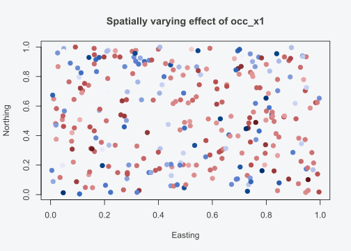

# Spatially Varying Coefficient Models

## Introduction

Standard occupancy models assume that a covariate has the same effect
everywhere: one slope, applied uniformly across all sites. In practice,
ecological relationships are often spatially non-stationary. Elevation
might drive occupancy strongly in one region but have little effect in
another. Forest cover might be positively associated with occurrence
near the range centre but negatively associated at range edges where the
species is already marginal. When a constant-coefficient model is forced
onto data with this kind of spatial heterogeneity, the global estimate
is a compromise that accurately describes no region in particular.

Spatially varying coefficient (SVC) models address this by allowing one
or more covariate effects to change continuously across space. Instead
of a single slope \\\beta_1\\, each site \\i\\ gets its own coefficient
\\\beta_1(\mathbf{s}\_i)\\, smoothed by a Gaussian spatial process. The
global (mean) effect is still estimated — it answers “on average, what
is the relationship?” — but the spatial surface of deviations around
that mean reveals *where* the relationship is stronger, weaker, or
reversed.

This vignette covers fitting SVC occupancy models in INLAocc, extracting
and visualising the varying coefficients, combining SVCs with temporal
structure, multi-species extensions, and practical guidelines for when
SVCs are warranted and how to interpret them. For the foundations of
spatial occupancy modelling (SPDE mesh construction, PC priors, spatial
residual checks), see
[`vignette("spatial-models")`](https://gillescolling.com/INLAocc/articles/spatial-models.md).
For general model diagnostics and comparison tools, see
[`vignette("diagnostics")`](https://gillescolling.com/INLAocc/articles/diagnostics.md).

## The SVC occupancy model

The occupancy submodel with a spatially varying coefficient on one
covariate is:

\\\text{logit}(\psi_i) = \beta_0 + \beta_1(\mathbf{s}\_i) \cdot
x\_{1i} + w(\mathbf{s}\_i)\\

where the spatially varying slope decomposes as:

\\\beta_1(\mathbf{s}\_i) = \bar{\beta}\_1 +
\tilde{\beta}\_1(\mathbf{s}\_i)\\

- \\\bar{\beta}\_1\\ is the **global (mean) effect** of \\x_1\\ across
  all sites.

- \\\tilde{\beta}\_1(\mathbf{s}\_i) \sim \text{GP}(0, C\_\beta(\cdot))\\
  is the **spatial deviation** at site \\i\\, drawn from a Gaussian
  process with its own Matern covariance function \\C\_\beta\\.

- \\w(\mathbf{s}\_i)\\ is a **separate spatial random effect** (the
  intercept spatial field) that captures residual spatial variation in
  baseline occupancy.

The SVC therefore has two distinct spatial fields: the intercept field
\\w(\mathbf{s}\_i)\\ and the coefficient field
\\\tilde{\beta}\_1(\mathbf{s}\_i)\\. Each has its own range and variance
parameters, controlling how smoothly they vary across space and how much
variation they carry.

The detection submodel is standard — no SVC is applied to detection:

\\\text{logit}(p\_{ij}) = \mathbf{w}\_{ij}^\top \boldsymbol{\alpha}\\

The spatial smoothing via the Gaussian process prevents overfitting to
individual sites. Sites close together share information about the local
coefficient value, which is particularly important when per-site sample
sizes (number of visits) are modest.

Spatial non-stationarity is common in ecology. Elevation effects on bird
occupancy change with latitude because the treeline shifts: 1000 m is
alpine tundra in the Alps but montane forest in the tropics. Temperature
effects on plant occurrence differ between continental and maritime
climates because humidity mediates the physiological response. Land-use
intensity has different consequences depending on the regional species
pool: converting forest to agriculture in a region with many forest
specialists causes steep occupancy declines, while the same conversion
in a region dominated by generalists has less effect. In each case, the
slope of the covariate-occupancy relationship changes across space
because of an interaction with geography that the analyst may not have
measured or may not know about in advance.

The SVC captures these patterns without requiring the analyst to specify
the interaction. Instead of writing `occupancy ~ elevation * latitude`,
which assumes a specific parametric form for the interaction, the SVC
lets the data determine where and how the elevation effect changes. This
is useful when the interaction is nonlinear, when the interacting
variable is unknown, or when multiple interacting variables operate
simultaneously. The cost is that the SVC is harder to interpret than a
simple interaction term, because the spatial surface of deviations does
not come with a label saying “this is latitude” or “this is humidity.”
The analyst must examine the surface and propose explanations.

## Simulating SVC data

``` r

library(INLAocc)

# Simulate spatial occupancy data (generates a spatial random effect)
sim <- simulate_occu(N = 300, J = 4,
                     beta_occ = c(0.5, -0.8),
                     beta_det = c(0, -0.5),
                     n_occ_covs = 1, n_det_covs = 1,
                     spatial_range = 0.3,
                     seed = 42)
```

[`simulate_occu()`](https://gillescolling.com/INLAocc/reference/simulate_occu.md)
generates a spatial random effect on the intercept but not a true SVC.
To create data where a covariate effect genuinely varies across space,
construct the varying coefficient manually:

``` r

# Extract site coordinates
coords <- sim$data$coords

# True SVC: effect of occ_x1 varies with latitude
# Stronger negative effect in the south, weaker (approaching zero) in the north
svc_true <- -0.8 + 1.5 * (coords[, 2] - 0.5)

# Verify: effect at southern edge (y = 0) is -0.8 + 1.5*(-0.5) = -1.55
#          effect at northern edge (y = 1) is -0.8 + 1.5*(0.5)  = -0.05
range(svc_true)
#> [1] -1.54288885 -0.05025313
```

This gradient — a covariate that matters strongly in the south but
barely at all in the north — is exactly the kind of pattern an SVC model
should recover.

## Fitting the SVC model

### Spatially varying intercept

The simplest SVC places spatial variation on the intercept itself. This
is distinct from the standard spatial random effect: the intercept SVC
interacts with the constant “1” in the design matrix, so it is
functionally equivalent to a spatial intercept field, but parameterised
through the SVC machinery.

``` r

fit_svc_int <- occu(~ occ_x1, ~ det_x1, data = sim$data,
                    spatial = sim$data$coords, svc = 1, verbose = 0)
summary(fit_svc_int)
```

`svc = 1` means the first occupancy coefficient (the intercept) varies
spatially. The global intercept \\\bar{\beta}\_0\\ is the spatial mean,
and each site gets a deviation \\\tilde{\beta}\_0(\mathbf{s}\_i)\\.

### Spatially varying slope

More commonly, the goal is to let a covariate’s effect vary. Here, the
slope of `occ_x1` changes across space:

``` r

fit_svc <- occu(~ occ_x1, ~ det_x1, data = sim$data,
                spatial = sim$data$coords, svc = 2, verbose = 0)
summary(fit_svc)
#> === Occupancy Model (INLA-Laplace) ===
#> 
#> Sites: 300 | Max visits: 4
#> Naive occupancy: 0.610 | Naive detection: 0.514
#> EM iterations: 2 | Converged: TRUE
#> 
#> --- Occupancy (psi) ---
#>                  mean     sd 0.025quant 0.5quant 0.975quant
#> (Intercept)    0.4194 0.2149    -0.0018   0.4194     0.8406
#> occ_x1        -0.7933 0.1595    -1.1060  -0.7933    -0.4806
#> svc_spatial_1 -0.0012 0.0016    -0.0044  -0.0012     0.0019
#> 
#> --- Detection (p) ---
#>                mean     sd 0.025quant 0.5quant 0.975quant
#> (Intercept) -0.1063 0.0795    -0.2621  -0.1063     0.0495
#> det_x1      -0.4879 0.0793    -0.6434  -0.4879    -0.3324
#> 
#> --- Hyperparameters (Occupancy) ---
#>                                         mean        sd 0.025quant 0.5quant
#> Precision for occ_re_svc_spatial_1 1008.3769 6459.3872     9.7914 148.8742
#> Range for spatial                     0.9381    2.2709     0.0419   0.3747
#> Stdev for spatial                     0.1697    0.1479     0.0234   0.1278
#>                                    0.975quant
#> Precision for occ_re_svc_spatial_1  6858.9038
#> Range for spatial                      5.4314
#> Stdev for spatial                      0.5617
#> 
#> --- Model Fit ---
#> WAIC:  1401.11
#> 
#> Estimated occupancy: 0.650 (0.327 - 0.902)
#> Estimated detection: 0.478 (0.284 - 0.690)
#> Estimated occupied sites: 195.9 / 300
#> 
#> --- Spatial Component (SPDE) ---
#> Mesh nodes: 740
#>                     mean     sd 0.025quant 0.975quant
#> Range for spatial 0.9381 2.2709     0.0419     5.4314
#> Stdev for spatial 0.1697 0.1479     0.0234     0.5617
```

`svc = 2` targets the second occupancy coefficient — the slope of
`occ_x1`. The model estimates both a global slope \\\bar{\beta}\_1\\ and
a spatial surface of deviations \\\tilde{\beta}\_1(\mathbf{s}\_i)\\.

Reading this output:

- **Global effect of occ_x1**: the mean effect on the logit scale.
  Across all sites on average, a one-unit increase in `occ_x1` changes
  log-odds of occupancy by this amount.
- **Spatial Component**: the intercept spatial field captures residual
  spatial variation in baseline occupancy after accounting for
  covariates.
- **SVC Component**: the coefficient spatial field. The SVC range
  controls how smoothly the coefficient changes across space (larger
  range = smoother). The SVC standard deviation measures how much the
  coefficient varies across space.

The global effect is the “average” relationship between the covariate
and occupancy, integrated across the entire study area. It answers the
same question as a standard (non-SVC) model would. The SVC range tells
you the spatial scale over which the relationship changes. A short range
means the coefficient shifts rapidly from site to site, implying
fine-grained spatial heterogeneity in the ecological process. A long
range means broad, regional gradients where the coefficient changes
slowly. If the range is much larger than the study extent, the
coefficient is approximately constant and the SVC adds little beyond
what a fixed slope provides.

The SVC standard deviation measures total spatial variation in the
coefficient. Compare it to the magnitude of the global effect. If the
global effect is -0.8 and the SVC SD is 0.1, the coefficient ranges from
roughly -0.9 to -0.7 across space, and the relationship is qualitatively
the same everywhere. If the SVC SD is 1.2, the coefficient ranges from
about -2.0 to +0.4, meaning the relationship reverses sign in parts of
the study area. That is a qualitatively different situation and warrants
careful ecological interpretation. When the SVC SD is small relative to
the global effect, consider dropping the SVC in favor of the simpler
constant-coefficient model.

### Multiple SVCs

When theory suggests that more than one covariate has a spatially
varying effect, pass a vector to `svc`:

``` r

sim2 <- simulate_occu(N = 300, J = 4, n_occ_covs = 2, n_det_covs = 1,
                       beta_occ = c(0.5, -0.8, 0.4),
                       beta_det = c(0, -0.5),
                       spatial_range = 0.3, seed = 43)
fit_svc_multi <- occu(~ occ_x1 + occ_x2, ~ det_x1, data = sim2$data,
                      spatial = sim2$data$coords, svc = c(1, 2), verbose = 0)
```

Both the intercept and the `occ_x1` slope vary spatially. Each SVC adds
a separate spatial field to the model, so computational cost scales with
the number of SVCs. Use multiple SVCs sparingly and only when each has a
clear ecological justification.

## Extracting SVC surfaces

[`getSVCSamples()`](https://gillescolling.com/INLAocc/reference/getSVCSamples.md)
returns the posterior summary of the site-level coefficient: the total
effect \\\beta_1(\mathbf{s}\_i) = \bar{\beta}\_1 +
\tilde{\beta}\_1(\mathbf{s}\_i)\\ at each site.

``` r

svc_all <- getSVCSamples(fit_svc)
svc_samples <- svc_all[[1]]  # extract the data.frame for the first SVC covariate
head(svc_samples)
#>   site       mean        sd      q025       q975
#> 1    1 -0.7844430 0.1527154 -1.109642 -0.4377368
#> 2    2 -0.7881896 0.1526152 -1.118005 -0.4460327
#> 3    3 -0.8027269 0.1520885 -1.148602 -0.4797773
#> 4    4 -0.8018400 0.1519479 -1.146362 -0.4780545
#> 5    5 -0.7864794 0.1526203 -1.114115 -0.4423401
#> 6    6 -0.8043318 0.1523729 -1.152723 -0.4828490
```

Each row gives the posterior mean, standard deviation, and 95% credible
interval for the total effect of `occ_x1` at that site. Sites where the
interval excludes zero have a “significant” local effect; sites where it
spans zero may have no local effect even if the global effect is
non-zero.

### Visualising the SVC surface

A map of site-level coefficients reveals the spatial pattern:

``` r

svc_df <- data.frame(
  x = sim$data$coords[, 1],
  y = sim$data$coords[, 2],
  beta1 = svc_samples$mean
)

# Base R visualisation
col_idx <- cut(svc_df$beta1, breaks = 100, labels = FALSE)
plot(svc_df$x, svc_df$y,
     col = hcl.colors(100, "Blue-Red 3")[col_idx],
     pch = 19, cex = 1.2,
     xlab = "Easting", ylab = "Northing",
     main = "Spatially varying effect of occ_x1")
```



When examining an SVC map, look for spatial structure that matches known
geography. A north-south gradient in the coefficient might indicate an
interaction with temperature or latitude. East-west variation near a
coastline might reflect maritime influence on the ecological
relationship. Patchy variation at scales smaller than the spacing
between sites usually indicates noise rather than signal: the SVC is
interpolating between sparse data points and the resulting pattern is
not ecologically interpretable. If the map looks like static, the SVC
may be overfitting, and the constant-coefficient model is likely a
better choice.

For publication-quality maps, use `ggplot2`:

``` r

library(ggplot2)

ggplot(svc_df, aes(x = x, y = y, colour = beta1)) +
  geom_point(size = 2.5) +
  scale_colour_gradient2(low = "#2166AC", mid = "grey90", high = "#B2182B",
                         midpoint = 0, name = expression(beta[1](s))) +
  coord_equal() +
  labs(title = "Spatially varying effect of occ_x1",
       x = "Easting", y = "Northing") +
  theme_minimal(base_size = 13)
```


### Mapping uncertainty

The posterior standard deviation reveals where the SVC is well-estimated
versus uncertain:

``` r

svc_df$sd <- svc_samples$sd

ggplot(svc_df, aes(x = x, y = y, colour = sd)) +
  geom_point(size = 2.5) +
  scale_colour_viridis_c(option = "magma", name = "Posterior SD") +
  coord_equal() +
  labs(title = "Uncertainty in spatially varying effect",
       x = "Easting", y = "Northing") +
  theme_minimal(base_size = 13)
```


Regions with few sites or low detection probability will have wider
credible intervals. If the uncertainty map shows uniformly high SD, the
data may not support an SVC — consider dropping back to a constant
coefficient.

### Posterior predictive check

Verify model adequacy after fitting the SVC:

``` r

ppc <- ppcOccu(fit_svc, fit.stat = "freeman-tukey", group = 1)
ppc$bayesian.p
#> [1] 0.036
```

A Bayesian p-value near 0.5 confirms that the SVC model generates data
consistent with observations.

### Parameter recovery

When working with simulated data, compare the estimated SVC surface
against the known truth:

``` r

# Correlation between true and estimated site-level coefficients
cor(svc_true, svc_samples$mean)
#> [1] -0.04965911
```

A high correlation between the true spatially varying coefficient and
the estimated surface indicates good recovery. The correlation will not
be 1.0 because: (a) estimation uncertainty at each site, (b) the
Gaussian process smooths over sharp local variation, and (c) the SPDE
mesh approximation introduces discretisation error. With more sites or
higher detection probability, the recovery improves.

## Model comparison: SVC vs. constant coefficient

An SVC should only be retained if it meaningfully improves model fit.
Always compare against simpler alternatives:

``` r

# Baseline: no spatial effect
m_base <- occu(~ occ_x1, ~ det_x1, data = sim$data, verbose = 0)

# Spatial intercept only (no SVC)
m_spatial <- occu(~ occ_x1, ~ det_x1, data = sim$data,
                  spatial = sim$data$coords, verbose = 0)

# SVC on intercept
m_svc_int <- occu(~ occ_x1, ~ det_x1, data = sim$data,
                  spatial = sim$data$coords, svc = 1, verbose = 0)

# SVC on occ_x1 slope
m_svc_slope <- occu(~ occ_x1, ~ det_x1, data = sim$data,
                    spatial = sim$data$coords, svc = 2, verbose = 0)

compare_models(base = m_base,
               spatial = m_spatial,
               svc_int = m_svc_int,
               svc_slope = m_svc_slope,
               criterion = "waic")
#>       model    loglik df      AIC      BIC     WAIC n_iter converged     delta
#> 1      base -661.5232  4 1331.046 1351.407 1393.321     20      TRUE  0.000000
#> 2   svc_int -649.3031  5 1308.606 1334.057 1401.176      2      TRUE  7.855078
#> 3   spatial -646.4943  4 1300.989 1321.349 1402.860      2      TRUE  9.538571
#> 4 svc_slope -652.6713  5 1315.343 1340.793 1403.619      2      TRUE 10.297619
#>        weight
#> 1 0.967132184
#> 2 0.019044835
#> 3 0.008207509
#> 4 0.005615471
```

Interpretation:

- **base to spatial**: a WAIC improvement confirms spatial structure
  matters.

- **spatial to svc_int**: any improvement indicates spatial variation in
  baseline occupancy beyond what the standard spatial field captures.

- **spatial to svc_slope**: a substantial improvement indicates the
  effect of `occ_x1` genuinely varies across space.

If the SVC model does not improve WAIC over the spatial intercept model,
the constant coefficient is sufficient and the additional complexity is
not justified. A spatially varying intercept captures spatial variation
in *baseline* occupancy. An SVC on a slope captures spatial variation in
*how the covariate affects occupancy*. These are different ecological
hypotheses — compare them explicitly rather than assuming one subsumes
the other.

Each step in this comparison tests a specific ecological hypothesis.
Going from base to spatial tests “is there unexplained spatial structure
in occupancy?” Going from spatial to SVC-intercept tests “does baseline
occupancy vary beyond what the covariates and a single spatial field
explain?” Going from spatial to SVC-slope tests “does the effect of the
covariate change across space?” The WAIC differences between these
nested models answer each question quantitatively. A large WAIC drop at
one step but not another tells you which kind of spatial complexity the
data support.

## Prediction at new locations

SVC predictions at unsampled sites incorporate the spatially varying
coefficient. Pass new coordinates and covariates to
[`predict_spatial()`](https://gillescolling.com/INLAocc/reference/predict_spatial.md):

``` r

new_coords <- as.matrix(expand.grid(x = seq(0, 1, by = 0.05),
                                     y = seq(0, 1, by = 0.05)))
new_covs <- data.frame(occ_x1 = 0)

preds <- predict_spatial(fit_svc, newcoords = new_coords,
                         newocc.covs = new_covs)
head(preds)
#> $psi.0
#> $psi.0$mean
#>   [1] 0.4037842 0.4024436 0.4026741 0.4035020 0.4028872 0.4028045 0.4032609
#>   [8] 0.4029436 0.4021831 0.4015018 0.4013098 0.4019432 0.4017883 0.4014207
#>  [15] 0.4012227 0.4025955 0.4059503 0.4092643 0.4124032 0.4148054 0.4155502
#>  [22] 0.4046552 0.4045463 0.4055904 0.4057054 0.4041570 0.4043249 0.4042599
#>  [29] 0.4031354 0.4020908 0.4007908 0.4008008 0.4022280 0.4023954 0.4005348
#>  [36] 0.4000600 0.4016310 0.4055725 0.4097410 0.4137613 0.4163030 0.4165868
#>  [43] 0.4060419 0.4072760 0.4085045 0.4080935 0.4065908 0.4060356 0.4054512
#>  [50] 0.4039899 0.4029029 0.4018672 0.4029263 0.4042916 0.4044716 0.4025085
#>  [57] 0.4004688 0.4022875 0.4065592 0.4108964 0.4148259 0.4173071 0.4170876
#>  [64] 0.4076947 0.4090607 0.4102280 0.4104491 0.4095455 0.4092411 0.4077457
#>  [71] 0.4051626 0.4041447 0.4035509 0.4050704 0.4067426 0.4072997 0.4060613
#>  [78] 0.4045424 0.4063204 0.4092989 0.4132525 0.4153328 0.4167099 0.4172524
#>  [85] 0.4101267 0.4112549 0.4125199 0.4121842 0.4109751 0.4102913 0.4092095
#>  [92] 0.4079325 0.4064770 0.4052619 0.4067647 0.4089658 0.4101171 0.4099364
#>  [99] 0.4090537 0.4113555 0.4132063 0.4149913 0.4162566 0.4170794 0.4172952
#> [106] 0.4128261 0.4142162 0.4153251 0.4150407 0.4136996 0.4124995 0.4115195
#> [113] 0.4107835 0.4088752 0.4075889 0.4081443 0.4099706 0.4124842 0.4137321
#> [120] 0.4136522 0.4155251 0.4164037 0.4172347 0.4174824 0.4178958 0.4177335
#> [127] 0.4149607 0.4168830 0.4181526 0.4182439 0.4159644 0.4144498 0.4134716
#> [134] 0.4124244 0.4110944 0.4100039 0.4097891 0.4113988 0.4142729 0.4161693
#> [141] 0.4168586 0.4179402 0.4190584 0.4186768 0.4178136 0.4183593 0.4180350
#> [148] 0.4166700 0.4185078 0.4195087 0.4186242 0.4169683 0.4156934 0.4147004
#> [155] 0.4139250 0.4127394 0.4120823 0.4120150 0.4131190 0.4157416 0.4168681
#> [162] 0.4179479 0.4191304 0.4202253 0.4202591 0.4194963 0.4189277 0.4182056
#> [169] 0.4174538 0.4193202 0.4197148 0.4186378 0.4172559 0.4158691 0.4151771
#> [176] 0.4149027 0.4142711 0.4137530 0.4140831 0.4152565 0.4164935 0.4171973
#> [183] 0.4186606 0.4194932 0.4203958 0.4213685 0.4207434 0.4196602 0.4184668
#> [190] 0.4175796 0.4197749 0.4204157 0.4198342 0.4178862 0.4156864 0.4148920
#> [197] 0.4152895 0.4147636 0.4148504 0.4154371 0.4167314 0.4174135 0.4183025
#> [204] 0.4195154 0.4205546 0.4209948 0.4218756 0.4209661 0.4197814 0.4184088
#> [211] 0.4170951 0.4189269 0.4193946 0.4189184 0.4182406 0.4165667 0.4153804
#> [218] 0.4151052 0.4151344 0.4156648 0.4170962 0.4178445 0.4183825 0.4186651
#> [225] 0.4205864 0.4221549 0.4223007 0.4222218 0.4211384 0.4196509 0.4181053
#> [232] 0.4158151 0.4169857 0.4175024 0.4174047 0.4169183 0.4165279 0.4157341
#> [239] 0.4149685 0.4155492 0.4163819 0.4176655 0.4185370 0.4189576 0.4194648
#> [246] 0.4197469 0.4203906 0.4198064 0.4198754 0.4195186 0.4187906 0.4173749
#> [253] 0.4140344 0.4153495 0.4159470 0.4158168 0.4154751 0.4153725 0.4145131
#> [260] 0.4138678 0.4144739 0.4164372 0.4179922 0.4189474 0.4198228 0.4197180
#> [267] 0.4186534 0.4171106 0.4161953 0.4165255 0.4166704 0.4168240 0.4162577
#> [274] 0.4120925 0.4134907 0.4146954 0.4145210 0.4135643 0.4131999 0.4122505
#> [281] 0.4114234 0.4127283 0.4146840 0.4168067 0.4184212 0.4195409 0.4194087
#> [288] 0.4179710 0.4157653 0.4135277 0.4141345 0.4143660 0.4147164 0.4140993
#> [295] 0.4097583 0.4111210 0.4130658 0.4127026 0.4108574 0.4094128 0.4084397
#> [302] 0.4081906 0.4089808 0.4112912 0.4135776 0.4166528 0.4182515 0.4183208
#> [309] 0.4171837 0.4157984 0.4140226 0.4123035 0.4126380 0.4130080 0.4126360
#> [316] 0.4079711 0.4086945 0.4096589 0.4095156 0.4077807 0.4062406 0.4050689
#> [323] 0.4049054 0.4057626 0.4082749 0.4113126 0.4144310 0.4162633 0.4171171
#> [330] 0.4159691 0.4147624 0.4133979 0.4113966 0.4110283 0.4113098 0.4113736
#> [337] 0.4057326 0.4052885 0.4038669 0.4036554 0.4032088 0.4026848 0.4019579
#> [344] 0.4019038 0.4028660 0.4055337 0.4086429 0.4107196 0.4123775 0.4133779
#> [351] 0.4131104 0.4127162 0.4110029 0.4100583 0.4094707 0.4101062 0.4101922
#> [358] 0.4032086 0.4018077 0.3991609 0.3990112 0.3993579 0.3988122 0.3983206
#> [365] 0.3987719 0.4005609 0.4027463 0.4051104 0.4072408 0.4085859 0.4092627
#> [372] 0.4094184 0.4084261 0.4073291 0.4077075 0.4083871 0.4089758 0.4089949
#> [379] 0.4014659 0.3993555 0.3974570 0.3971700 0.3973747 0.3976825 0.3952366
#> [386] 0.3957608 0.3983474 0.4006876 0.4023393 0.4038666 0.4049695 0.4054079
#> [393] 0.4049933 0.4034910 0.4043080 0.4051472 0.4067073 0.4069036 0.4075837
#> [400] 0.4000133 0.3983350 0.3979370 0.3972400 0.3973108 0.3977568 0.3955669
#> [407] 0.3959481 0.3983393 0.3998280 0.4009369 0.4013869 0.4023168 0.4018810
#> [414] 0.4002557 0.4002546 0.4014401 0.4025789 0.4040225 0.4048208 0.4061947
#> [421] 0.4000906 0.3988855 0.3992599 0.3989891 0.3984821 0.3980580 0.3976431
#> [428] 0.3977511 0.3987770 0.3996382 0.4000790 0.4003363 0.4009288 0.4003072
#> [435] 0.3989459 0.3996832 0.4007329 0.4017927 0.4025386 0.4040841 0.4053957
#> 
#> $psi.0$sd
#> [1] 0
#> 
#> $psi.0$quantiles
#>      2.5% 50% 97.5%
#> [1,]  0.5 0.5   0.5
#> 
#> $psi.0$samples
#>      [,1] [,2] [,3] [,4] [,5] [,6] [,7] [,8] [,9] [,10] [,11] [,12] [,13] [,14]
#> [1,]  0.5  0.5  0.5  0.5  0.5  0.5  0.5  0.5  0.5   0.5   0.5   0.5   0.5   0.5
#>      [,15] [,16] [,17] [,18] [,19] [,20] [,21] [,22] [,23] [,24] [,25] [,26]
#> [1,]   0.5   0.5   0.5   0.5   0.5   0.5   0.5   0.5   0.5   0.5   0.5   0.5
#>      [,27] [,28] [,29] [,30] [,31] [,32] [,33] [,34] [,35] [,36] [,37] [,38]
#> [1,]   0.5   0.5   0.5   0.5   0.5   0.5   0.5   0.5   0.5   0.5   0.5   0.5
#>      [,39] [,40] [,41] [,42] [,43] [,44] [,45] [,46] [,47] [,48] [,49] [,50]
#> [1,]   0.5   0.5   0.5   0.5   0.5   0.5   0.5   0.5   0.5   0.5   0.5   0.5
#>      [,51] [,52] [,53] [,54] [,55] [,56] [,57] [,58] [,59] [,60] [,61] [,62]
#> [1,]   0.5   0.5   0.5   0.5   0.5   0.5   0.5   0.5   0.5   0.5   0.5   0.5
#>      [,63] [,64] [,65] [,66] [,67] [,68] [,69] [,70] [,71] [,72] [,73] [,74]
#> [1,]   0.5   0.5   0.5   0.5   0.5   0.5   0.5   0.5   0.5   0.5   0.5   0.5
#>      [,75] [,76] [,77] [,78] [,79] [,80] [,81] [,82] [,83] [,84] [,85] [,86]
#> [1,]   0.5   0.5   0.5   0.5   0.5   0.5   0.5   0.5   0.5   0.5   0.5   0.5
#>      [,87] [,88] [,89] [,90] [,91] [,92] [,93] [,94] [,95] [,96] [,97] [,98]
#> [1,]   0.5   0.5   0.5   0.5   0.5   0.5   0.5   0.5   0.5   0.5   0.5   0.5
#>      [,99] [,100] [,101] [,102] [,103] [,104] [,105] [,106] [,107] [,108]
#> [1,]   0.5    0.5    0.5    0.5    0.5    0.5    0.5    0.5    0.5    0.5
#>      [,109] [,110] [,111] [,112] [,113] [,114] [,115] [,116] [,117] [,118]
#> [1,]    0.5    0.5    0.5    0.5    0.5    0.5    0.5    0.5    0.5    0.5
#>      [,119] [,120] [,121] [,122] [,123] [,124] [,125] [,126] [,127] [,128]
#> [1,]    0.5    0.5    0.5    0.5    0.5    0.5    0.5    0.5    0.5    0.5
#>      [,129] [,130] [,131] [,132] [,133] [,134] [,135] [,136] [,137] [,138]
#> [1,]    0.5    0.5    0.5    0.5    0.5    0.5    0.5    0.5    0.5    0.5
#>      [,139] [,140] [,141] [,142] [,143] [,144] [,145] [,146] [,147] [,148]
#> [1,]    0.5    0.5    0.5    0.5    0.5    0.5    0.5    0.5    0.5    0.5
#>      [,149] [,150] [,151] [,152] [,153] [,154] [,155] [,156] [,157] [,158]
#> [1,]    0.5    0.5    0.5    0.5    0.5    0.5    0.5    0.5    0.5    0.5
#>      [,159] [,160] [,161] [,162] [,163] [,164] [,165] [,166] [,167] [,168]
#> [1,]    0.5    0.5    0.5    0.5    0.5    0.5    0.5    0.5    0.5    0.5
#>      [,169] [,170] [,171] [,172] [,173] [,174] [,175] [,176] [,177] [,178]
#> [1,]    0.5    0.5    0.5    0.5    0.5    0.5    0.5    0.5    0.5    0.5
#>      [,179] [,180] [,181] [,182] [,183] [,184] [,185] [,186] [,187] [,188]
#> [1,]    0.5    0.5    0.5    0.5    0.5    0.5    0.5    0.5    0.5    0.5
#>      [,189] [,190] [,191] [,192] [,193] [,194] [,195] [,196] [,197] [,198]
#> [1,]    0.5    0.5    0.5    0.5    0.5    0.5    0.5    0.5    0.5    0.5
#>      [,199] [,200] [,201] [,202] [,203] [,204] [,205] [,206] [,207] [,208]
#> [1,]    0.5    0.5    0.5    0.5    0.5    0.5    0.5    0.5    0.5    0.5
#>      [,209] [,210] [,211] [,212] [,213] [,214] [,215] [,216] [,217] [,218]
#> [1,]    0.5    0.5    0.5    0.5    0.5    0.5    0.5    0.5    0.5    0.5
#>      [,219] [,220] [,221] [,222] [,223] [,224] [,225] [,226] [,227] [,228]
#> [1,]    0.5    0.5    0.5    0.5    0.5    0.5    0.5    0.5    0.5    0.5
#>      [,229] [,230] [,231] [,232] [,233] [,234] [,235] [,236] [,237] [,238]
#> [1,]    0.5    0.5    0.5    0.5    0.5    0.5    0.5    0.5    0.5    0.5
#>      [,239] [,240] [,241] [,242] [,243] [,244] [,245] [,246] [,247] [,248]
#> [1,]    0.5    0.5    0.5    0.5    0.5    0.5    0.5    0.5    0.5    0.5
#>      [,249] [,250] [,251] [,252] [,253] [,254] [,255] [,256] [,257] [,258]
#> [1,]    0.5    0.5    0.5    0.5    0.5    0.5    0.5    0.5    0.5    0.5
#>      [,259] [,260] [,261] [,262] [,263] [,264] [,265] [,266] [,267] [,268]
#> [1,]    0.5    0.5    0.5    0.5    0.5    0.5    0.5    0.5    0.5    0.5
#>      [,269] [,270] [,271] [,272] [,273] [,274] [,275] [,276] [,277] [,278]
#> [1,]    0.5    0.5    0.5    0.5    0.5    0.5    0.5    0.5    0.5    0.5
#>      [,279] [,280] [,281] [,282] [,283] [,284] [,285] [,286] [,287] [,288]
#> [1,]    0.5    0.5    0.5    0.5    0.5    0.5    0.5    0.5    0.5    0.5
#>      [,289] [,290] [,291] [,292] [,293] [,294] [,295] [,296] [,297] [,298]
#> [1,]    0.5    0.5    0.5    0.5    0.5    0.5    0.5    0.5    0.5    0.5
#>      [,299] [,300] [,301] [,302] [,303] [,304] [,305] [,306] [,307] [,308]
#> [1,]    0.5    0.5    0.5    0.5    0.5    0.5    0.5    0.5    0.5    0.5
#>      [,309] [,310] [,311] [,312] [,313] [,314] [,315] [,316] [,317] [,318]
#> [1,]    0.5    0.5    0.5    0.5    0.5    0.5    0.5    0.5    0.5    0.5
#>      [,319] [,320] [,321] [,322] [,323] [,324] [,325] [,326] [,327] [,328]
#> [1,]    0.5    0.5    0.5    0.5    0.5    0.5    0.5    0.5    0.5    0.5
#>      [,329] [,330] [,331] [,332] [,333] [,334] [,335] [,336] [,337] [,338]
#> [1,]    0.5    0.5    0.5    0.5    0.5    0.5    0.5    0.5    0.5    0.5
#>      [,339] [,340] [,341] [,342] [,343] [,344] [,345] [,346] [,347] [,348]
#> [1,]    0.5    0.5    0.5    0.5    0.5    0.5    0.5    0.5    0.5    0.5
#>      [,349] [,350] [,351] [,352] [,353] [,354] [,355] [,356] [,357] [,358]
#> [1,]    0.5    0.5    0.5    0.5    0.5    0.5    0.5    0.5    0.5    0.5
#>      [,359] [,360] [,361] [,362] [,363] [,364] [,365] [,366] [,367] [,368]
#> [1,]    0.5    0.5    0.5    0.5    0.5    0.5    0.5    0.5    0.5    0.5
#>      [,369] [,370] [,371] [,372] [,373] [,374] [,375] [,376] [,377] [,378]
#> [1,]    0.5    0.5    0.5    0.5    0.5    0.5    0.5    0.5    0.5    0.5
#>      [,379] [,380] [,381] [,382] [,383] [,384] [,385] [,386] [,387] [,388]
#> [1,]    0.5    0.5    0.5    0.5    0.5    0.5    0.5    0.5    0.5    0.5
#>      [,389] [,390] [,391] [,392] [,393] [,394] [,395] [,396] [,397] [,398]
#> [1,]    0.5    0.5    0.5    0.5    0.5    0.5    0.5    0.5    0.5    0.5
#>      [,399] [,400] [,401] [,402] [,403] [,404] [,405] [,406] [,407] [,408]
#> [1,]    0.5    0.5    0.5    0.5    0.5    0.5    0.5    0.5    0.5    0.5
#>      [,409] [,410] [,411] [,412] [,413] [,414] [,415] [,416] [,417] [,418]
#> [1,]    0.5    0.5    0.5    0.5    0.5    0.5    0.5    0.5    0.5    0.5
#>      [,419] [,420] [,421] [,422] [,423] [,424] [,425] [,426] [,427] [,428]
#> [1,]    0.5    0.5    0.5    0.5    0.5    0.5    0.5    0.5    0.5    0.5
#>      [,429] [,430] [,431] [,432] [,433] [,434] [,435] [,436] [,437] [,438]
#> [1,]    0.5    0.5    0.5    0.5    0.5    0.5    0.5    0.5    0.5    0.5
#>      [,439] [,440] [,441] [,442] [,443] [,444] [,445] [,446] [,447] [,448]
#> [1,]    0.5    0.5    0.5    0.5    0.5    0.5    0.5    0.5    0.5    0.5
#>      [,449] [,450] [,451] [,452] [,453] [,454] [,455] [,456] [,457] [,458]
#> [1,]    0.5    0.5    0.5    0.5    0.5    0.5    0.5    0.5    0.5    0.5
#>      [,459] [,460] [,461] [,462] [,463] [,464] [,465] [,466] [,467] [,468]
#> [1,]    0.5    0.5    0.5    0.5    0.5    0.5    0.5    0.5    0.5    0.5
#>      [,469] [,470] [,471] [,472] [,473] [,474] [,475] [,476] [,477] [,478]
#> [1,]    0.5    0.5    0.5    0.5    0.5    0.5    0.5    0.5    0.5    0.5
#>      [,479] [,480] [,481] [,482] [,483] [,484] [,485] [,486] [,487] [,488]
#> [1,]    0.5    0.5    0.5    0.5    0.5    0.5    0.5    0.5    0.5    0.5
#>      [,489] [,490] [,491] [,492] [,493] [,494] [,495] [,496] [,497] [,498]
#> [1,]    0.5    0.5    0.5    0.5    0.5    0.5    0.5    0.5    0.5    0.5
#>      [,499] [,500]
#> [1,]    0.5    0.5
#> 
#> 
#> $z.0
#> $z.0$mean
#>   [1] 0 0 0 0 0 0 0 0 0 0 0 0 0 0 0 0 0 0 0 0 0 0 0 0 0 0 0 0 0 0 0 0 0 0 0 0 0
#>  [38] 0 0 0 0 0 0 0 0 0 0 0 0 0 0 0 0 0 0 0 0 0 0 0 0 0 0 0 0 0 0 0 0 0 0 0 0 0
#>  [75] 0 0 0 0 0 0 0 0 0 0 0 0 0 0 0 0 0 0 0 0 0 0 0 0 0 0 0 0 0 0 0 0 0 0 0 0 0
#> [112] 0 0 0 0 0 0 0 0 0 0 0 0 0 0 0 0 0 0 0 0 0 0 0 0 0 0 0 0 0 0 0 0 0 0 0 0 0
#> [149] 0 0 0 0 0 0 0 0 0 0 0 0 0 0 0 0 0 0 0 0 0 0 0 0 0 0 0 0 0 0 0 0 0 0 0 0 0
#> [186] 0 0 0 0 0 0 0 0 0 0 0 0 0 0 0 0 0 0 0 0 0 0 0 0 0 0 0 0 0 0 0 0 0 0 0 0 0
#> [223] 0 0 0 0 0 0 0 0 0 0 0 0 0 0 0 0 0 0 0 0 0 0 0 0 0 0 0 0 0 0 0 0 0 0 0 0 0
#> [260] 0 0 0 0 0 0 0 0 0 0 0 0 0 0 0 0 0 0 0 0 0 0 0 0 0 0 0 0 0 0 0 0 0 0 0 0 0
#> [297] 0 0 0 0 0 0 0 0 0 0 0 0 0 0 0 0 0 0 0 0 0 0 0 0 0 0 0 0 0 0 0 0 0 0 0 0 0
#> [334] 0 0 0 0 0 0 0 0 0 0 0 0 0 0 0 0 0 0 0 0 0 0 0 0 0 0 0 0 0 0 0 0 0 0 0 0 0
#> [371] 0 0 0 0 0 0 0 0 0 0 0 0 0 0 0 0 0 0 0 0 0 0 0 0 0 0 0 0 0 0 0 0 0 0 0 0 0
#> [408] 0 0 0 0 0 0 0 0 0 0 0 0 0 0 0 0 0 0 0 0 0 0 0 0 0 0 0 0 0 0 0 0 0 0
```

The predictions reflect both the spatial intercept field and the SVC.
Even with `occ_x1` held at 0, occupancy varies across space because of
the intercept spatial field. To see the SVC’s contribution, compare
predictions at `occ_x1 = 0` vs `occ_x1 = 1` across the same grid — the
difference will vary spatially, which is the SVC in action.

## SVC + temporal models

For multi-season data where the covariate effect might vary in space but
the temporal dynamics also matter, combine SVC with temporal structure:

``` r

sim_t <- simTOcc(N = 100, J = 3, n_seasons = 5, seed = 300)

fit_svc_t <- occu(~ occ_x1, ~ det_x1, data = sim_t$data,
                  spatial = sim_t$data$coords,
                  temporal = "ar1", svc = 2, verbose = 0)
summary(fit_svc_t)
#> === Temporal Occupancy Model (INLA-Laplace) ===
#> 
#> Periods: 5 | Sites: 100 | AR(1): TRUE
#> 
#> EM iterations: 32 | Converged: TRUE
#> 
#> --- Occupancy (psi) ---
#>               mean     sd 0.025quant 0.5quant 0.975quant   mode    kld
#> (Intercept) 1.4987 0.0989     1.2840    1.501     1.6967 1.5001 0.0047
#> occ_x1      0.5890 0.0039     0.5815    0.589     0.5966 0.5890 0.0000
#> 
#> --- Temporal Component ---
#>                         mean      sd 0.025quant 0.5quant 0.975quant    mode
#> Precision for period 28.7241 17.1936     7.2300  24.8585    72.3933 17.8078
#> Rho for period       -0.2549  0.3311    -0.7928  -0.2880     0.4504 -0.3984
#> 
#> --- Per-Period Summary ---
#>  period est_psi est_p
#>       1   0.646 0.505
#>       2   0.633 0.483
#>       3   0.650 0.469
#>       4   0.662 0.504
#>       5   0.558 0.538
```

This model combines AR(1) temporal autocorrelation with a spatially
varying slope on `occ_x1`. The SVC captures spatial non-stationarity in
the covariate–occupancy relationship, while the AR(1) component captures
temporal persistence in occupancy states. This is the most complex
single-species model available in INLAocc and should be used only when
both spatial non-stationarity and temporal autocorrelation are
ecologically plausible.

A sensible workflow is to first establish whether the SVC is warranted
using spatial-only models, then add temporal structure to the preferred
spatial specification. Do not add both simultaneously on a first attempt
— it becomes difficult to diagnose which component is absorbing which
signal.

## Multi-species SVC

When multiple species are surveyed at the same sites, each species can
have its own spatially varying coefficient:

``` r

sim_ms <- simMsOcc(N = 200, J = 4, n_species = 5,
                   spatial_range = 0.3, seed = 123)

fit_ms_svc <- occu(~ occ_x1, ~ det_x1, data = sim_ms$data,
                   multispecies = TRUE,
                   spatial = sim_ms$data$coords, svc = 2, verbose = 0)
```

Each species gets its own SVC field — the effect of `occ_x1` varies
spatially *and* differs across species. A generalist might show a flat
SVC (constant effect everywhere), while a specialist might show strong
spatial variation. The species-level SVC surfaces from
[`getSVCSamples()`](https://gillescolling.com/INLAocc/reference/getSVCSamples.md)
can be compared to understand how species respond differently to the
same environmental gradient across space.

This is computationally demanding: each species adds a separate spatial
field. With 5 species and `svc = 2`, the model estimates 5 SVC fields
plus 5 intercept spatial fields (10 spatial fields total). Use only with
adequate sample sizes (200+ sites, 3+ visits per site per species).

## Practical guidelines for interpretation

### Don’t assign SVCs arbitrarily

SVCs should reflect a specific ecological hypothesis: “the effect of
\\X\\ varies across space because of \[mechanism\].” Plausible
mechanisms include:

- **Local adaptation**: species respond differently to a resource in
  different parts of their range.
- **Interaction with an unmeasured gradient**: temperature modulates the
  effect of precipitation, and temperature varies spatially.
- **Range boundary effects**: a habitat covariate matters more at the
  range edge where the species is at its physiological limit.

Without a mechanistic rationale, an SVC may be overfitting to noise or
absorbing the signal of an omitted covariate.

### Start simple, compare up

The recommended workflow for deciding whether an SVC is needed:

1.  Fit the model without any spatial effect.

2.  Add a spatial intercept (captures unmeasured spatial variation in
    baseline occupancy).

3.  Add an SVC on the hypothesised covariate.

4.  Compare all three via WAIC using
    [`compare_models()`](https://gillescolling.com/INLAocc/reference/compare_models.md).

If the SVC does not improve on the spatial intercept model, the
covariate effect is likely constant across space, and the simpler model
should be preferred.

### Visualise the SVC surface

Always map the site-level coefficient estimates. Diagnostic patterns to
look for:

- **Smooth gradients**: likely real ecological non-stationarity (e.g., a
  temperature effect that varies with latitude). This is the ideal case
  — the SVC is capturing a genuine spatial process.
- **Patchy or noisy pattern**: possibly overfitting, or confounding with
  another spatially structured process. Consider whether an omitted
  covariate could explain the pattern.
- **Sign changes**: the covariate has opposite effects in different
  regions. This can be ecologically meaningful (positive effect at range
  centre, negative at range edge) or a sign of confounding. Investigate
  carefully before reporting.
- **Uniform surface with high uncertainty**: the data do not support an
  SVC. The constant-coefficient model is sufficient.

### Consider the spatial scale

The SVC range parameter controls how smoothly the coefficient varies.
Its relationship to the study extent determines what the model can
resolve:

- **SVC range \>\> study extent**: the effect is nearly constant across
  the study area. The SVC is not needed; a fixed coefficient suffices.
- **SVC range \<\< inter-site distance**: the spatial process varies
  faster than the sampling can resolve. Site-level estimates will be
  noisy and poorly constrained.
- **SVC range \\\approx\\ study extent / 5–10**: the ideal regime. The
  spatial variation is smooth enough to estimate with reasonable
  precision but fast enough to reveal meaningful heterogeneity.

If the posterior for SVC range piles up against the upper boundary of
the prior, it is signalling that the effect is effectively constant. If
it piles up near zero, the data may be too sparse to support an SVC.

### Prior sensitivity

SVC spatial variance and range priors matter more than in standard
spatial models, because the SVC field competes with the intercept
spatial field for signal. The default PC (penalised complexity) priors
in INLAocc are calibrated to shrink toward the constant-coefficient
model (i.e., zero SVC variance). This is conservative by design: the SVC
must earn its complexity by improving the marginal likelihood.

If results are sensitive to the choice of PC prior parameters, the data
are likely marginal for supporting an SVC. Report the sensitivity
analysis alongside the primary results.

In practice, this means fitting the SVC under at least two prior
specifications. For example, change the PC prior from \\P(\sigma \> 1) =
0.05\\ to \\P(\sigma \> 2) = 0.1\\ and refit. If the SVC surface changes
substantially in magnitude or spatial pattern, the data do not contain
enough information to pin down the SVC, and the posterior is being
driven by the prior rather than the likelihood. Report both results side
by side. If the surface is stable across reasonable prior choices, the
SVC is well-identified and the conclusions do not depend on subjective
prior decisions.

### Identifiability concerns

With both an intercept spatial field \\w(\mathbf{s}\_i)\\ and an SVC
field \\\tilde{\beta}\_1(\mathbf{s}\_i)\\, the model has two spatial
processes that can partially trade off against each other. This
trade-off becomes problematic when:

- The SVC covariate \\x_1\\ is itself spatially structured (e.g.,
  elevation, which varies smoothly across space). The intercept field
  and the SVC field may both try to capture the same spatial signal,
  leading to poorly identified variance components.
- The data are sparse relative to the spatial scale of variation. Few
  sites means few data points to separate the two spatial processes.

Use
[`checkIdentifiability()`](https://gillescolling.com/INLAocc/reference/checkIdentifiability.md)
to flag potential issues:

``` r

checkIdentifiability(fit_svc)
#> Identifiability check: 3 issue(s) found (2 HIGH, 1 MEDIUM)
#> 
#> [!!] RE group 'svc_spatial_1' has levels with < 3 sites
#>     300 levels, smallest has 1 sites. Variance is poorly estimated for small groups.
#>     -> Merge small groups or drop the random effect.
#> 
#> [!!] RE group 'svc_spatial_1' has too many levels
#>     300 levels for 300 sites. More groups than data can support.
#>     -> Use a fixed effect, reduce levels, or remove.
#> 
#> [!] RE variance collapsed: Precision for occ_re_svc_spatial_1
#>     Precision = 1008 (variance ~ 0.0010). The random effect has shrunk to zero.
#>     -> This RE is not supported by the data. Consider dropping it.
```

If identifiability warnings appear, consider whether the SVC covariate
is too collinear with the spatial structure of the data. Options
include: residualising the covariate against a spatial smooth before
fitting, using stronger PC priors to regularise the SVC, or accepting
the spatial intercept model and reporting the global coefficient only.

## Summary

- SVCs decompose a covariate effect into a global mean plus a spatial
  surface of deviations. They answer “where does this relationship hold,
  and where does it break down?”

- Fit with `occu(..., spatial = coords, svc = k)` where `k` indexes the
  occupancy covariate. Extract surfaces with
  [`getSVCSamples()`](https://gillescolling.com/INLAocc/reference/getSVCSamples.md).

- SVCs are the most complex single-species model in INLAocc. Use only
  with ecological justification and adequate sample size (200+ sites).

- Always compare to simpler alternatives: no spatial effect, spatial
  intercept only, constant coefficient with spatial intercept.

- Visualise the SVC surface. If it looks like noise, it probably is.

- SVC + temporal is slow. Establish that the SVC is warranted in a
  spatial-only model before adding temporal structure.

- Prior sensitivity and identifiability checks are essential, not
  optional.

The full decision tree for SVC analysis: (1) fit the base model without
spatial effects, (2) check Moran’s I on residuals for spatial
autocorrelation, (3) add a spatial intercept field, (4) hypothesize
which covariate might have a spatially varying effect based on
ecological reasoning, (5) fit the SVC model, (6) compare all models via
WAIC, (7) visualize the SVC surface and check whether the spatial
pattern is interpretable, (8) run a prior sensitivity analysis to
confirm the results are stable. If the SVC does not improve WAIC, or the
surface looks like noise, or the results shift under different priors,
fall back to the spatial intercept model and report the global
coefficient.
